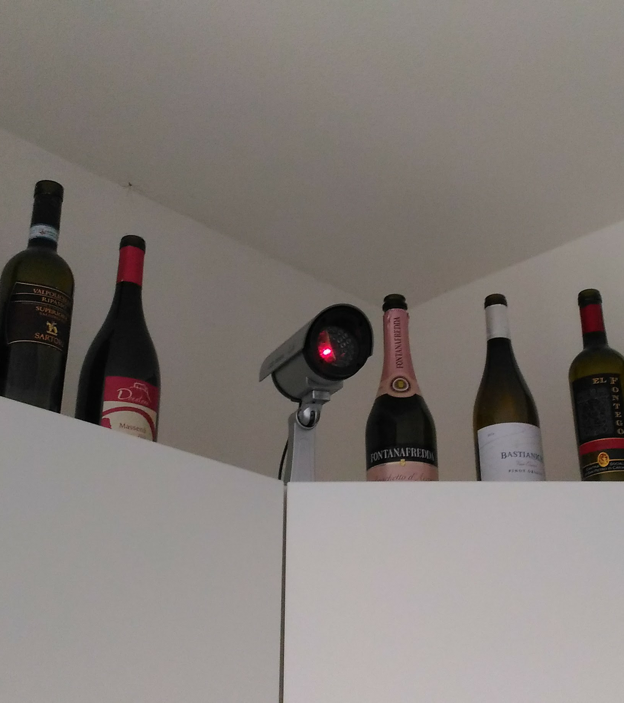
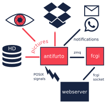
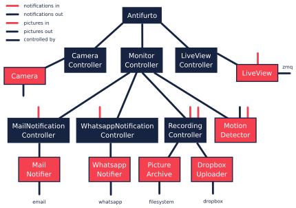
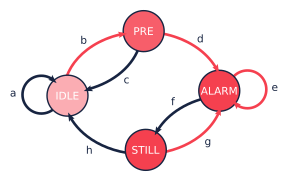
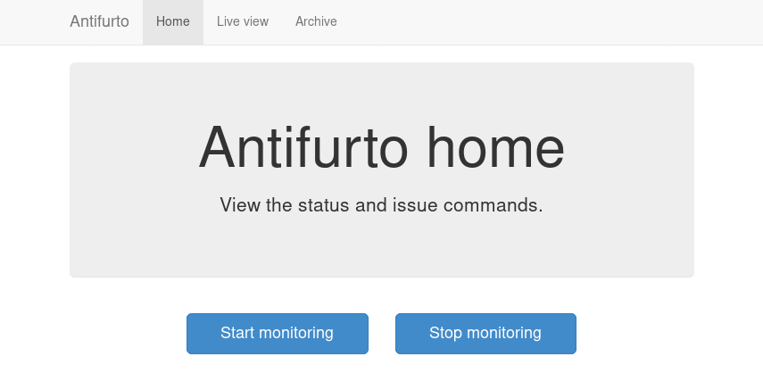
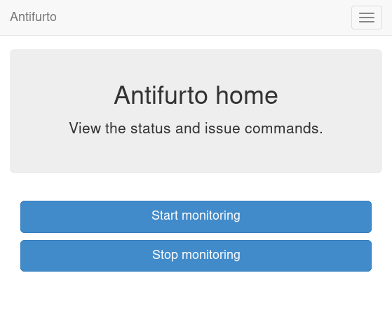
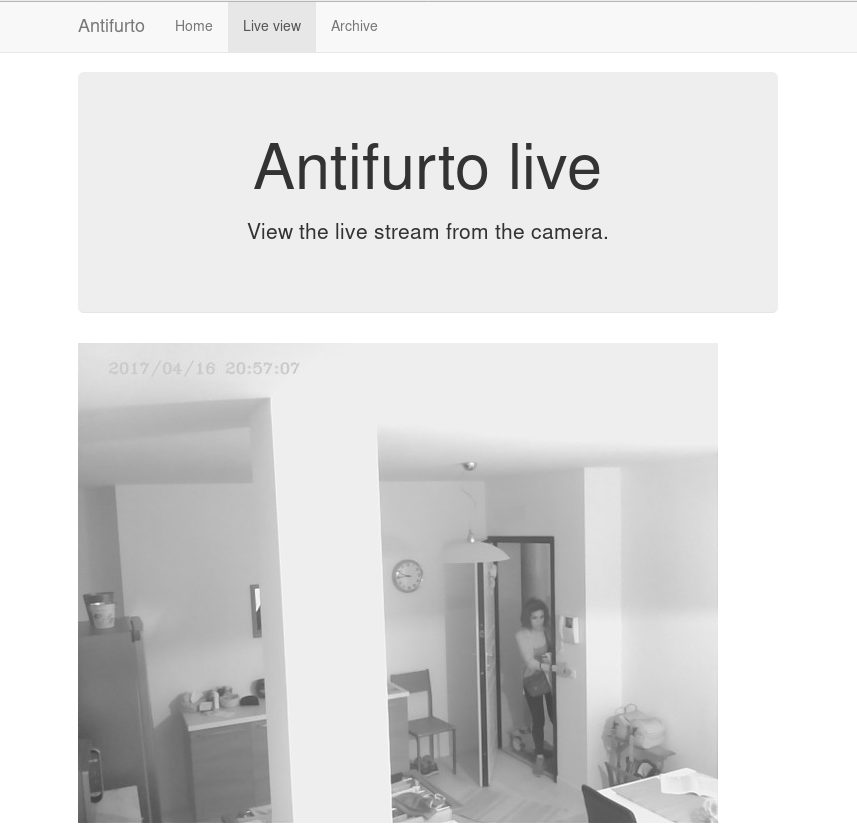
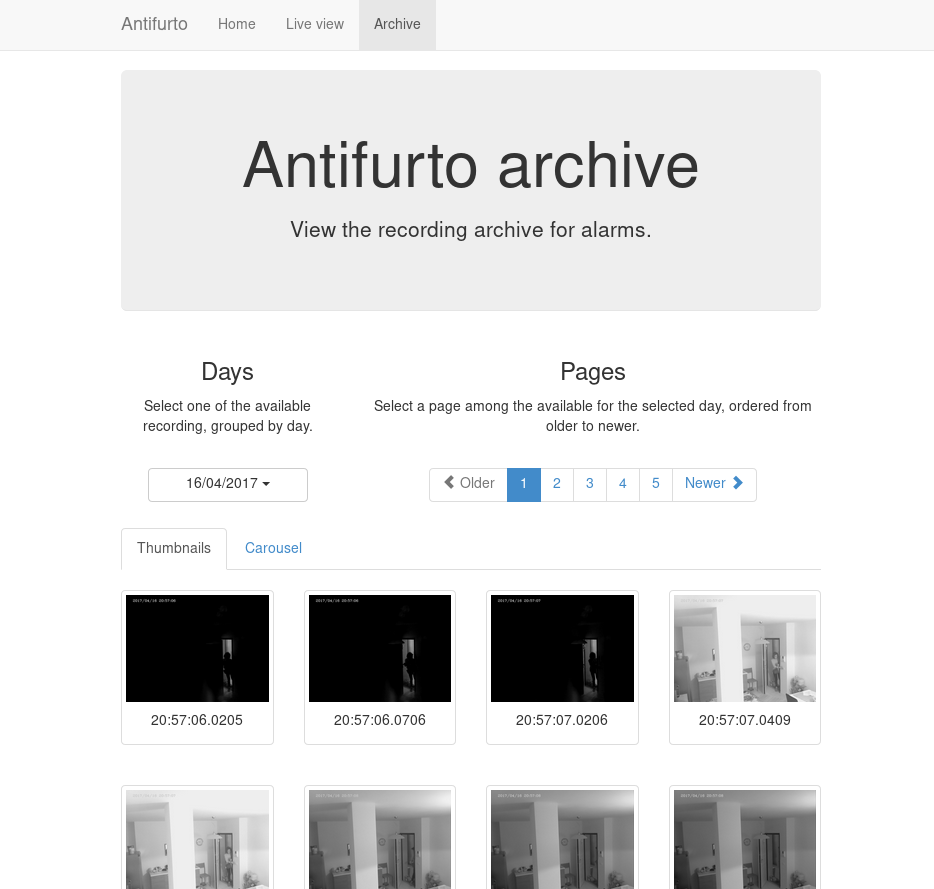
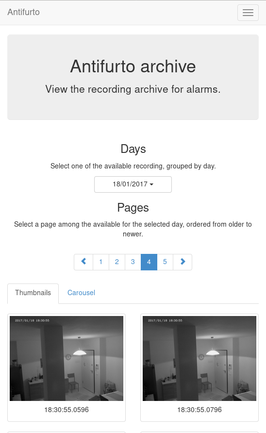
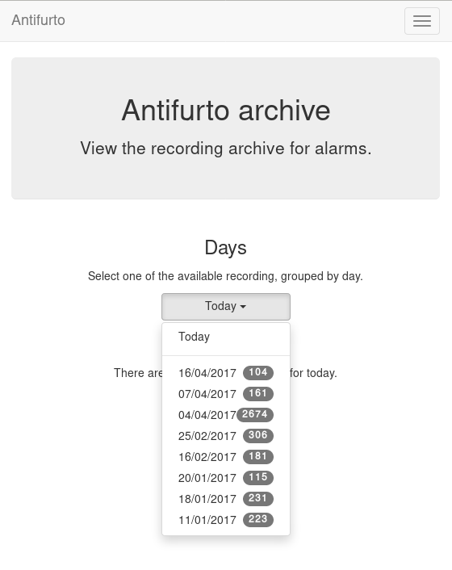

# Introduction

In February 2014 I had a very unpleasant surprise after coming back home from a
weekend in Berlin. Me and my girlfriend found out our apartment upside down
because of burglars. We suffered the loss not only of many of our belongings,
but worse, of our safety. We didn't feel safe in our home and we didn't feel
safe to leave it - not even for half an hour - for the fear to come back and
find somebody inside. It was with this mood that I started this project: totally
motivated to do something about it.

My goal was to install in the apartment a security alarm that was cheap, safe
and easy to use: something that I could trust. Nowadays there are plenty of
alternatives that satisfy all the requirements, but at that moment I couldn't
find anything like that. As I am a software engineer, I decided to jump into the
project and spend most of my free time on it (my girlfriend was only partially
happy with this resolution).

The end result was a Raspberry Pi with a camera module and a bunch of software,
in part taken from the open-source and in part written by me. As of the time of
writing, it's been running in production (namely my apartment) untouched for
more than two years now. Ironically my security camera lasted way more than my
apartment, because since then I already moved twice. So, quite a success for me.

And, if you're asking yourself if I had any burglars again since then, the
answer is no, luckily. But I had the opportunity to test it multiple times when
my parents have intruded my apartment without permission...




## Why?

At this point you can probably see my motivation behind the project, and also
the target audience: I needed something cheap that I, and my girlfriend could
use. This set of users was important for the design. It meant that the normal
usage should be simple, because my girlfriend (who is not a developer) had to
use it. The configuration and maintenance was however on me, so I didn't focus
on make that simple.

Today I'm open-sourcing the project. You can find it on GitHub under
[mbrt/antifurto](https://github.com/mbrt/antifurto). The name comes from an
Italian word that means "security alarm". It was a codename at the beginning,
waiting to be changed in something better, but in the end I didn't bother. So
antifurto is still the name today.

Why am I open-sourcing that now, and not before? Why not keeping it closed
source? The project started to meet my needs, so I had no reason at the
beginning to open source something that was completely tied to my use case.
Nobody would have gotten any particular benefit from it. After some time however
it grown up into a more featured product. So, since at the time I wasn't happy
with my job, I considered starting a business and commercialize it. Long story
short, getting funds for startups in Italy is quite hard, so I needed money from
myself or my family. I then had to improve many parts of the project because I
needed to scale out for multiple customers. It was not only about my apartment
anymore. In the meantime competitors started to jump out from nowhere before I
even got started. I had an opportunity for a new job, so my motivations kinda
vaporized.

At the end of the day, there is not a commercial product, but a working
prototype, and an interesting experience to share. I decided to open-source it
now, because I needed time to put together this writeup and cleanup some
documentation. All things that I find boring, so it took me a while.


## What?

In this writeup I'm going to present the interesting bits of the project. I will
try to not focus too much on the details, but rather to present clearly the
high-level architecture, some design decisions and some interesting
implementation bits.


## Features

The antifurto project is essentially a security camera that allows to monitor
what happens through the lenses of a single camera. When the camera detects
motion above a certain threshold, it sends notifications through WhatsApp and
emails and starts to record pictures. These are in turn saved to the local disk
and uploaded to a Dropbox folder. There is also a web portal (optimized for
desktop and mobile browsers) from which you can start and stop the monitoring, a
live view from which you can see images in real time and an archive page for the
past recordings. It's not possible to combine multiple cameras together: single
camera, single website.


# Architecture

The project architecture is simple. Everything lives inside a Raspberry Pi,
period. There isn't a server component communicating with the camera, or
anything else. This is not an ideal architecture from the security point of
view, because all the keys, including SSL, Dropbox API secrets, email passwords,
etc are inside that box. It was the perfect solution for me, because instead of
a device and a server to manage, I had only one device. Moreover, the
development time was reduced because the architecture was simpler.

This unfortunately cannot work out if you want to provide the project to your
mother (assuming she's not a software developer). The Raspberry needs a non-zero
amount of maintenance, to provide a minimum amount of security. This includes
for example installing OS updates and rebooting the device periodically. The
keys need to be safe guarded inside the Raspberry itself, and re-generated in
case of leak. Again, this is not good if you want to do it properly, but I
preferred to do something quick and get it working as fast as I could.

Now for the details. The project is divided into three main parts:

-   the main `antifurto` executable (written in C++), which is responsible for the
    monitoring and notifications;
-   a web server (Apache + PHP), that serves the website from which you can see
    the live stream, turn the monitoring on and off and view the archive;
-   a FastCGI component that serves as a bridge between the webserver and the main
    executable.

There are also other small satellite components and scripts, such as:

-   a bash script to send emails with the `mail` command;
-   python scripts to send WhatsApp notifications and upload pictures to Dropbox.

You can see below a diagram of the high level architecture:



As you can see, the pictures come from the camera module and are processed by
the `antifurto` main executable. This decides whether to store the pictures on
the local hard drive (an SD card), and upload them on Dropbox or not. It also
decides, when to send notifications via email or WhatsApp messages. Whenever the
user decides to start a live view from the web interface, or start/stop the
monitoring, the backend sends a POSIX signal to the main process. If the desired
action was to start the live view, the main executable will start to send the
pictures over the `zmq` channel to the `antifurto.fcgi` component. Its only task
is to forward them to the webserver via an FCGI socket.

The design is heavily based on
[observers](https://en.wikipedia.org/wiki/Observer_pattern),
[type erasure](https://en.wikipedia.org/wiki/Type_erasure),
[composite reuse principle](https://en.wikipedia.org/wiki/Composition_over_inheritance) and
[SOLID principles](https://en.wikipedia.org/wiki/SOLID_(object-oriented_design)), to
minimize dependencies among components. Well, at least I tried to keep those in
mind.



In the diagram you can see the architecture of the main executable. Each box
represents a class. I didn't represent all of them, but only the most important.
For example I left out the utility classes like schedulers, queues, observer
lists. The dark boxes represent controller classes, which are responsible for
managing specific parts of the application. Controller classes manage all the
boxes connected via a "tilted square" arrow. This means that they both own those
classes (so they are responsible for their lifetime) and they know how to
operate them. Red boxes don't manage anything, but they provide a functionality
either for other classes or talk to external services.

One important thing to notice is that each class is owned by one and only one
controller. The architecture and the lifetime of the resources are very simple
and clear in this way. A consequence is that classes can be tested individually
much more easily, since there are no cyclical dependencies, and children don't
know anything about their parents.

In the diagram you can also see what are the inputs and outputs of each class.
Red arrows are inputs, and dark arrows are outputs. You can see that I didn't
connect explicitly those arrows. Why? Because they are loose connections.
Outputs are provided in the form of observers,[^1]
and classes interested in pictures don't know anything
about the [Camera](#camera) class. So, controllers are responsible to "wire"
those connections, by registering themselves to the inputs they need and forward
them to the classes they manage. For example the [RecordingController](#recordingcontroller) class
register itself to both alarm notifications (provided by the
[MotionDetector](#motiondetector)) and the picture stream (provided by the
[Camera](#camera)). It is managed by the [MonitorController](#motioncontroller), so whenever
the monitoring functionality is stopped, the recording classes can be safely
deleted. The `RecordingController` then listens to alarm events and whenever one
occurs, it forwards the pictures stream directly to the [PictureArchive](#picturearchive) and
the [DropboxUploader](#dropboxuploader).


# Main executable

In this long section I'm going to talk about the internal details of the main
executable, called `antifurto` for a very lack of fantasy.


## Main class

The main class is called `Antifurto`, what a surprise! It is responsible to
start and stop the monitoring and the live view, by orchestrating the resources
involved. It uses a `Config` structure for the configuration, that comes from
the command line and the configuration file. It can be used as an external
library, as most of the components in this project, since it is self contained.

It contains all the controllers, that are described in the [Main controllers](#main-controllers)
section, and the implementation details are hidden from the header file behind a
[Pimpl](https://herbsutter.com/gotw/_100/).

The interface is very simple: it takes a configuration and the user can control
when to start and stop monitoring and live view from four public methods:

```c++
class Antifurto
{
public:
    Antifurto(const Configuration& c, bool maintenanceNeeded = true);

    void startMonitoring();
    void stopMonitoring();

    void startLiveView();
    void stopLiveView();

private:
    meta::ErasedUniquePtr<AntifurtoImpl> pimpl_;
};
```

So, this class is all about the very high level use cases of configuring,
starting and stopping the main functionalities.[^2]

These functions are a bit less simple than one can at first imagine. For example
the `startMonitoring` is anynchronous and starts the monitoring only after a
configurable timeout. This is because after the start, the person may need to
get out the way before the monitoring effectively starts. The default I'm using
for myself is one minute. At the same time, the function needs to check if the
user cancels the start request before the timer goes off. I needed to put some
attention in the interaction between start, stop and the destructor. The
[CameraController](#cameracontroller) lifetime depends on whether one between the monitoring and the
live view functionalities are on:

```c++
void handleCameraControllerNeed()
{
    if ((liveViewActive_ || monitorActive_) && !camera_)
    camera_.reset(new CameraController());
    else if (!liveViewActive_ && !monitorActive_)
    camera_.reset();
}
```

This method is called by all the four external methods, to factor out this
common part.


## Main controllers

In this section I'm going to describe the three controllers that manage the
monitoring, live view and the camera sub-components.


### MonitorController

This class controls the monitoring functionality life cycle. It delegates to its
sub-components tasks such as motion detection, and notifications. The most
important part of its public interface is the `examinePicture` function:

```c++
void examinePicture(const Picture& picture);
```

The [Main class](#main-class) calls this function whenever a new picture comes out of the
camera.

Another interesting bit is the way this class asks for the upper level
controller to change the picture capture interval, or to stop the recording
altogether. To break cyclical dependencies, the upper level class has to
instantiate the `MonitorController` by passing a couple of callbacks. One of
them is the `SetPicturesInterval`:

```c++
using SetPicturesInterval = std::function<void(std::chrono::milliseconds)>;
```

that is used whenever some motion is detected. In that case, the
`MonitorController` asks for an increase of the capture frequency. It's also
useful whenever nothing is going on, to decrease the capture frequency and so
save energy:

```c++
void MonitorController::onAlarmStateChanged(MotionDetector::State state)
{
    using State = MotionDetector::State;

    switch (state) {
    case State::NO_ALARM:
        setPicturesInterval_(config::monitorCycleDuration());
        break;
    case State::PRE_ALARM:
        setPicturesInterval_(config::monitorCycleDurationOnAlarm());
        break;
    default:
        break;
    }
    log::info() << "Alarm state: " << state;
}
```


### CameraController

This class is responsible to take pictures from a camera at a given rate. A user
of this class can register an observer and specify the rate at which the
pictures have to be taken:

```c++
class CameraController
{
public:
    using Subject = meta::Subject<const Picture&>;
    using Observer = Subject::Observer;
    using Registration = Subject::Registration;
    using Period = std::chrono::milliseconds;

    /// Set the pictures capture rate
    void setDesiredPeriod(Registration const& r, Period period);

    /// Add an observer to the pictures flow
    Registration addObserver(Observer observer, Period desiredPeriod);

    // ...
};
```

This uses the observer pattern, implemented as an utility in the
[meta namespace](#meta-namespace).

Every time a picture is taken, the observer callback is called. If multiple
observers are interested in different capture rates, the maximum rate is used.
This means that an observer specifies the minimum speed, but it could get
pictures at a higher speed, if it's necessary for other observers.

To implement this functionality, in a separate thread a `Metronome` class sleeps
the required time, and then the `Camera` class takes a picture. Every time an
observer is registered or de-registered, the sleep time is updated.


### LiveViewController

This class starts and stops the live view functionality. It doesn't implement
the functionality itself; it just controls the lifetime of a [LiveView](#liveview)
object. From the outside it takes pictures and the start and stop commands.

Whenever a picture comes, it is forwarded to the internal `LiveView` object. To
detect when the user is not interested in the live view anymore, there is a
primitive control flow, which is basically a fixed queue of pictures sent to the
browser. When the client doesn't request them, the queue fills up. After a
certain timeout with a full queue, the `LiveViewController` simply stops the
live view:

```c++
if (liveView_->addPicture(p))
    lastPictureWrittenTime_ = system_clock::now();
else if (system_clock::now() - lastPictureWrittenTime_ > timeout_)
    stop();
```

To do this, the internal `LiveView` object simply informs whether it has been
able to process the image or not, and if not, the timeout is checked.

The `stop` function invokes a callback, that asks to be de-registered from the
stream of pictures.


## Picture's capture

### MotionDetector

This class uses the [OpenCV](http://opencv.org/) library to examine the pictures
flow and determine if something is moving. It implements the observer pattern to
notify the observers for the current state. The motion detection code is pretty
simple:

```c++
cv::absdiff(curr_, p, currDiff_);
cv::bitwise_and(prevDiff_, currDiff_, motion_);
if (motionHappened())
    onMotionDetected();
else
    onNoMotion();
// save
std::swap(prevDiff_, currDiff_);
    curr_ = p;
```

The code works with three pictures: the current one and the last two. Two images
are computed out of them by making a difference (i.e. subtracting the gray
values of the pixels one by one) between the first with the second and the
second with the third. Then a "bitwise and" is computed between them. Random
noise will be filtered out, since it's unlikely to stay still for three frames,
and the image will be almost completely black. Whenever something moves however,
certain areas of the pictures will differ among the three frames, and so the
difference will produce white pixels. These pixels are then counted in
`motionHappened()`, and if they exceed a certain threshold, then motion is
detected.

There is an additional layer of protection against errors, and it's a state
machine that counts how many consecutive moving frames have been detected. These
states are used to better control energy saving, picture capture and alarm
notifications.



Every time a transition occurs in this state machine, all the observers are
notified. It will be up to them to take the right action.

Everything starts from the `IDLE` state. Whenever some motion is detected, the
state becomes `PRE_ALARM`. If no more motion frames are detected, the state goes
back to `IDLE`. If the motion continues however, the state machine transitions
to `ALARM`. It stays there while the motion continues. When it stops, the state
goes to the `STILL` state. This means that even though nothing is moving, for
some time, the alert level is still on alarm. Indeed, if some motion happens
again, the state turns immediately to `ALARM` again. If instead nothing happens
for some time, the state goes back to `IDLE`.

In this way we have decoupled the abstract states in which the system may be
with the actions the various components have to take to respond.


### Camera

The camera type is statically determined in `StaticConfig.hpp`. In the
Raspberry-Pi case, there is a homegrown version implemented by `PiCamera` that
uses a slightly modified version of the `picam` library, that I found
[here](http://robotblogging.blogspot.nl/2013/10/an-efficient-and-simple-c-api-for.html).
This library is a simple interface on top of the Raspberry
[userland](https://github.com/mbrt/userland) library I forked just to ease the
build. To capture images outside the Raspberry world I instead opted for the
[OpenCV](http://opencv.org/) library and implemented `CvCamera`. Now, I have to
admit that the `CvCaptureRAII` class might look a bit weird, but it was an
attempt to implement the camera resource through
[RAII](https://en.wikipedia.org/wiki/Resource_acquisition_is_initialization). I
took inspiration from Martinho Fernandez [rule of
zero](https://rmf.io/cxx11/rule-of-zero) blog post and the [concern about the
rule of
zero](http://scottmeyers.blogspot.nl/2014/03/a-concern-about-rule-of-zero.html)
by Scott Meyers. To discuss this in detail I would need an entire blog post in
itself, so I'll just point you to these valuable resources. To be honest I'm not
very satisfied by its look and feel now.

With the same spirit I implemented the capture resource for `PiCamera`, which is
just a one liner:

```c++
std::unique_ptr<CCamera, void(*)(CCamera*)> capture_;
```

It uses the non-so-well-known custom deleter feature of `std::unique_ptr`.
Again, look at the Fernandez's post for an explanation on why I didn't just
implemented a stupid destructor for `PiCamera`. Everything is handled
automatically, since in the constructor I pass the resource, and the deleter
function to be called in destruction (namely `picam_stop_camera`):

```c++
PiCamera::PiCamera(int width, int height)
    : width_(width), height_(height)
    , capture_(::picam_start_camera(width, height, 10, 1, false),
                &::picam_stop_camera)
{
    // ...
}
```

These two different implementations of the camera resource were not intended to
be used at the same time: one was only for the Raspberry Pi hardware, and the
other for PC's with USB cameras. For this reason I didn't introduce any common
interface, and just used a compile time define and a `typedef` to switch between
them:

```c++
namespace antifurto {
namespace config {

#if defined(ANTIFURTO_RASPBERRY)
    using Camera = antifurto::PiCamera;
#else
    using Camera = antifurto::CvCamera;
#endif

}}
```

The code will simply refer to the `antifurto::config::Camera` type to get a
capture resource. I just needed to make sure their public interface (i.e. the
public methods) are the same, so the two classes could be used interchangeably.

This trick is quite handy if you don't need runtime polymorphism, but honestly
it's a bit overkill for this project.


## LiveView

This class is managed by the [LiveViewController](#liveviewcontroller) and is responsible to forward
pictures to a [ZeroMQ](http://zeromq.org/) socket. It has a single producer /
single consumer queue (see the [concurrency](#concurrency) section) and a worker thread
to offload the communication.

The interesting part about this class is the use of a non-blocking lock-free
queue, that allows minimum interruption for the producer. Whenever the queue is
full, the images are discarded, and the caller is notified, in order to make
some control flow, without interrupting the images flow.

For the communication to the webserver we use the [request-reply
pattern](http://zguide.zeromq.org/page:all#Ask-and-Ye-Shall-Receive) in ZeroMQ.
It's a simple protocol where at very request corresponds one reply.
Reconnections are implemented in the [FastCGI backend](#fastcgi-backend), with the
[ZmqLazyPirateClient](#zmqlazypirateclient) class.


## Picture recording

### RecordingController

This class is responsible for managing the registration of the pictures while an
alarm is active. It accepts pictures with the `void addPicture(Picture p)`
method and registers itself to the [MotionDetector](#motiondetector) to know when to start
and stop the recording. This is done by saving Jpeg pictures on the local file
system (by using [PictureArchive](#picturearchive)) and uploading them to Dropbox (by using
[DropboxUploader](#dropboxuploader)).

The state machine is quite simple:

```c++
void RecordingController::onAlarmStateChanged(MotionDetector::State state)
{
    using State = MotionDetector::State;
    switch (state) {
    case State::NO_MOTION:
        archive_.stopSaving();
        break;
    case State::NO_ALARM:
        enqueueOlderPictures();
        break;
    case State::ALARM:
        archive_.startSaving();
        break;
    case State::PRE_ALARM:
    default:
        break;
    }
}
```

Whenever the motion detector notifies this class about an alarm, it starts to
save the pictures. When there is no motion involved (even if the alarm is still
active), the recording is stopped.

Saving pictures in real time is important, both on disk and online. If there is
a slow upload for any reason, the queue between the producer (the
[Camera](#camera)) and the consumer (the uploader), grows. This would mean
that by looking at the pictures online, the delay between capture and upload
will grow more and more over time during alarms. To avoid this behavior, the
queue size is limited, and whenever it's full, the coming pictures are queued in
a secondary one:

```c++
void RecordingController::onPictureSaved(const std::string& fileName)
{
    if (!uploadWorker_.enqueue(fileName)) {
        log::info() << "Failed to upload picture to Dropbox: queue is full";
        std::unique_lock<std::mutex> lock(toUploadAfterQueueMutex_);
        toUploadAfterQueue_.emplace(fileName);
    }
}
```

This ensures a fixed maximum delay between capture and upload, just by skipping
pictures now and then, when the queue is full. All the missing pictures are
instead uploaded when the alarm is not active anymore (the `case
State::NO_ALARM:` above):

```c++
while (!toUploadAfterQueue_.empty()) {
    if (uploadWorker_.enqueue(toUploadAfterQueue_.front()))
        toUploadAfterQueue_.pop();
    else
        break;
}
// if the queue is not empty, we need to schedule another upload cycle
if (!toUploadAfterQueue_.empty()) {
    log::info() << "Cannot empty the upload queue. Schedule a new upload";
    scheduler_.scheduleAfter(std::chrono::minutes(10), [this] {
            enqueueOlderPictures();
    });
}
```

The logic is a bit brutal but it works. While there is still something to
upload, it adds the pictures to the upload queue. If the queue gets full again,
a new procedure is scheduled after 10 minutes.

There is another maintenance procedure, to avoid a full hard drive. Every 24
hours, older pictures are removed. Depending on the configuration, only a
certain amount of days are kept:

```c++
// schedule maintenance at every midnight
using namespace std::chrono;
auto maintenanceWork = [this] { performMaintenance(); };
scheduler_.scheduleAt(concurrency::tomorrow() + minutes(1), [=] {
    performMaintenance();
    scheduler_.scheduleEvery(hours(24), maintenanceWork);
});
```


### PictureArchive

This class saves pictures in Jpeg format to a given folder. It takes a stream of
pictures and two commands: `startSaving` and `stopSaving`. When the recording is
started, not only the next picture is saved, but also some of the previous. This
object has indeed a fixed sized circular buffer that allows to retroactively
save the images right before an alarm popped up. It also allows observers to
register for when a picture is saved to disk, getting the file name.

```c++
void PictureArchive::save(Picture& p, Clock t)
{
    std::string filename{ fs::concatPaths(currentFolder_,
        text::toString(t, text::ToStringFormat::FULL, '-', '_') + ".jpg")};

    cv::putText(p, text::toString(t, text::ToStringFormat::SHORT, '/', ' '),
                cv::Point(30,30), CV_FONT_HERSHEY_COMPLEX_SMALL, 0.8,
                cv::Scalar(200,200,250), 1, CV_AA);
    cv::imwrite(filename, p, {CV_IMWRITE_JPEG_QUALITY, 90});
    notifyObservers(filename);
}
```

The picture gets a timestamp text overlay on the top left corner and then is
saved on disk.

On the bad side there is the ring buffer, which is actually not a ring buffer at
all. Pictures are pushed to the end of a vector. The beginning is then deleted
by moving all the other elements at the previous index. Not pretty, not fast,
but all in all it works. Moving to a proper circular buffer should not be very
hard.


### DropboxUploader

This class is responsible for uploading files to a Dropbox account, by using an
external `dropbox_uploader.sh` script. It just generates a configure file for
it, starting from the Antifurto's configuration, and uploads a file when
requested, by launching an external process. Nothing fancy here, I just forked
[andreafabrizi/Dropbox-Uploader](https://github.com/andreafabrizi/Dropbox-Uploader).


## Notifications

Two types of notifications are supported: WhatsApp and emails. WhatsApp have
been historically fighting against bots. For this reason the phone numbers I
used as source for notifications have been banned. I don't recommend using it
for this reason. A much more sane approach would have been to implement a
Telegram bot instead, but at that time they didn't exist. Email notifications
are instead much more safe and reliable to use. For those two functionalities we
have two very similar controllers: `WhatsappNotificationController` and
`MailNotificationController`, that register themselves to the
[MotionDetector](#motiondetector) and whenever there is an alarm, they try to use their
counterpart ([WhatsappNotifier](#whatsappnotifier) and [MailNotifier](#mailnotifier)) to send the
notifications asynchronously. They also take care of retrials in case of errors,
and avoid sending too many of them in a short period of time, to avoid flooding
the receivers.


### WhatsappNotifier

This class manages WhatsApp notifications. Whenever `send(std::string const&
dest, std::string const& msg)` is called, it sends a message with
[yowsup-cli](https://github.com/mbrt/yowsup) by spawning an external process.
This class just generates the configuration file needed by Yowsup from the main
process configuration and takes care of its execution.


### MailNotifier

This class is responsible for sending emails.

```c++
void send(ContactList const& dest,
            std::string const& sender,
            std::string const& subject,
            std::string const& body);
```

It calls an external bash script that uses the Unix `mail` utility, to send the
mail.


## Utility libraries

Here I present some random notes on the utility namespaces that help with design
patterns, concurrency, filesystem and logging. Some of them are a bit
over-engineered but in hobby projects you also need to have some fun, don't you?
:)


### meta namespace

This namespace contains some generic patterns and algorithms that do not depend
on the specific details of the project itself. In `Observer.hpp` you can find a
generic implementation of the [observer
pattern](https://en.wikipedia.org/wiki/Observer_pattern). A `Subject` wants to
provide observers the possibility to register for events. The class takes a
variadic number of type parameters, that will be used in the notification. For
example:

```c++
Subject<int, float> s;
auto reg = s.registerObserver([](int a, float b) { print(a, b); });
s.notify(3, 3.14);
```

in this example we want to notify our observer with an integer and a float. To
do that we just need to declare `Subject` with the right parameters. This will
in turn be able to accept observers that respect the `std::function<void(int,
float)>` signature.

Interesting:

-   the registration returns a token that when goes out of scope unregisters the
    observer automatically;
-   it is possible to register and unregister observers within notification
    callbacks (re-entrant calls are supported).

Other small utilities are also present, like `ErasedUniquePtr`, which provides a
unique pointer with an erased deleter. This is an useful workaround to a subtle
problem when you want to forward declare a class and use it in an unique
pointer. For more details see the [type erasure
post](https://akrzemi1.wordpress.com/2013/12/11/type-erasure-part-iii/) of
Andrzej's blog.


### fs

This namespace contains simple path manipulation utilities to concatenate
multiple paths with a single call:

```c++
std::string p = fs::concatPaths("/var/log", bar, "file.txt");
```

This is similar to what `boost::filesystem` does, but in a more functional way.


### log

This namespace contains logging utilities. The focus of this library was to
provide a fast and simple logging without using macro shenanigans.

You can use it with a call to a free function, that will return the proper
logger:

```c++
log::debug() << "my log here " << 15;
```

There is also a `reload` function. When a log rotation occurs it will simply
close the old file (that has been rotated) and open a new file in the same
place. Ignored log levels are implemented by returning a logger that writes to a
`NullSink`, which simply does nothing. Interestingly cryptic is the
implementation of an `std::outstream` that does nothing. You can find it in
`log/NullStream.hpp`.


### concurrency

This namespace contains some classes that deal with concurrency. An interesting
one is `SpScQueue`, that wraps a worker thread and allows to enqueue work items
for it. The type of the work item is templated, to maximize reusability. The
queue is a lock-free implementation that can be chosen at compile time among a
fixed-size and a dynamically allocated one. The former is preferred in case the
maximum queue size is known at compile time.

As a side note I would like to add here that since the project deals with
real-time data, avoiding dynamic allocations can be critical. We used fixed
bound queues in all places for this reason.

Another interesting class in this namespace is the `TaskScheduler`. It provides
the possibility to schedule tasks at certain time points, either one-shot or
periodic:

```c++
void scheduleAt(Clock::time_point t, Task w);
void scheduleAfter(Clock::duration d, Task w);
void scheduleEvery(Clock::duration d, Task w);
```

The work items are processed one after the other in a worker thread, so delays
added by one task impact on the next ones. It is for this reason used only for
short tasks.


### ipc

This namespace contains classes related to child processes and inter-process
communication. There is a `forkAndCall` function, that forks the process, calls
a the given function and returns the function result by using the child process
exit code:

```c++
/// This function fork the process, calls the function in the child process,
/// wait for completion and returns the function return value.
ChildProcess forkAndCall(std::function<int()> f);
```

The child process itself can be killed or waited. In the latter case, the
function return code will be returned.

In this namespace there is also a `NamedPipe` class that provides Linux named
pipes. The constructor creates a [FIFO](https://linux.die.net/man/3/mkfifo) with
the given file name, and the destructor removes it.

There is also an interesting `PosixSignalHandler` class, that handles POSIX
signals safely. You need to use it carefully though: initialize it at the
beginning of the main function, before any thread creation, and register all the
signal handlers as soon as possible, by using:

```c++
void setSignalHandler(int signal, Handler h);
```

where an handler is a callback that takes the signal that just happened:

```c++
using Handler = std::function<void(int)>;
```

The POSIX standard says that a lot of functions are not safe to be used within
signal handlers. For example it's not possible to allocate heap memory and call
many standard library functions. We need however to support arbitrary code
execution in the handlers, so to workaround this we use a vector of atomic
booleans, one for each possible signal. Whenever a signal is sent to the
process, the handler flips the corresponding boolean to true. A separate thread
polls that vector, and executes the registered handlers, if any were given. This
allows the signal handler to return immediately and in a safe way:

```c++
std::vector<std::atomic<bool>> signalsToBeHandled(SIGRTMAX);

void sigactionHandler(int sig, siginfo_t* , void* )
{
    signalsToBeHandled[sig].store(true, std::memory_order_release);
}
```

and the user-defined handler is called asynchronously in a separate thread. This
allows to execute arbitrary code.


### text

In this namespace we have some string manipulation utilities, like `toString`.
This free function converts any list of printable objects in an `std::string`,
e.g.

```c++
std::string s = text::toString("my ", std::string("s"), 15, true);
```

Allowing to both covert objects into strings and concatenate them, without the
need of odd `std::ostringstream` objects all around the codebase.

A `TextReplace` class allows to do replace variable occurrences in a text with
user specified values. For example:

```c++
std::ifstream f("file.txt");
std::ostringstream out;
text::TextReplace r;
r.addVariable("var", "X");
r.addVariable("foo", "BAR");
r.replaceVariables(f, out);
```

and suppose `file.txt` contains:

```
replace ${var} variables
with ${foo} their values ${p}.
```

the result of the replacement will be:

```
replace X variables
with BAR their values ${p}.
```

Note that unknown variables are left untouched.


# Website

I am not so proud of the website code, and I don't recommend looking at it in
detail. I did not have much experience in web development at that time, but I am
still quite happy with the result. Year ago it was not so obvious that a website
was mobile ready:





The website is just a bunch HTML + JavaScript pages. For the styling and the
responsive design I went with the immortals
[Bootstrap](http://getbootstrap.com/) and [JQuery](https://jquery.com/), while
for the server side part I used the now infamous PHP.

Commands like start and stop monitoring and live view are issued by the frontend
by doing `GET` requests to pages under the `controller/` path. The PHP backend
listening that endpoint sends POSIX signals to the main executable. The
communication is not more complicated than that, because this first
implementation worked fine. I didn't bother changing it in something more
complicated.

The funniest part of the frontend is the live view though. Also in this case the
first implementation was good enough :). Basically the frontend uses an infinite
loop of Ajax requests[^3] to a special `live.jpg` picture, which is served by a
custom FastCGI backend, written in C++. This is the one described in the
[FastCGI backend](#fastcgi-backend) section.

```c++
function loadImage(url, imageObj, target) {
    imageObj.onload = function() {
        target.setAttribute('src', this.src);
        loadImage(url, imageObj, target);
    };
    imageObj.src = url + '?_=' + new Date().getTime();
}

$.ajax({ url: '../controller/live.php',
            dataType: 'json',
            cache: false
        })
    .done(function(data) {
        if (data.result == 0) {
            $('.live-container').html(
                '</img>'
            );
            var img = document.getElementById('liveimg');
            loadImage('live.jpg', img, new Image);
        }
        else
            displayMessage('.live-container',
                '<h4>Ooops...</h4>' +
                '<p>' + data.log + '</p>',
                'alert-danger');
    })
    .fail(function(jqxhr, textStatus, errorThrown) {
        displayMessage('.live-container',
            '<h4>Ooops...</h4>' +
            '<p>' + errorThrown + '</p>',
            'alert-danger');
    });
```

Yes, that's it. I didn't even have to shorten the code. Something that I
couldn't explain myself here was that in `loadImage` I couldn't use JQuery,
because it was much slower than the old style `setAttribute` and `image.src =
url`. So I decided to live with that.



The archive page shows pictures from previous alarms. Just don't look at the PHP
code behind that, it's really horrible crap. It can give you nightmares for days.



This is the carusel view:


This is the mobile version:



And this is the date selector for the alarm, in the mobile version:




# FastCGI backend

One of the website backend components is ironically in a folder called
`frontend`. The name is unfortunate but it was meant to suggest an interface to
the main executable. It communicates with it via a ZeroMQ socket, and with the
web server through [FastCGI](https://en.wikipedia.org/wiki/FastCGI).

Interestingly enough, the first implementation was in Python, but it was too
slow. I had to re-implement it in C++, and now it's about three orders of
magnitude faster (yes, I really mean 1000X).

The `main.cpp` file contains all the logic:

-   A webserver request is directed to the executable through the standard input
    (which is ignored);
-   a picture is requested to the main antifurto executable through a ZeroMQ
    request;
-   as soon as a reply arrives, it is immediately written to the standard output,
    that is read by the webserver.

There are a bunch of utility classes that have been used to make the code
cleaner, described in the following sections.


## ZmqLazyPirateClient

This class implements the [Lazy pirate
pattern](http://zguide.zeromq.org/page:all#Client-Side-Reliability-Lazy-Pirate-Pattern)
in ZeroMQ, which is a request-reply transition supporting socket reconnections.
This allows to start and stop the main executable and the webserver
independently; the connection between them will catch up automatically. When a
request-reply transaction is needed, this class will send the request and wait
until the reply comes, or a timeout expires. On timeout, the request is sent
again, until the maximum number of retrials is reached. At that point the
transaction is considered failed.


## Stream utilities

The `StreamRedirector` class is responsible for redirecting the standard input
and output to FastCGI stream buffers, while `StreamReader` allows to buffer
reads from a stream (in this case the standard input). I actually don't remember
because it's a class instead of a simple function. Probably it's a non-sense.


# Conclusion

In this post we had a look at the pet project I worked on for a while some years
ago. By skimming through this post again I realized that it is mostly a random
collection of impressions, design decisions and code snippets, so I don't know
how effective that is for a reader. However, for me it was important to wrap up,
because after all the time and effort spent, I didn't want to forget it, and I
also wanted to share my insights with the community.[^4]

My takeaways are that with this project I learned some stuff and I did something
useful for myself. I would definitely recommend working on things you really
need, as opposed to experimenting with technologies purposelessly. It really
helps to get them done (to a certain extent at least). Or at least that's the
only way I found preventing me to give up projects too early.[^5]

I hope this post gave you some interesting insights and maybe inspire you some
extensions, related projects or ideas. The code is open source on GitHub, under
[mbrt/antifurto](https://github.com/mbrt/antifurto), as I wrote earlier. I
encourage you to take a look yourself to some of the classes. You can also build
it and use it as is for your own security alarm. The deployment is kind of a
pain right now, because there are many dependencies and configuring the external
services is not exactly easy to do (Dropbox, mails, WhatsApp, etc). The
documentation is also somehow lacking; apologies for that.

That's all folks!


[^1]: Take a look at the [meta namespace](#meta-namespace) for the implementation.

[^2]: If you are curious, the `ErasedUniquePtr` class is briefly described in
the [meta namespace](#meta-namespace) section.

[^3]: Yes, I know WebSocket existed
already years ago, but really, at that time my phone didn't support them, and I
didn't feel like developing two different protocols.

[^4]: The license is GPL.

[^5]: See [do finish your stuff](http://250bpm.com/blog:50) by Martin Sústrik.
