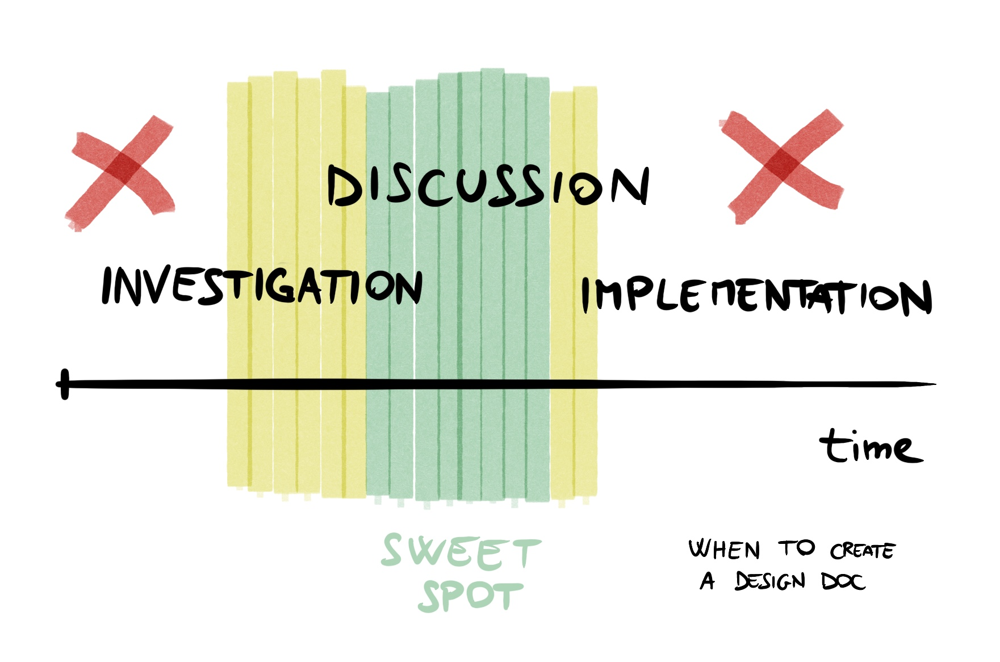
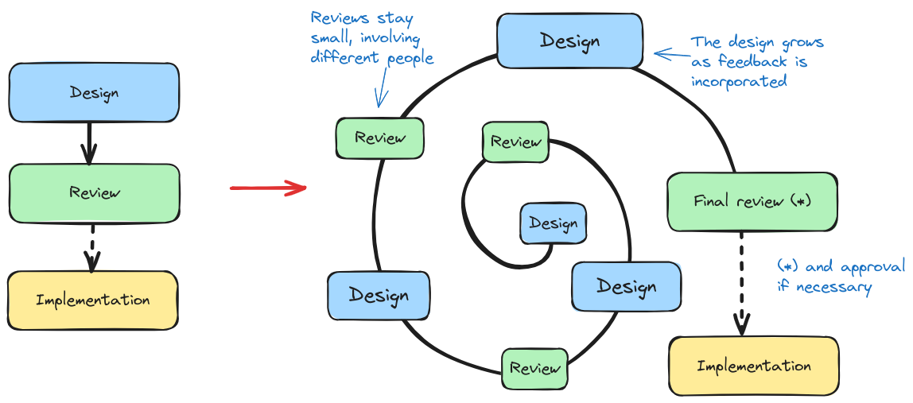

**What** is a design document? **When** is it useful to have one? **How** to
make it useful? These are the questions I'm going to address in this post. The
goal is to provide some bite sized, easy to remember guidelines. My promise to
you is that after this post, you'll be faster and more effective in making and
reviewing designs.

This is a written version of a talk I gave at my current employer. Since it was
well received and helped a few folks, I decided to make it more available.

## Why this?

I'm not a professional technical writer. I'm not even the best writer among my
peers. Why am I even trying to address this complex topic? Well, I happen to
have seen lots of design docs (and written a few) over the years. Some
excellent, some awful, and everything in between. I collected patterns and made
my own perspective.

The first goal of this is to help people struggling to write or get attention on
their designs. My secondary goal is definitely selfish, as I'm hoping to reduce
the percentage of design docs reviews I need to make that are physically
painful.

To be fair, I've written my fair share of painful-to-read docs. You can even
scroll back in time in this blog to see some great examples of bad writing. The
third goal is then to pay back some of this debt.

## What is the purpose of a design doc?

The answer is, as always, *it depends*. But among the various things a design
doc could be, I'm not going to focus on:

* Implementation manuals,
* Detailed requirement documents,
* Novels,
* Brain dumps.

These may all be valid *written documents* in certain contexts. For example, a
detailed specification document might be necessary when writing the actual code
is offloaded to contractors, or when specifications are legally required (e.g.
aerospace or safety critical domains). Brain dumps are useful while
brainstorming. Novels are a pleasure to read, and so forth.

Nevertheless, the focus is here on organizations of *software engineers* that
own software end-to-end. The goal of a design doc there is to solve a problem
collaboratively, rather than fulfilling red tape or legal requirements. This is
the attitude you commonly see in today's tech companies (established and
startups alike).

Design docs are also most definitely **not perfect**. We're not trying to win the
Pulitzer prize, but solve a concrete problem in a timely and effective manner.

In this context, the **key purposes** of a design doc are instead:

1. **Improve the understanding** of a problem and its domain (of author and
   reviewers).
2. **Drive alignment**, to get to a better solution faster (and more cheaply)
   than trial and error.

Although these are the main goals that we'll use to build our guiding
principles, good design docs come with side benefits:

* Documentation: they serve as organizational memory, ease knowledge transfer
  and onboarding.
* Easier stakeholder communication.
* Lower the cost of failure (a discarded design is cheaper than a discarded
  implementation).
* Serve as artifacts for engineers (in performance reviews).
* Enable asynchronous discussion.

Does every decision need to be a design document? Absolutely not! Smaller scope
or easily reversible decisions might need just a simple code review or an email.

## How to make a good design doc?

The idea is simple: we take the two goals above and follow the implications
logically to build the principles below. Since there's no perfect structure, and
we don't have infinite time, we'll also need to be pragmatic in applying them.
Sometimes not all the principles are necessary or useful, but it's still good to
keep in mind when we deviate and why.

### 1. Know your audience

**Who** needs to read the document? What's their background? What are they
worried about? The target audience of the document informs its **main focus**.

For example, if the audience is internal to the team, there needs to be less
background information and perhaps more implementation detail. For cross-team
reviews? The focus should be on cross-team interfaces and responsibilities. For
executives or product managers? Success metrics and business impact should be
the main focus.

Getting the audience wrong will generate more questions during reviews and waste
precious space on the doc with unwanted details. Using the same document for two
vastly different audiences will make them both unhappy. Split it into two
smaller documents instead.

Do your audience a favor and tailor your document to their needs. This will
improve their understanding of the problem and solution.

### 2. Timing

The document should arrive in a timely manner. There's a time for designing, a
time for experimentation and one for implementing. Outside a window of
opportunity, design documents are no longer useful.

It's common advice that designs should be shared early, but there's a limit to
it. Sharing a design before doing any experimentation might be a waste of time.
Too many options unexplored and unclear direction. Sharing something too rough
with a wide audience attracts brutal reviews, where the document is ripped apart
line by line.

At the same time, sharing after implementation started is too late! Changing
direction based on feedback at this point in time is expensive and might be
unfeasible. What's the point of the design, then? Ticking a box in your next
performance review?

### 3: Explain reasoning

Explaining how a solution works is not enough. It's even more important to
explain **why**:

* **Why** do we even have a problem (worth solving)?
* **Why** are we picking this solution?
* What are **the alternatives** we didn't pick and **why**?

Why is much more important than how. If you need to cut anything, cut
implementation detail over reasoning and alternatives. This will improve
understanding now, but also answer future questions of people digging and
wondering "why didn't we do that instead?". Your future self and colleagues will
thank you.

### 4: Clear scope and abstraction level

This tracks back to [#1](#1-know-your-audience), but focuses on scoping. Given
an audience, focus on **one problem** (or class of problems) to solve and **one
abstraction level**. Don't mix detailed requirements with implementation details.
It will make the document too large and difficult to follow.

In addition, place the document in a context: what is related work? What is the
area, project or overarching effort? How does this work fit into the greater
context? Add pointers to these to help place the doc logically in people's
heads.

If a document is becoming too large, **split it up!** Keep a shorter high level
overview and add pointers to separate documents focusing on sub-parts with
additional details. This has the additional benefit of **allowing multiple
people to design sub-parts** (delegation) and still keep efforts in harmony. It
also keeps the abstraction levels and scoping clear, allowing reviews from the
right set of people on each document, as they can be different.

### 5: Simple

Nobody's got time to read your doc. Assume **casual reading** from busy people.
Assume no in-depth knowledge of the topic (unless proven otherwise). Keep
sentences short and simple. Keep the document short. Add pictures and diagrams
whenever possible.

Be kind to your reviewers and their time. You'll get quicker and better
feedback.

### 6: Important information first

Reader's attention will drop after just a couple of pages. Keep the objective
and main idea in the first page. Details, alternatives and future work should be
at the bottom. This maximizes return over readers' attention.

For example, put meeting notes, alternatives considered and implementation
details at the bottom of the document. Keep objective, TL;DR, metadata and
diagrams at the top.

### 7: Clear status

Readers should have an easy time understanding whether to provide feedback and
to whom. Document metadata serves this purpose. Who is the author? When did they
write it? What's the current state (under review, approved, abandoned or
implemented)?

At a minimum, there should be:

* Owners
* Date of last update
* Review / implementation status
* Link to bugs (e.g. Jira issues)

When you come across an old doc you own, take the time to update its metadata
when necessary.

### 8: Data and metrics

If the problem is not self-evident, quantify it. **How much** of a problem is
it? Define **success metrics** and predict the **impact** of the solution (e.g.
x% faster, \$\$ saved per year, etc.).

This is not always relevant or feasible, but very important for more expensive
and broader scope efforts (e.g. when multiple teams are involved). Also keep in
mind that executives love numbers on things they review.

### 9: Good title (bonus)

Having a memorable title is a nice plus. It will help people remember and refer
to it more easily. It can also prime the reader towards the proposed solution.
You can think of the title as prime real estate on the document, so it should be
used wisely.

For example, consider a document aimed to solve observability issues in a
service. The idea is to get SRE involved in a subset of the service. Compare
these two titles:

1. Addressing noisy alerts in ServiceX
2. ServiceX monitoring responsibilities: TeamX and SRE

While the first version talks about a symptom, the second version already
suggests what the proposal is. This will prime the reader to look into where the
responsibilities are shifted, which is the most important part.

## Efficient creation process

How do you go from a blank page to something good enough to guide an
implementation? The mistake most people make here is to simply sit on the design
and refine it for weeks or months before sharing. By that point, the idea and
its implementation became too precious. Too much time was invested, and it's too
expensive and emotionally distressing for the author to part away from their
child.

Documents designed for too long tend to result in charged reviews. On the one
hand, authors are very invested in the idea, on the other, their isolation from
reviewers will oftentimes lead to suboptimal proposals. This generates many
questions and comments asking for changes, especially when the audience is
broad. The discussion might become heated.

What is the mistake here? The problem is considering that a design is "done
once", perfected and then presented to the target audience (waterfall model).
Reviewers are treated as gatekeepers. They should approve or object to the
design during that latter phase.

Sharing a document with everyone before it's ready is also problematic, because
you will likely still get too much feedback from many people, and it might be
distracting and useless. This is the more true, the broader the target audience.

The better way to design something is to iterate on both document and target
audience:

1. Discuss
2. Dump knowledge, incorporate feedback
3. Organize
4. Share with a few (more)
5. Iterate, incorporate comments (go to #2)
6. Maintain until the implementation is finished, then archive

Ideally, authors should not spend more than a few hours on a document before
sharing. Terrible ideas will be weeded out during early iterations, while the
document is not polished.

Questions from early reviewers really show where the document is missing details
or is making weak assumptions. Make sure those are addressed in the document
directly, rather than just replying to the questions during the review.

In case formal review and approval is necessary, this can be done during later
iterations, when most of the target audience has already seen and discussed the
contents. This ensures a smoother review.

## Structure

There's no perfect structure. You'll see that different formats are used or even
imposed in different companies. I personally don't think imposing a structure is
useful, except for more inexperienced teams and authors, or in companies where
reviews are very formalized and structured.

My personal go-to starter structure for a technical design is the following:

* Title + metadata (author, date, status, issue link)
* Objective
* Requirements
* Background
* Proposal
* Alternatives considered

From this structure, I will add or remove sections depending on the domain and
audience. I might, for example, put more emphasis in security considerations and
therefore add a specific section for that.

Note also that this structure will not work for retrospectives, nor project
proposals, where the emphasis is on different points (the past in the former,
the responsibilities and problem analysis in the latter).

## Alternatives

### Amazon's 6-pager

The famous [Amazon's
6-pager](https://writingcooperative.com/the-anatomy-of-an-amazon-6-pager-fc79f31a41c9)
comes with a prescribed structure and length. The prose is basically a wall of
text without links, nor pictures (except for the appendix). The review is a
formalized meeting where leads read print-outs of the document. The focus is
really on an in-person, synchronous review, which requires lots of preparation
and can be painful. The differences stop there. The rest of the approach is the
same as the one I described: focus on the audience, clarity and simplicity,
reasoning.

I personally prefer asynchronous and incremental reviews, as these tend to be
cheaper and less emotionally charged. However, given how successful Amazon is,
their approach is clearly working as well :)

### Architecture Decision Records

An alternative is [Architecture Decision
Records](https://www.cognitect.com/blog/2011/11/15/documenting-architecture-decisions)
(ADRs). Their focus is on the decisions being made and their consequences. The
proposed structure is: context, decision, status and consequences. I really like
the approach because of its simplicity. What are you changing, how, and what is
the expected result? What is becoming easier, and what harder as a consequence?
These are the questions answered by ADRs, which help to make decisions but also
serve as documentation for the future.

The only thing I'm missing from ADRs is the discussion about alternative options
and why they weren't picked. They can nevertheless serve as a very good starting
point for a design document.

### Do nothing

The most important alternative, I would always like to see in a design, is the
default "do nothing" option. I'm going to add it here as well: what about not
using design docs at all? For example, doing decisions through very small,
incremental changes that can be discussed within a team, or having a lead making
those decisions. One prominent proponent of this idea is 37 Signals, which
[suggests](https://basecamp.com/gettingreal/11.2-dont-do-dead-documents) not
using designs at all and if really forced, "this process shouldn't take more
than one day". The focus is on mocks and coding instead.

There are areas where this can work just fine, especially with [two-way
doors](https://aws.amazon.com/executive-insights/content/how-amazon-defines-and-operationalizes-a-day-1-culture/)
decisions, or UI changes for an app. I didn't find this working well enough when
decisions impact multiple teams or are not easily reversible. For example,
security or data protection changes cannot be made without deliberate
discussions. Large architectural changes or new technologies also require
scrutiny and discussion. Failing that, organizations will rely on decisions
being made by the quickest person implementing them, or leaders in an
untransparent way. Both of which result in suboptimal and sometimes disastrous
results. A common example of that is introducing a new technology just because
someone wants to learn it, rather than solving a real problem. We all know how
this ends: people introducing this new technology leave and the remaining are
stuck with an inconsistent architecture. This can happen multiple times, until
the result is so unnecessarily complex that every successive change requires a
lot of discussion or is plain impossible. If design docs are not used here
either, this means many repetitive meetings and slow progress.

## Conclusions

Design documents should not be a pain to read and write. They should not slow
people down, nor make them feel stupid. They should be used as a
[shift-left](https://en.wikipedia.org/wiki/Shift-left_testing) tool to iterate
on ideas collaboratively, efficiently and transparently. Furthermore, they
should serve as an accelerator for quality and knowledge sharing.

To facilitate moving from painful to useful, keep in mind the following key goals of a doc:

* Facilitate understanding.
* Drive alignment.

Translate that into practice by paying attention to the following principles:

1. Know your audience
2. Get the timing right
3. Explain reasoning, discuss alternatives
4. Keep scope and abstraction level consistent
5. Keep it simple and short
6. Put important information first
7. Add metadata
8. Use data and metrics to help quantify problems and solutions (when necessary)
9. Come up with a memorable title

Obviously, this is coming from my own experience. Your mileage may vary and so
forth. I would be definitely curious to hear different opinions on the matter!

## References

In writing this, I also took inspiration from the following references:

* Scott Adams, [The day you became a better
  writer](https://web.archive.org/web/20230521020635/https://dilbertblog.typepad.com/the_dilbert_blog/2007/06/the_day_you_bec.html).
* [Design docs at
  Google](https://www.industrialempathy.com/posts/design-docs-at-google/).
* [Kubernetes KEP
  process](https://github.com/kubernetes/enhancements/blob/91fb85c4084bcc89d524fd9d8cd4152e7577b65d/keps/README.md).
* [Rust RFC process](https://github.com/rust-lang/rfcs).
