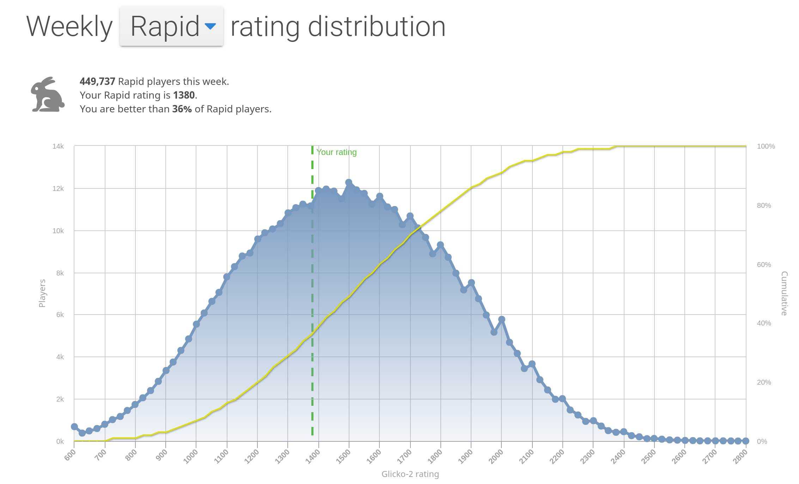
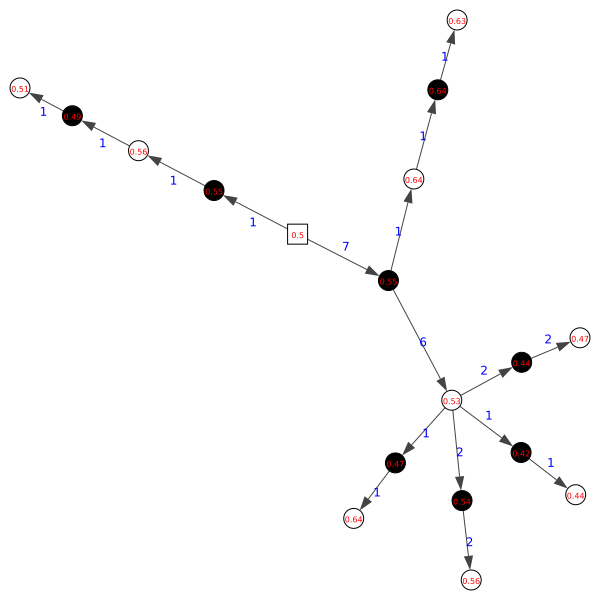
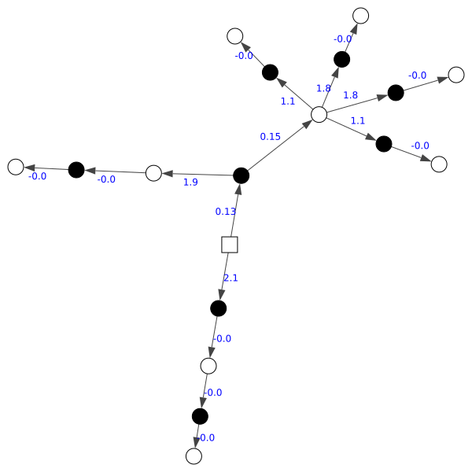
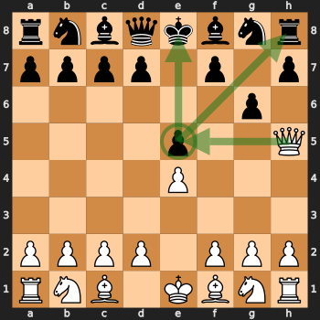
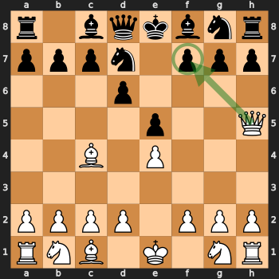
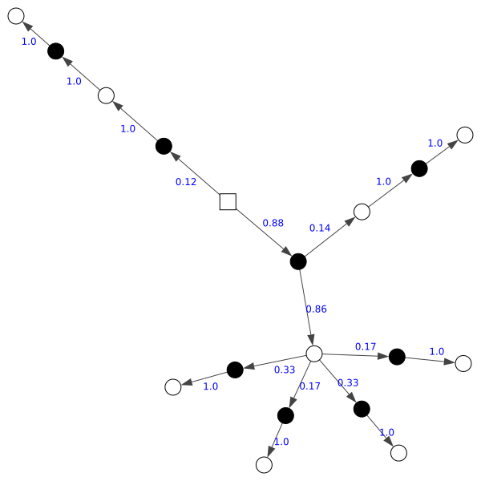

This is the story of me trying to win a game of chess against my brother. A
single freaking game. What's so special about it? Am I good at chess? Not at
all. Did I improve at my game in the process? Also no. Is it a story about "the
journey rather than the destination"? Not really. Did I at least have fun in
the process? Not so sure. This is the story of me trying to be unconventional
at probably the most studied game in existence and using my software
engineering background for something that probably doesn't need it.

Although I'm a total disaster at chess and this post is useless to whoever
seriously wants to improve at their game, I still thought it was worth sharing
how it's possible to apply software engineering principles to a problem. Was I
successful? You'll see at the end.

## Intro: why I got into chess

During the 2020 COVID19 pandemic, my brother, along with many other people,
took a passion for playing online chess. After playing for a couple of months
he started speaking very enthusiastically about it and challenging other family
members, but where my father would budge (and get digitally butchered) I
wouldn't. For one thing, I refrained myself from delving into a potentially
very time consuming hobby. I knew enough about chess to understand that to be
only a mediocre amateur club player you'd still need to sink hundreds if not
thousands of hours in the game. I admit I also didn't like the thought of
losing against my brother, which was certain at the time, since he already had
hundreds of games under his belt and I had none.

Then one day I finally gave in and accepted a challenge from him. Needless to
say that I lost completely. I knew the rules and the rudimentary of the game,
having played a little bit as a kid, but my brother was obviously no match.
Looking at the post-game analysis in [chess.com](https://www.chess.com) I saw
that my disadvantage only grew, move by move, until reaching a +9 evaluation
(equivalent to having lost one rook, a bishop and a pawn to zero), which is
beyond any hope for a comeback, where I resigned. This blueprint was followed
for another couple of matches, where I understood I had to do something to
avoid being demolished every time.

This is when I decided I wanted to study the game a bit more.

## First attempt: learn

My first attempt in trying to improve at the game was to do the obvious: head
to Reddit and YouTube to see what other learners recommend. Between a tutorial
from [GM Naroditsky](https://www.youtube.com/channel/UCHP9CdeguNUI-_nBv_UXBhw),
some reading and puzzle solving on [Lichess](https://lichess.org) I also played
a few games with random people on the Internet. My rating stayed pretty low
nevertheless (1300 - 1400 Rapid on Lichess).



After another couple of lost matches against my brother, it dawned on me that I
had no hope of beating him. I was following his same steps to improve (playing,
studying the game, watching videos), but I was dedicating much less time. At
that point he was playing hundreds of games a month and I was willing to play
maybe 10. At that pace I was only going to get further and further behind.

It was at that point that I had my second realization: I didn't really care
about the game, I didn't want to really improve at chess in general, I only
cared about beating a single person: my brother.

## Second attempt: study the opponent

A chess match can be generally divided into three phases: the
[opening](https://en.wikipedia.org/wiki/Chess_opening), the
[middlegame](https://en.wikipedia.org/wiki/Chess_middlegame) and the
[endgame](https://en.wikipedia.org/wiki/Chess_endgame). Converting a
significant advantage into a victory during an endgame is usually easy, after
studying some
[basic checkmate patterns](https://en.wikipedia.org/wiki/Checkmate#Basic_checkmates),
so the question for me was how to get that advantage in the first place.
Gaining advantage during a middlegame is usually achieved by long-term
[strategy](https://en.wikipedia.org/wiki/Chess_strategy) and
[tactics](https://en.wikipedia.org/wiki/Chess_tactic). The first can be
improved by reading and studying the game principles (something I can enjoy)
while the second is only possible by doing
[puzzles](https://en.wikipedia.org/wiki/Chess_puzzle) (which I don't
particularly like). I knew that I would be at a disadvantage here, given that
my brother used to do about 20 puzzles a day on chess.com, something I would
never be able to catch up to. This only left one possibility: gaining advantage
during the opening.

Chess opening theory is humongous and involves memorizing long sequences and
variations of moves, along with possible replies from the opponent. Beginners
don't really need to memorize much, but some familiarity with the most common
openings can go a long way (or so I was told). What I tried then was to look at
some random games that my brother played and try to study the openings he was
using. I looked at the [Italian opening](https://lichess.org/study/vJsZScnC)
and [Sicilian defense](https://lichess.org/study/jsSks17H) on Lichess and tried
to memorize the basic ideas behind those. I also watched a bunch of videos on
YouTube.

Obviously my brother did all of this already before me (better) and so I
understandably lost again. Not to mention that memorizing meaningless (at least
to me) opening moves is boring and laborious. I didn't really have fun doing
any of that. Another issue was that after my opponent deviated from the known
book moves I had no idea about how to react, because I didn't really understand
the positions.

It was time to step back and think again. I realized then I wasn't really
trying to beat my brother, but I was trying to improve my game against
opponents that played his same openings perfectly. Could I be more specific?
Could I prepare against my brother's weaknesses instead? Obviously this
wouldn't work against any player other than him, but that still satisfied my
goal.

## Third attempt: engineering

The problem to solve became: find positions out of the opening that my brother
(PlayerX from now on, for simplicity) would likely reach and be at a
disadvantage. Remember that neither of us is an expert of the game and at our
level players don't play very accurately. The only way to play against a good
player would be to follow book moves accurately, because you at least know in
advance there's no move they can make to get an advantage. The story is
different when you play against a club player. You can take risks (i.e. be
temporarily at a disadvantage) if you know that your opponent is unlikely to be
able to find the correct response and so get into trouble.

I also had a list of over 500 games my brother played on chess.com. Being a
software engineer it came natural to me approaching this as any other
engineering problem.

I started by downloading the games he played by using the
[chess.com APIs](https://www.chess.com/news/view/published-data-api) and split
them between black and white games. I focused on the games he played as black,
given that I felt I had better chances at guiding the game where I wanted if I
played as white.

```python
import json
import requests

def get_month_games(player, yyyy_mm):
    url = 'https://api.chess.com/pub/player/{}/games/{}'
    r = requests.get(url.format(player, yyyy_mm))
    if not r.ok:
        raise Exception('get_month_games failed')
    games = json.loads(r.content)
    # Format: {games: [{url, pgn}, ...]}
    return games['games']

# ...
```

```python
import chess.pgn
import io
import json

with open('games.json') as f:
    data = json.load(f)

games = []
for game in data:
    pgn = io.StringIO(game)
    games.append(chess.pgn.read_game(pgn))

black_games = [g for g in games if g.headers["Black"] == "playerx"]
```

Then I formulated the problem in this way: "Given all the positions PlayerX has
seen, what are the ones that he's likely to reach out of the opening where he
is at a substantial disadvantage?".

Now I had a well formulated problem and I was finally playing in a domain I was
familiar with. I decided to do my analysis in Python and in particular to use a
[Jupyter notebook](https://jupyter.org/), because I didn't really want to
create a reusable tool, but only to explore the data and find one solution for
the data I had available. It turns out Python already has pretty amazing
libraries to manipulate chess games:
[python-chess](https://python-chess.readthedocs.io/) (moves generation,
validation, visualization) and [python
stockfish](https://pypi.org/project/stockfish/) (bindings to evaluate a chess
position by using the very famous Stockfish engine).

I translated the problem into a graph problem in this way: A node is a
particular chess position (described in
[FEN notation](https://en.wikipedia.org/wiki/Forsyth%E2%80%93Edwards_Notation)).
An edge links two nodes where the destination is reachable from the source
position by doing a valid move. There's a special initial node that is common
to all games: the initial position.

I then constructed the graph of all games played by PlayerX as black,
additionally annotating every edge with the number of times the particular move
was played. What results is weighted directed graph (not a tree because a
position can be reached with different sequences of moves) similar to this one:



Here the initial position is the squared node, the color indicates whether
from that position it's black or white's turn.

I also wanted then an evaluation of each position in terms of advantage for
white and to do so I used Stockfish. Given that the process of evaluating
thousands of positions is somewhat time consuming, I decided to do that
separately and create a JSON object mapping each unique FEN position to its
Stockfish evaluation.

```python
from stockfish import Stockfish

stock = Stockfish(parameters={"Threads": 8})
stock.set_depth(20)
stock.set_skill_level(20)

def eval_pos(fen):
    stock.set_fen_position(fen)
    return stock.get_evaluation()

# fens is a map between a FEN string and a node of the graph.
for fen, node in graph.fens.items():
    node.eva = eval_pos(fen)
```

The evaluation is returned in centipawn advantage [TODO link] or mate in X
moves, where a positive number means advantage for white and negative is an
advantage for black:

```python
{"type":"cp", "value":12}    # 12 centipawns advantage for white.
{"type":"mate", "value":-3}  # Black has mate in three.
```

100 centipawns represent the advantage of having one more pawn than your
opponent and 300 is a minor piece like a bishop. Note however that Stockfish
assigns a value to pieces depending on their position, so it's entirely
possible to have an advantage of 1000 even if the pieces on the board are
equal.

I needed to map this evaluation into something more manageable, like a number
between 0 and 1. To do so, I decided arbitrarily that an advantage of 300+ is
mapped to 1.0 and a disadvantage of 300+ is mapped to 0. Additionally, any mate
in X (even if X is 20) is 1 or 0.

```python
def compute_edges_weight(vertex):
    all_count = sum(map(lambda x: x["count"], vertex.out_edges()))
    for edge in vertex.out_edges():
        prob = edge["count"] / all_count
        edge["prob"] = prob
        edge["weight"] = -math.log(prob)
```

The information was then all there, I just needed to find nodes in the graph
(i.e. positions) where black was at a disadvantage, along with the sequence of
moves that was most likely to reach it. I needed to weigh the edges in such a
way that it was possible to easily compute the probability to reach a certain
position. My reasoning was as follow:

* At every position, we can evaluate the probability of doing a certain move by
  dividing the number of times the corresponding edge was taken by the total
  number of moves done from that position.
* Every edge will now have a weight between 0 and 1, where the higher the
  number, the higher the probability the edge will be taken from that position.
* The probability of a certain path is then the product of the probability of
  all the traversed edges.

To solve the problem with standard graph algorithms I needed to transform the
weights at the edges in such a way that:

* They represent a distance instead of a probability (i.e. the higher the
  distance, the lower the probability of the path).
* The distance between two nodes is the sum of the weights of the traversed
  edge (as opposed to the product of probabilities).

This is actually easier to do than to explain. The actual formula is very
simple:

```
distance(e) = -log(prob(e))
```

Taking the logarithm of the probability of an edge will give a negative number
by design, given that the probability is between 0 and 1. We don't have to
worry about the case of probability zero (which would shoot the logarithm to
minus infinity), as every edge of the graph has been taken at least once. The
lower the probability, the more negative the logarithm will be, so inverting
its sign will make it satisfy our requirements, because:

* The sum of logarithms is the same as the logarithm of the product of their
  arguments: `log(a) + log(b) = log(a*b)`.
* The bigger the result, the lower the underlying probability.



Equipped with this data, we can compute the [shortest
path](https://en.wikipedia.org/wiki/Shortest_path_problem) between the initial
node and all other nodes by using
[Dijkstra's algorithm](https://en.wikipedia.org/wiki/Dijkstra%27s_algorithm).
The result is a mapping between every node and the shortest path to the initial
position, which represents the sequence of moves most likely to land in that
position.

At that point I arbitrarily chose a minimum advantage and sorted the paths by
probability. The first few paths represented my best chances to gain an
advantage out of the opening against PlayerX.

### Tweaks

What did I find? This was a position returned by the algorithm above (white to
move):



As you can see the situation for black is pretty bad (+8.9 according to
Stockfish), because g6, the last move for black, was a mistake. White will go
on and eat the e5 pawn and the rook. The game for black is pretty much over, as
they scramble to save the knight, the h7 pawn and the bishop. Another result
was this one (white to move):



Which is mate in one move
([Scholar's mate](https://en.wikipedia.org/wiki/Scholar%27s_mate)).

The problem here is that these were mistakes done several times by PlayerX only
during his first matches and never repeated again. Early queen attacks are
usually carried out by very inexperienced players and they are effective only
against players at that level. PlayerX didn't fall for that trap for a long
time afterwards, because better opponents don't play that kind of move! I knew
that I couldn't really use this opening, because PlayerX knew how to defend
against it now and would not fall for it anymore.

Another problem was related to sequences of moves that happened only once, but
coming from common positions. The probability of the final position was the
same as the probability of the last common position, because every edge had a
probability of 1.0 (given that no other possibilities have been played). In the
example below (edges marked with their probabilities), you can follow the edges
with 7 and 6 (the most common position at move 2), but then follow one of the
edges with a 1. From that point on, all the subsequent moves will have been
played only once (i.e. probability 1.0) and so retain the probability of the
previous move.


And this is how the probabilities look like:



This is intuitively incorrect, as it's improbable that the same exact sequence
of moves will be played with absolute certainty.

The famous quote (from Brewster?) "In theory there is no difference between
theory and practice, while in practice there is", was true in this case as
well, so I needed a few tweaks and manual inspection to find better candidate
positions.

To correct the second problem I decided to put an upper bound to the
probability of an edge, so long sequences of moves played only once will
gradually lose probability. For the first problem I just manually screened out
bad suggestions. At the end of the day I only needed one or two good positions
to work on.

One more tweak was related to the fact that I didn't want white's probabilities
to affect the probability of the paths, because I was playing white and could
decide which path to take. For that reason I set all whites probabilities to
1.0 (a zero weight). The end result is a graph like this one:

[graph with final weights]

### Preparation

The position I settled on studying was this one:

[alekhine.svg]

According to Lichess this is an Alekhine defense (two pawn attack). In this
position there's only one good move for black (Nb6) and black is still at a
slight disadvantage (+0.6 according to Stockfish). However, from that position
PlayerX often plays Nf4, which is bad (+2.3). I created a study in Lichess and
started looking at several variations (good moves and moves played by PlayerX).
The end result was a tree of possibilities that I tried to memorize and
understand. For example I needed to know what a move like d5 was threatening,
why the move Nf4 was bad and prepare the best responses.

I didn't spend much time doing this because I got bored pretty quickly, but I
did prepare a bit for the upcoming match.

## The match

As if I were predicting the future, in my match against PlayerX, we got into an
Alekhine defense. Put under pressure he did end up blundering his knight at
move 5. Turns out even players much better than you end up making one mistake
after another when they are at a disadvantage. At move 10 I was at a +7.1
advantage, pretty much impossible to lose, but I was also out of my
preparation:

[game-opening.svg]

I started making a bunch of mistakes from that point on, but I nevertheless was
able to keep a non trivial advantage until move 27:

[game-mid.svg]

Unfortunately I was very low on time (it was a rapid 10 minutes game) and so I
had to move quickly. I ended up messing up completely move 32 and 33, giving my
half-dead opponent mate in one :/.

[game-end.svg]

Here's the full match:[^1]

<iframe src="https://lichess.org/embed/2qKKl2MI?theme=auto&bg=auto" width=600 height=397 frameborder=0></iframe>

## Conclusion

What did I learn from this endeavour? A few things, most of which seem obvious
in retrospect:

1. Preparing for a specific opponent can give a considerable edge during the
   opening.
2. Players at lower levels aren't good at punishing dubious moves from the
   opponent. Getting into tricky positions where only one response is correct
   are easy ways to gain an advantage.
3. The opening isn't everything. If you are bad at time management and tactics,
   it's possible to lose completely winning positions. Chess games can be
   decided by one bad move.
4. Studying the game is important and there's no silver bullet if your opponent
   is much better than you, but narrowing the skill gap is possible.
5. Applying software engineering principles to chess is fun. Doing it to have a
   chance at beating your brother is even more fun! I hope I'll be able to do
   it one day :)

You can find the code I used in my GitHub repo: [TODO link to my repo]. Note
that I did not include the data and the project is quite messy, but I hope this
can be some inspiration for you. If you are considering whether to study
computer science, whether being a software developer might be for you or not, I
hope this post can be some fun glimpse into how interesting it can be to solve
"real world problems" with a computer. It makes you feel you have an additional
tool under your belt.

That's all folks, I hope I'll be able to win a match against my brother some
day, but until then, I'll keep trying... my own way.


[^1]: Original usernames are edited out because I didn't ask my brother's
permission to post the match. I also still hope to try this trick one more time
on him before he finds out :)
