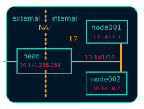
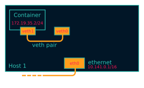
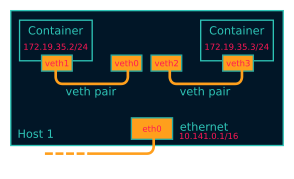
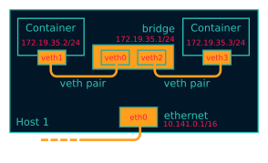
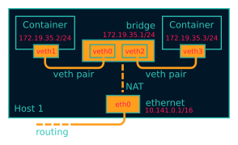
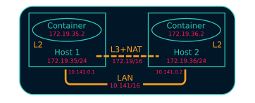
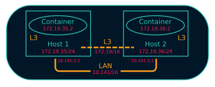
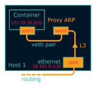

Over the last year, at work I had multiple chances to debug how containers work.
Recently we had to solve some networking problems a customer had with
[Kubernetes](https://kubernetes.io/), and I decided I wanted to know more. Once
the problem was solved, I spent more time on investigating what is actually
going on under the hood. After seeing the wonderful
[Eric Chiang](https://youtu.be/wyqoi52k5jM) and
[Laurent Bernaille](https://youtu.be/b3XDl0YsVsg) talks, and reading through
the very informative posts by
[Lizzie Dixon](https://blog.lizzie.io/linux-containers-in-500-loc.html) and
[Julia Evans](http://jvns.ca/blog/2016/10/10/what-even-is-a-container/)
(that I really really recommend), I got enough information about how a
container is created and managed. I'm going to rip off and mix some stuff from
their awesome posts in the first part of mine.

What I missed in those talks was the networking part. How do containers talk to
each other? In Bernaille's talk there is some information, but I after seeing
the video I was still not convinced completely. I was especially interested
about how [Calico](https://www.projectcalico.org/) works, and for that I could
find very little information.

To answer this kind of questions I will try to create containers from scratch,
by using just standard Linux commands. I will also setup the networking to make
them happily communicate, again from scratch. I like this approach because it
gets low level enough to demystify things that look very complicated, while it's
just a matter of spending some time to understand the basics.

This post is an extended version of a talk I gave internally at my company,
trying to shed some light on the subject.

Prerequisites for a good understanding are some basic networking and Linux
concepts:

-   the [OSI model](https://en.wikipedia.org/wiki/OSI_model), and in particular
    level 2 and 3;
-   IP networking and the [CIDR
    notation](https://en.wikipedia.org/wiki/Classless_Inter-Domain_Routing#CIDR_notation);
-   NAT ([Network Address
    Translation](https://en.wikipedia.org/wiki/Network_address_translation)).

I will link the advanced topics as the post unfolds.


## Containers from scratch

Rise your hand if you ever tried the magic of [Docker](https://www.docker.com/)
at least once. You pull an image from the Internet, you run it and you are
projected inside another OS, with different libraries and applications
installed, and all of that in no time. But how magic is a container after all?
Is it composed by very complicated tools? Is it a sort of virtual machine? In
the first part of this post I'm going to create a container from scratch, by
using only a Linux shell and standard Linux commands, to try to answer these
questions.


### Prepare the image

When you do a `docker pull` you are downloading a container image from the
Internet. This image at its core is basically just a root filesystem. You can
safely ignore the fact that it's composed by multiple stacked layers, because
the end result is just a root filesystem.

So we can try to make our own, and for this post I decided to go with [Alpine
Linux](https://alpinelinux.org/), because it's small and it's different from my
distribution.[^1]
Needless to say that for this to work you have to be running on Linux and with a
fairly recent Kernel. I haven't checked the specific requirements, but if you
updated your system in the last 5 years,[^2] you're probably good to go.

Be powerful, be root. You'll save yourself a lot of `sudo` invocations and
annoying "permission denied" messages:

```
sudo su
```

Download the mini root filesystem from the Alpine website and put it somewhere.
Then extract it:

```
mkdir rootfs
cd rootfs
tar xf ../alpine-minirootfs-3.6.2-x86_64.tar.gz
```

if you look there, you'll see the root filesystem:

```
[root@mike-dell rootfs]# ls -l
total 64
drwxr-xr-x  2 root root 4096 Aug 13 16:22 bin
drwxr-xr-x  4 root root 4096 Jun 17 11:46 dev
drwxr-xr-x 15 root root 4096 Aug 13 16:26 etc
drwxr-xr-x  2 root root 4096 Jun 17 11:46 home
drwxr-xr-x  5 root root 4096 Aug 13 16:22 lib
drwxr-xr-x  5 root root 4096 Jun 17 11:46 media
drwxr-xr-x  2 root root 4096 Jun 17 11:46 mnt
dr-xr-xr-x  2 root root 4096 Jun 17 11:46 proc
drwx------  2 root root 4096 Aug 13 16:08 root
drwxr-xr-x  2 root root 4096 Jun 17 11:46 run
drwxr-xr-x  2 root root 4096 Jun 17 11:46 sbin
drwxr-xr-x  2 root root 4096 Jun 17 11:46 srv
drwxr-xr-x  2 root root 4096 Jun 17 11:46 sys
drwxrwxrwt  2 root root 4096 Jun 17 11:46 tmp
drwxr-xr-x  7 root root 4096 Jun 17 11:46 usr
drwxr-xr-x 13 root root 4096 Aug 13 16:22 var
```


### chroot

Now let's try to `chroot` there. In this way we create a process and change its
root directory to the one we just created:

```
chroot rootfs /bin/ash
export PATH=/bin:/usr/bin:/sbin
```

This will execute a shell inside the chroot environment. Side note: exporting a
new `$PATH` (the second command) is wise, because otherwise you'd be carrying
your host `$PATH` in the chroot, and this might not be correct there. So where
are we exactly?

```
/ # cat /etc/os-release
NAME="Alpine Linux"
ID=alpine
VERSION_ID=3.6.2
PRETTY_NAME="Alpine Linux v3.6"
HOME_URL="http://alpinelinux.org"
BUG_REPORT_URL="http://bugs.alpinelinux.org"
```

Yes, in Alpine Linux. And you can't reach your host files anymore, because your
root directory is now the one we just chroot-ed into.

Let's now install some useful packages. They'll come in handy for later:

```
apk add --no-cache python findmnt curl libcap bind-tools
```

Another thing we have to fix now is the `/proc` filesystem. If you look there
you'll see that it's empty so any utility like `ps` won't work:

```
mount -t proc proc /proc
```

Now a question for you: Is this actually a container?

Sort-of, but the isolation is pretty poor. Take a look at `ps aux` from the
"container":

```
/ # ps aux
PID   USER     TIME   COMMAND
    1 root       0:03 {systemd} /sbin/init
    2 root       0:00 [kthreadd]
    3 root       0:00 [kworker/0:0]
    4 root       0:00 [kworker/0:0H]
    6 root       0:00 [mm_percpu_wq]
    7 root       0:00 [ksoftirqd/0]
    8 root       0:01 [rcu_preempt]
    9 root       0:00 [rcu_sched]
    10 root       0:00 [rcu_bh]
    11 root       0:00 [migration/0]
    12 root       0:00 [watchdog/0]
    13 root       0:00 [cpuhp/0]
    14 root       0:00 [cpuhp/1]
    15 root       0:00 [watchdog/1]
    16 root       0:00 [migration/1]
    17 root       0:00 [ksoftirqd/1]
    19 root       0:00 [kworker/1:0H]
    ...
    2816 1170       0:00 top
```

oops... I can see all the processes of my host from here. An I can actually kill
them:

```
killall top
```

Not only that. Look at the network:

```
/ # ip link
1: lo: <LOOPBACK,UP,LOWER_UP> mtu 65536 qdisc noqueue state UNKNOWN qlen 1000
    link/loopback 00:00:00:00:00:00 brd 00:00:00:00:00:00
3: wlan0: <BROADCAST,MULTICAST,UP,LOWER_UP> mtu 1500 qdisc fq_codel state UP qlen 1000
    link/ether 40:49:0f:fe:c3:05 brd ff:ff:ff:ff:ff:ff
```

You can see my WiFi card for example. I could change the IP, take it down, etc.
Not nice. The answer is then NO, this is not a container, because it's not
isolated enough. This is just a process in a different root filesystem.


### Namespaces

Linux has namespaces to the rescue. As `man 7 namespaces` says:

> A namespace wraps a global system resource in an abstraction that makes it
> appear to the processes within the namespace that they have their own isolated
> instance of the global resource. Changes to the global resource are visible to
> other processes that are members of the namespace, but are invisible to other
> processes. One use of namespaces is to implement containers.

or in other words: we take a resource like the list of processes in the machine,
we make an isolated copy of it, give it to our process and make sure that any
change there is not reflected to the root process list. This is the PID
namespace. Is it hard to set up? Judge by yourself:

```
unshare -p -f chroot rootfs /usr/bin/env -i \
    HOME=/root \
    PATH=/bin:/usr/bin:/sbin:/usr/sbin \
    /bin/ash -l
```

With this command from the host, we create a new process (the `chroot` we used
before) but we put it in a new PID namespace by prepending the `unshare -p`
invocation. This command is nothing fancy, just a handy wrapper around the
`unshare` Linux system call. The `env` command executed after the `chroot` makes
sure that the environment is correctly filled, avoiding us to repeat the
`export` command every time.

Let's take a look at the list of processes now, after we mount `/proc` again:

```
/ # mount -t proc proc /proc
/ # ps
PID   USER     TIME   COMMAND
    1 root       0:00 /bin/ash
    5 root       0:00 ps
```

Oh yes. Now our shell is actually PID 1. How weird is that? And yes, you won't
be able to kill any host process.

From the host you can instead see the containerized process:

```
[root@mike-dell micheleb]# ps aux |grep /ash
root      8552  0.0  0.0   1540   952 pts/3    S+   20:06   0:00 /bin/ash
```

and kill it if you want to.

The PID is not the only namespace you can create, as you can imagine. The
network for example is still the host one:

```
/bin # ip link
1: lo: <LOOPBACK,UP,LOWER_UP> mtu 65536 qdisc noqueue state UNKNOWN qlen 1000
    link/loopback 00:00:00:00:00:00 brd 00:00:00:00:00:00
3: wlan0: <BROADCAST,MULTICAST,UP,LOWER_UP> mtu 1500 qdisc fq_codel state UP qlen 1000
    link/ether 40:49:0f:fe:c3:05 brd ff:ff:ff:ff:ff:ff
```

Let's isolate it then. It's just a matter of adding some flags to `unshare`:

```
unshare -pmn -f chroot rootfs /usr/bin/env -i \
    HOME=/root \
    PATH=/bin:/usr/bin:/sbin:/usr/sbin \
    /bin/ash -l
```

here we are isolating the PID, mount and network namespaces, all at once. And
here is the result:

```
# / ip addr
1: lo: <LOOPBACK> mtu 65536 qdisc noop state DOWN qlen 1000
    link/loopback 00:00:00:00:00:00 brd 00:00:00:00:00:00
# / ping -c1 8.8.8.8
PING 8.8.8.8 (8.8.8.8): 56 data bytes
ping: sendto: Network unreachable
```

Pretty isolated I would say. Topic of the next section will be how to open a
little hole in this isolation and get some containers to communicate somehow.

Before to move on I'd like to put a little disclaimer here. Even though I'm done
with this section, it doesn't mean that with an `unshare` command you get a
fully secure container. Don't go to your boss and say that you want to toss
Docker and use shell scripts because it's the same thing.

What our container is still missing is, for example, resource isolation. We
could crash the machine by creating a lot of processes, or slow it down by
allocating a lot of memory. For this you need to use `cgroups`.[^3]
Then there's the problem you
are still root inside the container, You are limited but you are still pretty
powerful. You could for example change the system clock, reboot the machine, and
other scary things. To control them you'd need to drop some capabilities.[^4]
I won't dig into these
concepts in this post, because they don't affect the networking. All of that
involves just simple Linux system calls and some magic in the `/proc` and
`/sys/fs/cgroup/` filesystems.

I point you though to the excellent resources I linked at the beginning,
especially [Eric Chiang](https://youtu.be/wyqoi52k5jM) and [Lizzie
Dixon](https://blog.lizzie.io/linux-containers-in-500-loc.html), if you are more
curious. I could also write another post on that in the future.

I hope I nevertheless convinced you that a container is nothing more than a
highly configured Linux process. No virtualization and no crazy stuff is going
on here. You could create a container today with just a plain Linux machine, by
calling a bunch of Linux syscalls.


## Networking from scratch

Goal of this section will be to break the isolation we put our container in, and
make it communicate with:

-   a container in the same host;
-   a container in another host;
-   the Internet.

I'm running this experiment in a three nodes cluster. The nodes communicate
through a private network under 10.141/16. The head node has two network
interfaces, so it's able to communicate with both the external and the internal
network. The other two nodes have only one network interface and they can reach
the external network by using the head node as gateway. The following schema
should clarify the situation:




### Communicate within the host

Right now our container is completely isolated. Let's try to at least ping the
same host:

```
/# ping 10.141.0.1
PING 10.141.0.1 (10.141.0.1): 56 data bytes
ping: sendto: Network unreachable
```

It's not working, so the network is isolated. No matter what you do you won't be
able to reach the outside, because the only interface you have there is the
loopback (and it's also down).

```
/# ip link
1: lo: <LOOPBACK> mtu 65536 qdisc noop state DOWN qlen 1000
    link/loopback 00:00:00:00:00:00 brd 00:00:00:00:00:00
```

If you create another container on the same host, you can imagine they're not
going to be able to communicate either.

How do we solve this problem? We use a veth pair, which stands for Virtual
Ethernet pair. As the name suggests, a veth pair is a pair of virtual
interfaces, that act as an Ethernet cable. Whatever comes into one end, goes to
the other. Sounds useful? Yes, because we can move one end of the pair inside
the container, and keep the other end in the host. So we are basically piercing
a hole in the container to slide our little virtual wire in.

In another shell, same host, let's setup a `$CPID` variable to help us remember
what is the container PID:[^5]

```
CPID=$(ps -C ash -o pid= | tr -d ' ')
```

Let's create the veth pair with `iproute`,[^6]
move one end into the container and bring the host end up:

```
ip link add veth0 type veth peer name veth1
ip link set veth1 netns $CPID
ip link set dev veth0 up
```

If you take a look at the interfaces in the container now, you'll see something
like:

```
/# ip l
1: lo: <LOOPBACK> mtu 65536 qdisc noop state DOWN qlen 1000
    link/loopback 00:00:00:00:00:00 brd 00:00:00:00:00:00
3: veth1@if4: <BROADCAST,MULTICAST,M-DOWN> mtu 1500 qdisc noop state DOWN qlen 1000
    link/ether 8e:7f:62:52:76:71 brd ff:ff:ff:ff:ff:ff
```

Cool! Everything is down, but we have a new interface. Let's also rename it to
something less scary, like `eth0`. You'll feel more home in the container:

```
ip link set dev veth1 name eth0 address 8e:7f:62:52:76:71
```

where the address used is the MAC address shown by `ip link`, or `ip addr show
dev veth1`.[^7]

Now let's step back for a second. We have a container with this "cable" pointing
out. What kind of IP should we give to the container? What kind of connectivity
do we want to provide? The way we are going to set it up is the default Docker
way: bridge networking. Containers on the same host live on the same network,
but different than the host one. This means that we have to setup a virtual
network where containers are able to talk to each other at [level
2](https://en.wikipedia.org/wiki/Data_link_layer). This also means that we won't
consume any physical IP address from the host network.

I choose the 172.19.35/24 subnet for the containers, since it doesn't conflict
with the cluster private network (10.141/16).[^8]
This means that I have space for `2^8 - 2 = 30`
containers in this machine.[^9]

Now let's give the container an IP and bring it up, along with the loopback
interface:

```
ip addr add dev eth0 172.19.35.2/24
ip link set eth0 up
ip link set lo up
```

And this is the current situation:



Now we want do to the very same thing with another container. So let's create it
from the same root filesystem:

```
unshare -pmn -f chroot rootfs /usr/bin/env -i \
    HOME=/root \
    PATH=/bin:/usr/bin:/sbin:/usr/sbin \
    /bin/ash -l
mount -t proc proc /proc
```

Then in the host we setup another `$CPID2` variable with the PID of this new
container,[^10] and then create another veth pair:

```
ip link add veth2 type veth peer name veth3
ip link set veth3 netns $CPID2
ip link set dev veth2 up
```

Then rename the interface in the container, give it an IP and bring it up as
before:

```
ip link set dev lo up
MAC=$(ip addr show dev veth3 | grep 'link/ether' | tr -s ' ' | cut -d' ' -f3)
ip link set dev veth3 name eth0 address $MAC
ip addr add dev eth0 172.19.35.3/24
ip link set eth0 up
```

Note that I'm using another IP address in the 172.19.35/24 subnet. This is the
situation right now:



What we need to do here is try to link those two veth pairs together, in a way
that they can communicate at layer 2. Something like&#x2026; a
[bridge](https://wiki.archlinux.org/index.php/Network_bridge)! It will take care
of linking together the two network segments. It works at level 2 like a switch
(so it basically "talks Ethernet"), by "enslaving" existing interfaces. You add
a bunch of interfaces into a bridge, and they will be communicating with each
other thanks to the bridge.

Let's create the bridge and put the two veth interfaces in it:

```
ip link add br0 type bridge
ip link set veth0 master br0
ip link set veth2 master br0
```

Now let's give the bridge an IP and bring it up:

```
ip addr add dev br0 172.19.35.1/24
ip link set br0 up
```

Now we have this topology in place:



As you can see, now the containers can ping each other:

```
/ # ping 172.19.35.3 -c1
PING 172.19.35.3 (172.19.35.3): 56 data bytes
64 bytes from 172.19.35.3: seq=0 ttl=64 time=0.046 ms

--- 172.19.35.3 ping statistics ---
1 packets transmitted, 1 packets received, 0% packet loss
round-trip min/avg/max = 0.046/0.046/0.046 ms
```

Let's check the ARP table[^11] on the first container:

```
/ # ip neigh
172.19.35.3 dev eth0 lladdr c6:b3:e3:1d:97:7b used 40/35/10 probes 1 STALE
```

So this means that these two containers are on the same network, and can talk to
each other at level 2. And here is indeed the ARP request going through:

```
[root@node001 ~]# tcpdump -i any host 172.19.35.3
22:55:37.858611 ARP, Request who-has 172.19.35.3 tell 172.19.35.2, length 28
22:55:37.858639 ARP, Reply 172.19.35.3 is-at c6:b3:e3:1d:97:7b (oui Unknown), length 28
```


### Reach the internet

If you try to reach the external network, or even the host IP, you'll see that
it's still not working. That's because to reach a different network you need
some kind of level 3 communication. The way Docker sets it up by default is with
natting.[^12] In this
way, the 172.19.35/24 network will be invisible outside the host and mapped
automatically into the host IP address, that in my case is 10.141.0.1 (which by
the way is still a private IP, and will be natted by the head node into the
public IP).

Let's first enable IP forwarding, to allow the host to perform routing
operations:

```
echo 1 > /proc/sys/net/ipv4/ip_forward
```

Then insert a NAT rule (also called IP masquerade) in the external interface:

```
iptables -t nat -A POSTROUTING -o eth0 -j MASQUERADE
```

Then you need to set the default route in the container:

```
ip route add default via 172.19.35.1
```

In this way any packet with a destination on a different network will be sent
through the gateway, which is the bridge. From there it will be natted by eth0,
our physical interface, and then sent through the cluster fabric by using the
physical IP as source.

This is now the situation:



If I ping Google's DNS from the container, I see this from the host:

```
[root@node001 ~]# tcpdump -i any host 8.8.8.8 -n
23:27:51.234333 IP 172.19.35.2 > 8.8.8.8: ICMP echo request, id 13824, seq 0, length 64
23:27:51.234360 IP 10.141.0.1 > 8.8.8.8: ICMP echo request, id 13824, seq 0, length 64
23:27:51.242230 IP 8.8.8.8 > 10.141.0.1: ICMP echo reply, id 13824, seq 0, length 64
23:27:51.242251 IP 8.8.8.8 > 172.19.35.2: ICMP echo reply, id 13824, seq 0, length 64
```

As you can see the packet comes from the container, is translated into the host
IP (10.141.0.1) and then when it comes back, the destination is replaced with
the container IP (172.19.35.2).

This is what I see from the head node, instead:

```
[root@head ~]# tcpdump -i any host 8.8.8.8 -n
23:25:20.209922 IP 10.141.0.1 > 8.8.8.8: ICMP echo request, id 13568, seq 0, length 64
23:25:20.209943 IP 192.168.200.172 > 8.8.8.8: ICMP echo request, id 13568, seq 0, length 64
23:25:20.217286 IP 8.8.8.8 > 192.168.200.172: ICMP echo reply, id 13568, seq 0, length 64
23:25:20.217310 IP 8.8.8.8 > 10.141.0.1: ICMP echo reply, id 13568, seq 0, length 64
```

As you can see the packet comes from the node, it's forwarded through the head
node public IP (192.168.200.172), and then comes back the other way around. NAT
is also working here.


### Reach a remote container

Now from a container we are able to communicate with both another local
container and with the externa network. The next step is to reach a container in
another node, in the same physical private network (the 10.141/16 network the
nodes sit in).

This is basically the plan:



The two nodes communicate through the physical private network 10.141/16. We
want to assign a subnet to each node, so each will be able to host some
containers. We have already assigned the 172.19.35/24 network to the first host.
We can then assign another to the second, for example 172.19.36/24. I could have
chosen any other IP range that doesn't conflict with the existing networks, but
this one is especially handy, because both of them are part of a bigger
172.19/16 network. We can think of it as the containers' network, in which every
host gets a slice (a /24 subnet). This means that we can assign `24 - 16 = 8`
bits to different hosts, so maximum 255 nodes. Of course you can use different
network sizes to accomodate your needs, but that's the way we are going to set
it up here. NAT has been already setup in the first host, so we are going to do
the same for the second one, and then add routing rules (layer 3) between the
two hosts.

Let's go real quick over the second host, create a container, setup the
networking there as we did for the first host:

```
unshare -pmn -f chroot rootfs /usr/bin/env -i \
    HOME=/root \
    PATH=/bin:/usr/bin:/sbin:/usr/sbin \
    /bin/ash -l
```

then in the host:

```
CPID=$(ps -C ash -o pid= | tr -d ' ')
ip link add veth0 type veth peer name veth1
ip link set veth1 netns $CPID
ip link set dev veth0 up
ip link add br0 type bridge
ip link set veth0 master br0
ip addr add dev br0 172.19.36.1/24
ip link set br0 up
echo 1 > /proc/sys/net/ipv4/ip_forward
iptables -t nat -A POSTROUTING -o eth0 -j MASQUERADE
```

Note that I used the 172.19.36.1/24 IP for the bridge. Then in the container:

```
ip link set dev lo up
MAC=$(ip addr show dev veth1 | grep 'link/ether' | tr -s ' ' | cut -d' ' -f3)
ip link set dev veth1 name eth0 address $MAC
ip addr add dev eth0 172.19.36.2/24
ip link set eth0 up
ip route add default via 172.19.36.1
```

and again I use 172.19.36/24 here. Now the container is able to talk to the
Internet, as the other one. But, is the first container able to reach this new
container?

Try to think about it.

Then try to do it. No, it doesn't work, but why? The answer is in the routing
table of the first host:

```
[root@node001 ~]# ip r
default via 10.141.255.254 dev eth0
10.141.0.0/16 dev eth0  proto kernel  scope link  src 10.141.0.1
172.19.35.0/24 dev br0  proto kernel  scope link  src 172.19.35.1
```

There is a default gateway pointing to the head node, and two "scope link"
ranges, for networks reachable at level 2 (unsurprisingly there are the
10.141/16 physical network, and the 172.19.35/24 network for the local
containers). As you can see there's no rule for 172.19.36/24. This means the
packet will go through the default gateway, and from there it will try to go
outside, because the head node doesn't know anything about this IP either.

What we should do is add a routing rule to the node table, telling that any
packet for 172.19.36/24 should be forwarded to the second host, listening at
10.141.0.2:

```
ip route add 172.19.36.0/24 via 10.141.0.2 src 10.141.0.1
```

The same goes for the other host, but in reverse:

```
ip route add 172.19.35.0/24 via 10.141.0.1 src 10.141.0.2
```

And now, both containers are able to talk to each other. If you want to show
something fancy, you could run NGINX in one container, and `curl` the beautiful
default page from the other.

Hooray!


## Bonus: Calico

What I showed in the last section is basically how Docker sets up its bridge
networking. The routing rules to make the containers see each other come from
me. What Docker Swarm and other networking solutions for Docker use instead is
usually overlay networking, like
[VXLAN](https://en.wikipedia.org/wiki/Virtual_Extensible_LAN). VXLAN encapsulate
layer 2 Ethernet frames within layer 3 UDP packets. This provides layer 2
visibility to containers across hosts. I didn't show this approach because the
routing rules were simpler, and also because I prefer the Calico approach, that
I will present in this section.

Some of you may already know [Kubernetes](https://kubernetes.io/). It's the most
popular (any my favorite) container orchestrator. What it basically does is
providing declarative APIs to manage containers.
[Restarts](https://kubernetes.io/docs/concepts/workloads/pods/pod-lifecycle/#restart-policy)
upon failures, [replicas'
scaling](https://kubernetes.io/docs/concepts/workloads/controllers/replicaset/),
[upgrading](https://kubernetes.io/docs/concepts/workloads/controllers/deployment/),
[ingress](https://kubernetes.io/docs/concepts/services-networking/ingress/), and
[many](https://kubernetes.io/docs/concepts/services-networking/network-policies/)
[other](https://kubernetes.io/docs/concepts/api-extension/custom-resources/)
[things](https://kubernetes.io/docs/concepts/workloads/controllers/statefulset/)
can be managed automatically by Kubernetes. For all this magic to happen,
Kubernetes imposes some restrictions on the underlying infrastructure. Here is
the section about the [networking
model](https://kubernetes.io/docs/concepts/cluster-administration/networking/#kubernetes-model):

-   all containers can communicate with all other containers without NAT
-   all nodes can communicate with all containers (and vice-versa) without NAT
-   the IP that a container sees itself as is the same IP that others see it as.

As the documentation says:

> Coordinating ports across multiple developers is very difficult to do at scale
> and exposes users to cluster-level issues outside of their control. Dynamic
> port allocation brings a lot of complications to the system - every
> application has to take ports as flags, the API servers have to know how to
> insert dynamic port numbers into configuration blocks, services have to know
> how to find each other, etc. Rather than deal with this, Kubernetes takes a
> different approach.

The solution we used in the previous section does not satisfy these
requirements. In our case the source IP is rewritten by NAT, so the destination
container sees only the host IP.

There are a number of projects that satisfy the Kubernetes requirements, and
among them I really like [Project Calico](https://www.projectcalico.org//), so
I'm going to reproduce its setup here, again the hard way, just Linux commands.

The Calico's solution is to use layer 3 networking all the way up to the
containers. No Docker bridges, no NAT, just pure routing rules and iptables.
Interestingly enough, the way Calico distributes the routing rules is through
[BGP](https://en.wikipedia.org/wiki/Border_Gateway_Protocol),[^13]
which is the same way the Internet works.

The end result we're going to aim at is this:



Looks familiar? Yes, it's almost the same as the one I used in the previous
section. We're going to use the same IP ranges: the host networking under
10.141/16, and we're going to setup a 172.19/16 network for the containers. As
before, every host gets a /24 subnet. The difference is in the way the packets
are routed. With Calico everything goes at layer 3, so on the wire you'll see
packets coming from a 172.19/16 address and going to a 172.19/16 address
because, as I said before, no natting or overlays are used.


### Setup the host network

Without further ado, let's create our container on the first host:

```
unshare -pmn -f chroot rootfs /usr/bin/env -i \
    HOME=/root \
    PATH=/bin:/usr/bin:/sbin:/usr/sbin \
    /bin/ash -l
```

Then, let's create our veth pair, and move one end into the container:

```
CPID=$(ps -C ash -o pid= | tr -d ' ')
ip link add veth0 type veth peer name veth1
ip link set veth1 netns $CPID
ip link set dev veth0 up
```

Let's now give the container an IP address:

```
ip link set dev lo up
MAC=$(ip addr show dev veth1 | grep 'link/ether' | tr -s ' ' | cut -d' ' -f3)
ip link set dev veth1 name eth0 address $MAC
ip addr add dev eth0 172.19.35.2/32
ip link set eth0 up
```

Have you noted anything strange? I'm using a /32 address for the container IP.
This means that whenever I send a packet, even for a container living on the
same host, it will need to go through level 3. This allows to get rid of the
bridge, and also makes sure that the container doesn't try (and fail) to reach
another at level 2, by sending useless ARP requests.

Now on the host we need to enable [ARP
proxy](https://en.wikipedia.org/wiki/Proxy_ARP) for the veth interface.

```
echo 1 > /proc/sys/net/ipv4/conf/veth0/rp_filter
echo 1 > /proc/sys/net/ipv4/conf/veth0/route_localnet
echo 1 >/proc/sys/net/ipv4/conf/veth0/proxy_arp
echo 0 >/proc/sys/net/ipv4/neigh/veth0/proxy_delay
echo 1 >/proc/sys/net/ipv4/conf/veth0/forwarding
```

What this does is basically replying to ARP requests with its own MAC address.
In this way, when the container looks for the link local address, veth0 will
say: "it's me!", replying with it's own MAC address, and the packet will be sent
there at layer 2.[^14]

We also need to enable IP forwarding on the host's physical interface, to allow
routing:

```
echo 1 >/proc/sys/net/ipv4/conf/eth0/forwarding
```

And inside the container we have to add a couple of routing rules:

```
ip r add 169.254.1.1 dev eth0  scope link
ip r add default via 169.254.1.1 dev eth0
```

Here we use a [local link address](https://tools.ietf.org/html/rfc3927), so we
don't have to manage the IP of the other pair of the veth. We can assign the
same address to all the veths, since the address is valid only within the link,
so no routing will be performed by the kernel. We've also added a default route,
that says to use that IP for any address outside of the local range. But since
our local range is a /32, no IP is local. So, what we are saying to the kernel
in the end is: "any time we want to reach something outside the container, just
put it on the eth0 link". It seems convoluted, but the idea behind it is quite
simple.

Last bit missing on the host is the rule to reach the container from the host:

```
ip r add 172.19.35.2 dev veth0 scope link
```

With this we're saying that, to reach the container, the packet has to go
through the veth0 interface.

Now, from the container we're able to ping the host:

```
node001:/# ping 10.141.0.1 -c1
PING 10.141.0.1 (10.141.0.1): 56 data bytes
64 bytes from 10.141.0.1: seq=0 ttl=64 time=0.077 ms

--- 10.141.0.1 ping statistics ---
1 packets transmitted, 1 packets received, 0% packet loss
round-trip min/avg/max = 0.077/0.077/0.077 ms
```

And this is the traffic passing:

```
[root@node001 ~]# tcpdump -i any host 172.19.35.2 -n
16:25:10.439980 IP 172.19.35.2 > 10.141.0.1: ICMP echo request, id 6144, seq 0, length 64
16:25:10.440014 IP 10.141.0.1 > 172.19.35.2: ICMP echo reply, id 6144, seq 0, length 64
```

ARP goes back and forth to determine the physical address of the local link IP:

```
[root@node001 ~]# tcpdump -i any host 172.19.35.2
16:25:15.453847 ARP, Request who-has 169.254.1.1 tell 172.19.35.2, length 28
16:25:15.453882 ARP, Reply 169.254.1.1 is-at f6:5c:53:b4:f8:03 (oui Unknown), length 28
```

and if you look at the ARP table you'll see the cached reply:

```
node001:/# ip neigh
169.254.1.1 dev eth0 lladdr f6:5c:53:b4:f8:03 ref 1 used 2/2/2 probes 4 REACHABLE
```

The 169.254.1.1 IP is the only one reachable at level 2 from the container, as
expected. The MAC address corresponds to the other end of the veth pair, as you
can see from the host:

```
[root@node001 ~]# ip l show dev veth0
5: veth0@if4: <BROADCAST,MULTICAST,UP,LOWER_UP> mtu 1500 qdisc pfifo_fast state UP mode DEFAULT qlen 1000
    link/ether f6:5c:53:b4:f8:03 brd ff:ff:ff:ff:ff:ff link-netnsid 0
```

And this is the current situation:



Another detail is the blackhole route, to drop packets coming for unexisting containers:

```
ip r add blackhole 172.19.35.0/24
```

In this way any packet sent to the host subnet to an IP not present in the host
will be dropped. Packets for exising containers still work, because their
routing rules are more specific, so they take precedence:

```
[root@node001 ~]# ip r
default via 10.141.255.254 dev eth0
10.141.0.0/16 dev eth0  proto kernel  scope link  src 10.141.0.1
169.254.0.0/16 dev eth0  scope link  metric 1002
blackhole 172.19.35.0/24
172.19.35.2 dev veth0  scope link
```

In this case, if you send a packet to 172.19.35.2, it will go to veth0. If you
instead try to reach 172.19.35.3, it will go to the blackhole and dropped,
instead of going to the default gateway.


### Reach a remote container

To reach a container running on another host, you have to replicate the setup
done for this host. You have to assign to that node another /24 subnet from the
container network, and use one IP from that subnet to create a container (I used
the 172.19.36/24 subnet, the same as Part 2).[^15]

Then you need to add the routing rules to direct the traffic to the right host.
From the first host:

```
ip route add 172.19.36.0/24 via 10.141.0.2 src 10.141.0.1
```

and similarly from the second host:

```
ip route add 172.19.35.0/24 via 10.141.0.1 src 10.141.0.2
```

Done. Now the containers can reach each other. If you look at the traffic,
you'll see that the source and destination IPs are preserved, and not NATted,
satisfying the Kubernetes' requirements:

```
[root@node001 ~]# tcpdump -i any host 172.19.35.2
20:08:02.154031 IP 172.19.35.2 > 172.19.36.2: ICMP echo request, id 17152, seq 0, length 64
20:08:02.154045 IP 172.19.35.2 > 172.19.36.2: ICMP echo request, id 17152, seq 0, length 64
20:08:02.155088 IP 172.19.36.2 > 172.19.35.2: ICMP echo reply, id 17152, seq 0, length 64
20:08:02.155098 IP 172.19.36.2 > 172.19.35.2: ICMP echo reply, id 17152, seq 0, length 64
```

Success!


### Reach the Internet

If you are lucky you are able to reach the external network already. This all
depends on how NAT is setup in your cluster. A proper setup should allow only
packets coming from the physical network to escape.

From my head node (that is also the default gateway of the other nodes), I see:

```
[root@mbrt-c-08-13-t-c7u2 ~]# iptables -L -t nat
Chain PREROUTING (policy ACCEPT)
target     prot opt source               destination

Chain INPUT (policy ACCEPT)
target     prot opt source               destination

Chain OUTPUT (policy ACCEPT)
target     prot opt source               destination

Chain POSTROUTING (policy ACCEPT)
target     prot opt source               destination
MASQUERADE  all  --  10.141.0.0/16        anywhere
```

This is precisely my case. Only packets coming from the 10.141/16 network, will
be natted. To perform NAT also for packets coming from the containers network, I
have to add another rule:

```
iptables -t nat -A POSTROUTING -o eth1 -j MASQUERADE -s 172.19.0.0/16
```

Looking this way in the table:

```
MASQUERADE  all  --  172.19.0.0/16        anywhere
```

Then we need a routing rule in the head node, telling it where it can find the
172.19.35/24 subnet:

```
ip route add 172.19.35.0/24 via 10.141.0.1 src 10.141.255.254
```

And now, you can finally ping the outside network from the container!


### Missing pieces

Among the feature that I haven't discussed, Calico has a really nice distributed
firewall, applied through iptables, but I left it out of scope from this post.


## Bonus: Debug container networking

In this section I would like to digress a bit and talk about debugging. I hope
it's clear at this point that containers aren't magical, and networking isn't
magical either. This means that for debugging you can use all the regular tools
Linux provides. You don't need to rely on Docker or Calico to provide anything
on their end, and even if they would, how do you debug them when they are
broken? In the previous section I used `ping`, `iproute` and `tcpdump`, but what
happens if your Docker image does not contain these tools?

```
node001:/# ip r
/bin/ash: ip: not found
```

This happens many times, and even worse if your Docker image looks like this:

```dockerfile
FROM scratch
ADD main /
CMD ["/main"]
```

You don't even have a console there. What do you do?


### Enter the `nsenter` magical world

There is a very simple trick you should probably remember: `nsenter`. This
command enters one or more namespaces from the host. You can enter all of them
and in that case you would have another console open on the container (similar
to the [docker exec](https://docs.docker.com/engine/reference/commandline/exec/)
command):

```
nsenter --pid=/proc/$CPID/ns/pid \
        --net=/proc/$CPID/ns/net \
        --mount=/proc/$CPID/ns/mnt \
        /bin/bash
```

and look, we see the same processes as the container do:

```
[root@node001 rootfs]# mount -t proc proc /proc
[root@node001 rootfs]# ps aux
USER       PID %CPU %MEM    VSZ   RSS TTY      STAT START   TIME COMMAND
root         1  0.0  0.0   1540   548 pts/0    S+   16:19   0:00 /bin/ash -l
root        97  0.0  0.2 116144  2908 pts/1    S    20:25   0:00 /bin/bash
root       127  0.0  0.1 139492  1620 pts/1    R+   20:28   0:00 ps aux
```

What's most important for our purposes is accessing the network namespace
though:

```
nsenter --net=/proc/$CPID/ns/net /bin/bash
```

this way you have the same network as the container, but no other restrictions.
In particular you have access to the host filesystem:

```
[root@node001 ~]# cat /etc/os-release
NAME="CentOS Linux"
VERSION="7 (Core)"
ID="centos"
ID_LIKE="rhel fedora"
VERSION_ID="7"
PRETTY_NAME="CentOS Linux 7 (Core)"
...
```

and all your favorite tools available. But the network you see is the container
one:

```
[root@node001 ~]# ip r
default via 169.254.1.1 dev eth0
169.254.1.1 dev eth0  scope link
```

This, of course works with Docker too. Once you have the PID of your container,
you can `nsenter` it:

```
[root@node001 ~]# docker inspect --format '{{.State.Pid}}' my-awesome-container
24028
[root@node001 ~]# nsenter --net=/proc/24028/ns/net /bin/bash
```

So, please, don't install debugging tools in your Docker images anymore. It's
not really necessary.


## Concluding remarks

With this long post I tried to reproduce two different solutions for container
networking, with nothing more than Linux commands. Docker, Calico, Flannel and
the others are all nice tools, but they aren't magical. They build on top of
standard Linux functionality, and trying to reproduce their behavior helped me
(and I hope you too) to understand them better.

Keep in mind that this is not a complete guide. There are many more interesting
topics, like network policies and security in general, then a universe of
different solutions, like [overlay
networks](https://en.wikipedia.org/wiki/Overlay_network),
[Ipvlan](http://hicu.be/macvlan-vs-ipvlan),
[macvlan](http://hicu.be/docker-networking-macvlan-vlan-configuration),
[MacVTap](http://virt.kernelnewbies.org/MacVTap),
[IPsec](https://en.wikipedia.org/wiki/IPsec), and I don't know how many others.
For containers in general there are many other things you want to isolate, like
physical resources and capabilities, as I mentioned during the first part of
this post. The overwhelming amount of technical terms shouldn't discourage you
to explore and expand your knowledge. You might find, like me, that it's not as
hard as it seems.

That's all folks. Happy debugging!


## Footnotes

[^1]: I run my laptop with [Arch Linux](https://www.archlinux.org/) and I used
    [CentOS 7](https://www.centos.org/) for my demo cluster.

[^2]: Too bad CentOS 6 users!

[^3]: Again, `man 7 cgroups` is your friend.

[^4]: I might be boring: `man 7 capabilities`.

[^5]: This snippet assumes your machine is running only one `ash` command.

[^6]: `man ip`. If you're not familiar
    with it, today you have a good change to get started , because `ifconfig` has
    been long deprecated.

[^7]: Handy if you want to get it from a script, as a quick hack:

    ```
    MAC=$(ip addr show dev veth1 | grep 'link/ether' | tr -s ' ' | cut -d' ' -f3)
    ```

[^8]: Note that I'm using
    [private IPv4 address spaces.](https://en.wikipedia.org/wiki/Private_network#Private_IPv4_address_spaces)

[^9]: 24 bits are fixed by the network
    mask so I have only 8 bits to assign to hosts, but 172.19.35.0 is the network
    address, and 172.19.35.255 is the broadcast, so they aren't usable.

[^10]: A possibility would be to find it
    with `ps aux`, or if you're lazy you could temporarily run a recognizable
    process and query it's parent process from the host. I'm using `top` here:

    ```
    CPID2=$(ps -C ash -o ppid= | tr -d ' ')
    ```

[^11]: The
    [Address Resolution Protocol](https://en.wikipedia.org/wiki/Address_Resolution_Protocol)
    is responsible for translating IP addresses into MAC addresses. Every time a
    network device wants to communicate with an IP in the same subnet, the ARP
    protocol kicks in. It basically sends a broadcast packet asking to everybody:
    "how has this IP?", and it saves the answer (IP address, MAC address) into a
    table. This way every time you need to reach that IP, you know already which MAC
    address to contact.

[^12]: [Network Address Translation](https://en.wikipedia.org/wiki/Network_address_translation).
    This is the same mechanism your home router uses to connect you to the Internet. It
    basically maps all the internal network IPs into the only one that is externally
    available, and assigned to you by your ISP. Externally, only the router IP will
    be visible. So, when a packet is sent outside, the source address is rewritten
    to match the router external IP. When the reply comes back, the natting does the
    reverse, and replaces the destination address with the original source of the
    packet.

[^13]: See also
    [the Calico data path](https://docs.projectcalico.org/v2.5/reference/architecture/data-path)
    for some details.

[^14]: Some nice comments are present in the Calico source code about it. See
    `intdataplane/endpoint_mgr.go`:

    ```go
    // Enable strict reverse-path filtering.  This prevents a workload from spoofing its
    // IP address.  Non-privileged containers have additional anti-spoofing protection
    // but VM workloads, for example, can easily spoof their IP.
    err := m.writeProcSys(fmt.Sprintf("/proc/sys/net/ipv4/conf/%s/rp_filter", name), "1")
    if err != nil {
        return err
    }
    // Enable routing to localhost.  This is required to allow for NAT to the local
    // host.
    err = m.writeProcSys(fmt.Sprintf("/proc/sys/net/ipv4/conf/%s/route_localnet", name), "1")
    if err != nil {
        return err
    }
    // Enable proxy ARP, this makes the host respond to all ARP requests with its own
    // MAC.  This has a couple of advantages:
    //
    // - In OpenStack, we're forced to configure the guest's networking using DHCP.
    //   Since DHCP requires a subnet and gateway, representing the Calico network
    //   in the natural way would lose a lot of IP addresses.  For IPv4, we'd have to
    //   advertise a distinct /30 to each guest, which would use up 4 IPs per guest.
    //   Using proxy ARP, we can advertise the whole pool to each guest as its subnet
    //   but have the host respond to all ARP requests and route all the traffic whether
    //   it is on or off subnet.
    //
    // - For containers, we install explicit routes into the containers network
    //   namespace and we use a link-local address for the gateway.  Turing on proxy ARP
    //   means that we don't need to assign the link local address explicitly to each
    //   host side of the veth, which is one fewer thing to maintain and one fewer
    //   thing we may clash over.
    err = m.writeProcSys(fmt.Sprintf("/proc/sys/net/ipv4/conf/%s/proxy_arp", name), "1")
    if err != nil {
        return err
    }
    // Normally, the kernel has a delay before responding to proxy ARP but we know
    // that's not needed in a Calico network so we disable it.
    err = m.writeProcSys(fmt.Sprintf("/proc/sys/net/ipv4/neigh/%s/proxy_delay", name), "0")
    if err != nil {
        return err
    }
    // Enable IP forwarding of packets coming _from_ this interface.  For packets to
    // be forwarded in both directions we need this flag to be set on the fabric-facing
    // interface too (or for the global default to be set).
    err = m.writeProcSys(fmt.Sprintf("/proc/sys/net/ipv4/conf/%s/forwarding", name), "1")
    if err != nil {
        return err
    }
    ```

[^15]: For the lazy reader I reported the whole sequence here. Create the container:

    ```
    unshare -pmn -f chroot rootfs /usr/bin/env -i \
        HOME=/root \
        PATH=/bin:/usr/bin:/sbin:/usr/sbin \
        /bin/ash -l
    ```

    Then from the host:

    ```
    CPID=$(ps -C ash -o pid= | tr -d ' ')
    ip link add veth0 type veth peer name veth1
    ip link set veth1 netns $CPID
    ip link set dev veth0 up
    echo 1 > /proc/sys/net/ipv4/conf/veth0/rp_filter
    echo 1 > /proc/sys/net/ipv4/conf/veth0/route_localnet
    echo 1 >/proc/sys/net/ipv4/conf/veth0/proxy_arp
    echo 0 >/proc/sys/net/ipv4/neigh/veth0/proxy_delay
    echo 1 >/proc/sys/net/ipv4/conf/veth0/forwarding
    echo 1 >/proc/sys/net/ipv4/conf/eth0/forwarding
    ip r add 172.19.36.2 dev veth0 scope link
    ip r add blackhole 172.19.36.0/24
    ```

    and from the container:

    ```
    ip link set dev lo up
    MAC=$(ip addr show dev veth1 | grep 'link/ether' | tr -s ' ' | cut -d' ' -f3)
    ip link set dev veth1 name eth0 address $MAC
    ip addr add dev eth0 172.19.36.2/32
    ip link set eth0 up
    ip r add 169.254.1.1 dev eth0  scope link
    ip r add default via 169.254.1.1 dev eth0
    ```