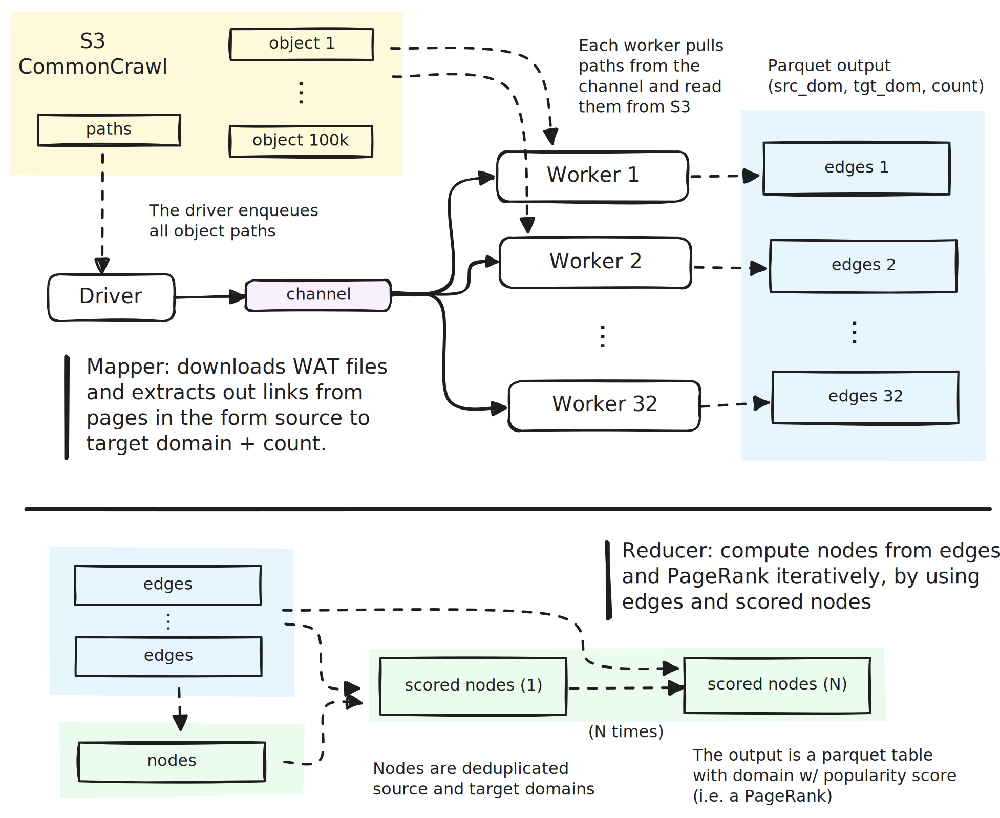
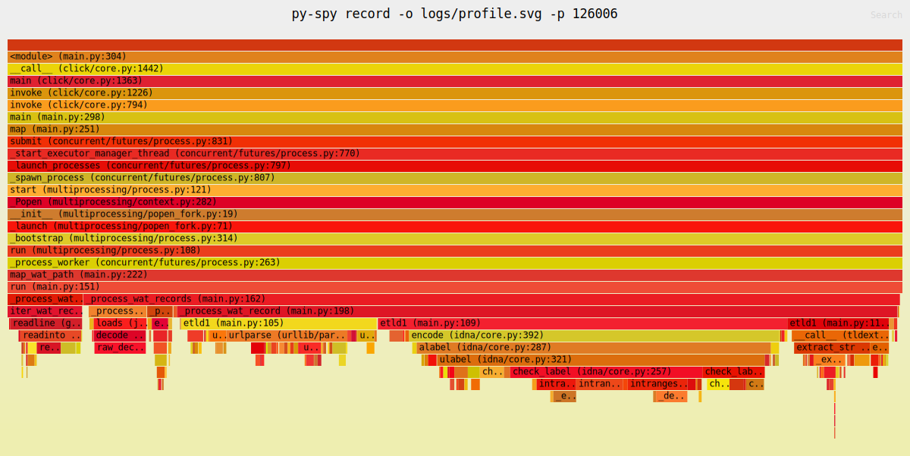
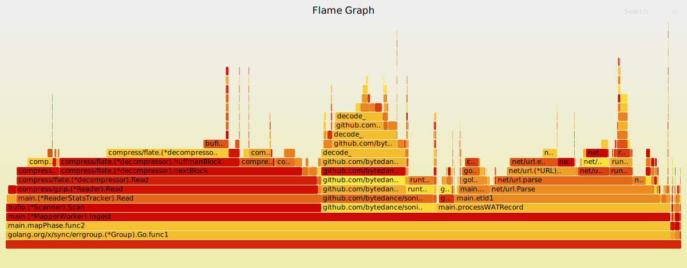
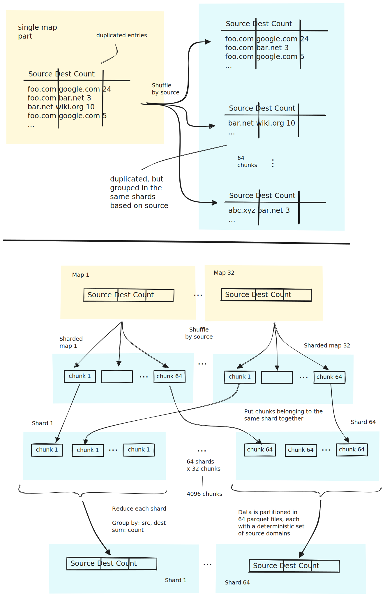
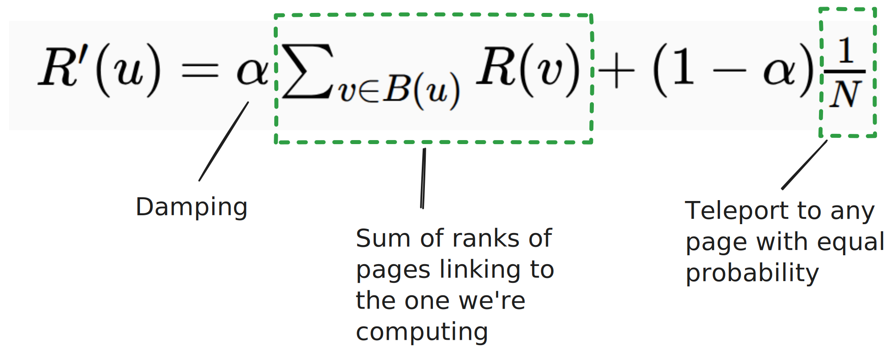
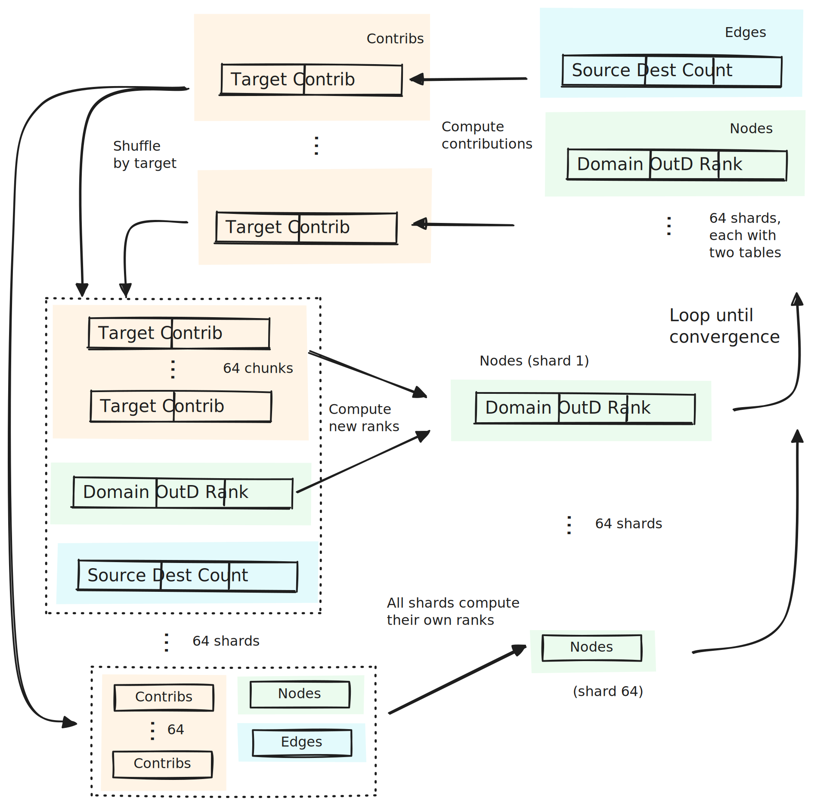
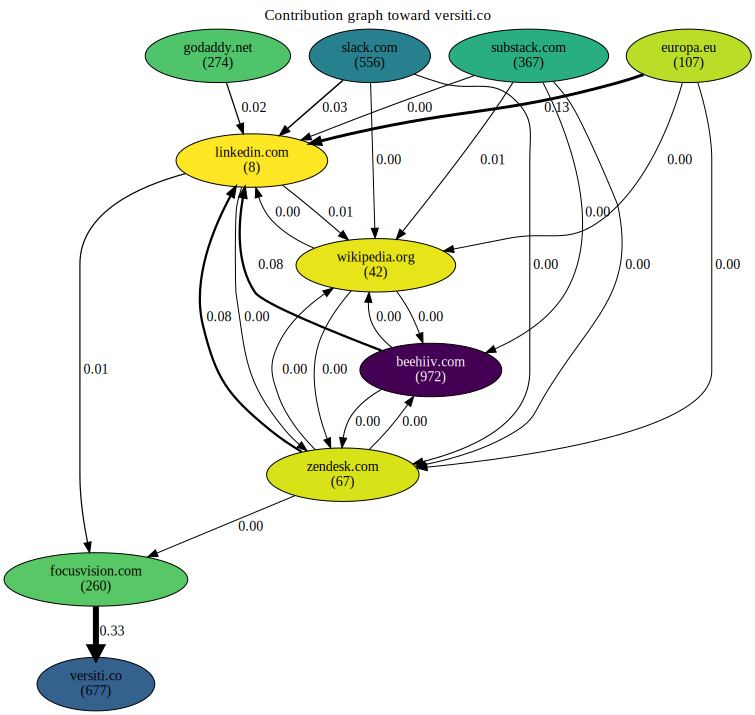
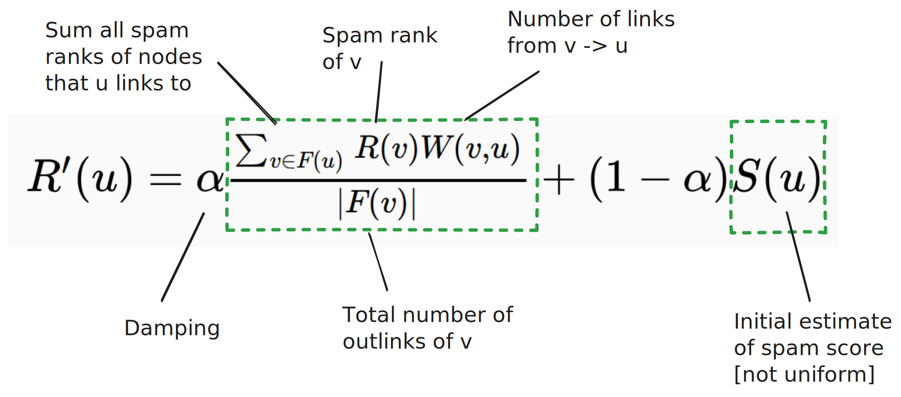
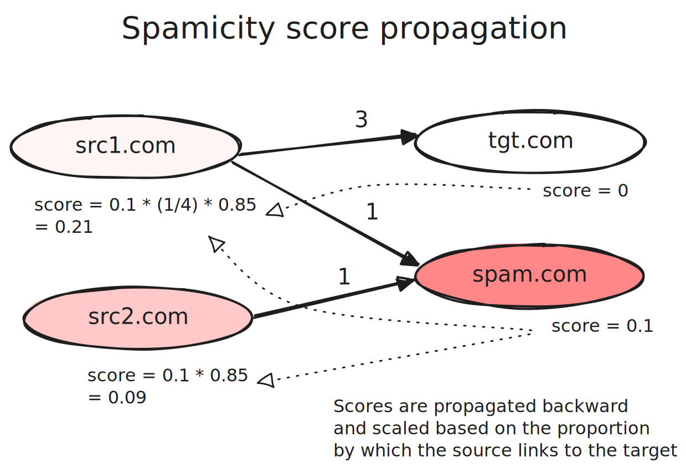

I processed a large fraction of the Internet on a single machine, trying to find
some valuable but forgotten domain names to buy (probably 25 years too late).
Here's the story of what I found and how I did it, and **not** the story of
**why** I decided to try, because I don't know myself.

**Spoiler alert**: If you just want to know whether there is indeed something,
and you should scramble to scoop it up to become a
[domain-flipper](https://en.wikipedia.org/wiki/Domain_name_speculation)
billionaire, hold your horses: I believe there isn't much. The following
sections are more focused on the engineering side, so if you only care about the
conclusion, skip to [Results](#results).

## A valuable domain

Domain names have a fixed registration period. They have to be periodically
renewed, and sometimes they aren't. The question was: is there some domain,
among those forgotten, that is worth resurrecting?

But first, what makes a domain valuable? I asked a few people, and the first
answer they came up with was this: a memorable or short name, or attached to a
known brand, or something that rings cool.

I believe this is too subjective. For example, `food.com` is arguably a good
sounding domain, but what about `food.de.com`? Or `asfood.com`? Why is the
latter estimated to cost $76000, while the former just $22/year? It's not just
the `.com` top level domain.

I thought that a more quantitative (and therefore easier) way to derive the
value of a domain would be to estimate its position in search results ranking.

## The idea

My idea was to compute [Page Rank](https://en.wikipedia.org/wiki/PageRank) for
every domain (assuming it's a good proxy for their value), and use it to sort
candidate expired domains. So, I started with one problem, and ended up with
two:

* How to calculate page ranks of the *entire Internet*.
* How to identify expired domains.

There's no direct way to get search scores from Google, so I thought to
approximate that by computing Page Rank myself. Although not really in use
anymore, it powered the early Google and made it extremely successful, before
being replaced by the zoo of algorithms, heuristics, models and manual curation
of today. I thought it should serve as a good base.

And here's where waiting 25 years helps, because thanks to [Common
Crawl](https://commoncrawl.org/), we don't need to crawl anything. We have
monthly datasets with most of the web, crawled and pre-processed for us, for
free. Problem number one becomes: "how to calculate PageRank over that dataset",
which is a *much easier problem to solve*.

For the second problem (identifying expired domains), we could think of
comparing several snapshots of Common Crawl, and look for domains that
disappeared, but that's expensive. There's indeed an easier way: look at which
domains are being referenced in links, but they themselves are *not* in the
dataset. [^1]

## Single machine?

The Internet is big. Even though Common Crawl doesn't have all of it, its latent
snapshot is [currently
counting](https://commoncrawl.org/blog/september-2025-crawl-archive-now-available)
421 TiB of content. Something of this size is not impossible to handle, but also
not cheap. Processing it sequentially at 1 Gbit/s (which is not particularly
slow) [would take 42
days](https://numbat.dev/?q=421+TiB+%2F+%281+Gbit%2Fs%29+-%3E+days%E2%8F%8E).

Fortunately, we can avoid most of this data and focus on the [WAT
subset](https://commoncrawl.org/get-started#WAT-Format), which is **76 TiB** (16
TiB compressed) of JSON metadata about pages and their links.

More than answering the original question, then I became interested in the
technical challenge: could I tackle the problem with a single machine in
reasonable time? And it turns out the answer was yes.

After keeping 32 cores 100% busy for about 13h, downloading 16 TiB of data,
processing 7+ billion pages and 83+ billion links
[[logs](https://github.com/mbrt/domain-resurrect/blob/fdb34189c583f899d3f45659c128315c5c6421ac/docs/logs/20250925-144437.log),
[infrastructure](#infrastructure)], I got my answer in the form of less than 2
GiB of parquet files: a list of domain names, sorted by rank.

But I'm getting ahead of myself. How did I know that this had a chance to work?
I tried to work it out from first principles by estimating resource usage and
time: network bandwidth, memory, CPU and disk.

### Network

The first problem was how to download 16 TiB of data. If this were to go through
a slow link from the Internet, I would have been worried, but Common Crawl
datasets are also in S3. A VM in the same region can download objects in
parallel to the point of saturating its network bandwidth. Staying between 1 and
10 Gbit/s [would
take](https://numbat.dev/?q=16+TiB+%2F+%2810+Gbit%2Fs%29+-%3E+h%E2%8F%8E) this
process between 4h and 40h, which seemed acceptable.

With this first constraint, I got the first design decision down: it had to run
in AWS from `us-east-1` (where the crawls are located).

### Disk space

The dataset contains about [39
million](https://commoncrawl.org/blog/september-2025-crawl-archive-now-available)
domains.[^2] Accounting for an average of 100 bytes per domain (to store the name),
this would be about 3.5 GiB uncompressed (which I think is a generous upper
bound).

For my purposes (domain reputation), I didn't need to store, nor keep track of
individual pages, but just domain names and their link counts. A list of
triplets: `source_domain, target_domain, count` is the simplest way. And if each
domain had links to an average of 50 other domains, this [would
result](https://numbat.dev/?q=39+million+*+100+B%E2%8F%8E_+-%3E+GiB%E2%8F%8E_+*+50%E2%8F%8E)
in 180 GiB of data. With compression, this was definitely going to be lower, and
if the estimate was too low, I could store the names just once and have the list
of edges as a table of integer indexes, making it at least one order of
magnitude smaller.

If I processed the data in a streaming fashion from S3 to a table stored
locally, it would result in some denormalization (because pages are processed in
parallel and the dataset is not ordered), inflating the numbers above. Adding a
10x penalty results in 1.8 TiB of data, but since this is mostly ASCII text, we
can account for a 70 - 80% compression, which brings it down to about 500 GiB.

All of this sounded manageable on a single disk / volume. Second decision down:
stream the results to a local disk is good enough (no need for distributed
storage).

### Memory

The first part of the process (creating the edges table) can be done in
streaming, so I had no memory usage concerns. Aggregating over the table can be
memory intensive, but could be done off-core too (paying the penalty of spilling
to disk). Page rank is parallelizable (as it runs in a distributed way), so it
can also be turned into a sharded off-core computation.

This opened a sub-problem: how to compute aggregations over the dataset while
spilling to disk?

### Disk speed

Running Page Rank over multiple iterations would mean reading and writing the
whole dataset several times, and 100 GiB of data written 10 times is about 1
TiB. [EBS
supports](https://docs.aws.amazon.com/emr/latest/ManagementGuide/emr-plan-storage-compare-volume-types.html)
up to 1 GiB/s throughput, and even the default 125 MiB/s would make this
possible [in
about](https://numbat.dev/?q=%281+TiB+%2F+125+MiB%29+s+-%3E+h%E2%8F%8E) 2h.

So, I wasn't concerned about memory, nor disk.

### CPU

This was the least concerning to me, as the problem didn't seem to need any
complex computation: decompress files, parse JSONL, turn URLs into domain names
and count.

Well, here I was wrong, as I underestimated the effort required by decompressing
large gzip files (i.e. [FLATE](https://en.wikipedia.org/wiki/Deflate)), which
turned out to be the actual bottleneck.

I found this out early while running a smaller scale experiment locally (with a
handful of WAT files), so I had to adjust things slightly before the actual full
run. See [Mapper implementation](#mapper) below for more details.

## Implementation

The informal feasibility check gave me the feeling that the bottleneck would be
streaming the 16 TiB from S3, as the rest was orders of magnitude smaller.
Optimizing for that would mean to stream process the data, one thread per core
and store it on disk denormalized (to keep memory usage low). After that,
compute PageRank one iteration at a time, while check pointing intermediate
steps on disk.



Based on that, I split the problem into two independent parts:

* A mapper, responsible for processing the Common Crawl [WAT
  dataset](https://commoncrawl.org/get-started#WAT-Format) and writing a set of
  parquet files with counters for links going from one domain to another (the
  edges).
* A reducer: which aggregates the edges (into nodes) and iteratively computes
  PageRank.

### Mapper

The first implementation of the mapper was a [Python
script](https://github.com/mbrt/domain-resurrect/blob/f91b54065ef5e9a156d95cd1e2ed781cb58b4fd7/docs/slow_map.py)
which used a `ProcessPoolExecutor` to process WAT files in parallel. Very simple
and readable implementation, but while testing locally, to my surprise I
discovered that it was terribly slow [see
[profile](https://github.com/mbrt/domain-resurrect/raw/f91b54065ef5e9a156d95cd1e2ed781cb58b4fd7/docs/profile/slow-map-profile.svg)].
The code would take about a minute to process a single WAT object, which would
translate to roughly 16000 CPU hours, given the 100k total files in the dataset.

[](map-python-flame.svg)

The culprit was mostly domain name
[computation](https://github.com/mbrt/domain-resurrect/blob/f91b54065ef5e9a156d95cd1e2ed781cb58b4fd7/docs/slow_map.py#L100-L121)
(eTLD+1), and after trying to replace it in many different ways (e.g. adding
heuristics, or using [`fasttld`](https://github.com/jophy/fasttld) and seeing a
large drop in extracted domains) I decided to give up and rewrite the thing in
Go.

I thought this would be a good match for the language: strong standard library,
especially for the web and networking domains, and fast concurrency.
Unfortunately, Go doesn't have an equivalent to the awesome
[`fsspec`](https://filesystem-spec.readthedocs.io/en/latest/) library, so I had
to [roll my
own](https://github.com/mbrt/domain-resurrect/blob/536322ecebd38c4aacb602a60b16265b47cee535/reader.go#L34-L56),
to abstract away how to read from a certain URL (local path, http or s3 URL).
Another thing I wasn't happy with was the support for good estimation of speed
and completion time, so I [rolled my
own](https://github.com/mbrt/domain-resurrect/blob/536322ecebd38c4aacb602a60b16265b47cee535/mapper.go#L535)
as well by using an exponentially weighted moving average
([EWMA](https://en.wikipedia.org/wiki/Moving_average#Exponential_moving_average))
and some prettier
[formatting](https://github.com/mbrt/domain-resurrect/blob/536322ecebd38c4aacb602a60b16265b47cee535/mapper.go#L101).

Although that was much faster (down from 60s to 9s per file), there was still
low-hanging fruit. Looking at the [CPU
profile](https://github.com/mbrt/domain-resurrect/raw/refs/heads/main/docs/profile/map-go-json-flame.svg),
I noticed a large amount of time spent in JSON parsing, and I suddenly
remembered how slow that is in Go (it's based on reflection and severely
under-optimized). So I swapped it for
[`bytedance/sonic`](https://github.com/bytedance/sonic), which is a drop-in
replacement, and saw another 30% speed up. Down to 6s per file, I was projecting
the map phase to finish in 160 CPU hours, which would be about 5h on a 32 cores
machine.

[](map-go-sonic-flame.svg)

I was ready to start working on the reducer.

### Reducer

The reducer has a very simple job: take the denormalized input from the previous
phase and aggregate it into unique rows of `source_domain, target_domain, count`
on a set of parquet files. This is the type of thing that
[Polars](https://pola.rs/) should eat for breakfast
[[ref](https://github.com/mbrt/domain-resurrect/blob/20797e0c519464c8db26bbe344fc6f88cba6a8f1/reducer.py#L57)]:

```py
map_df = pl.scan_parquet(tmp / "part_*.parquet")
edges = (
    map_df.group_by("src_dom", "tgt_dom")
    .agg(pl.col("count").sum().alias("count"))
)
edges.sink_parquet(out / "edges.parquet", compression="snappy")
```

But it turned out that out-of-core operations (i.e. swapping to disk) were not
yet supported in the new streaming engine
([pola-rs/polars#20947](https://github.com/pola-rs/polars/issues/20947)). On a
250 GiB dataset (compressed), this was not going to fly, and indeed, on my first
run, memory usage exploded and the whole thing crashed.

After several experiments, I was able to simulate out-of-core aggregations by:

* Processing one *map* partition at a time
* Splitting each one into a set of smaller shards, partitioned by `src_dom`.
  This made it so that all rows with the same source domain are *in the same
  partition*.
* Aggregate shards with the same partition key together, one by one.



This allowed splitting up the larger computation into sequentially independent
steps, where I control the size of each. A map reduce could process this in
parallel faster, but I just decided to process it sequentially, so it could fit
on a single machine.

### Page Rank

The second phase of the reducer computes Page Rank. We'll see in a minute how
this turned out to be insufficient, but it's good to understand the basic
version before complicating it.

The [original
paper](https://www.cis.upenn.edu/~mkearns/teaching/NetworkedLife/pagerank.pdf)
from Page and Brinn describes the intuition behind it quite well:

> A page has a high rank if the sum of the ranks of its backlinks is high. This
> covers both the case when a page has many backlinks and when a page has a few
> highly ranked backlinks.

This reduces the problem of establishing the importance of pages to that of
analyzing links, rather than contents, of those pages. The paper gives one more
intuition on how to compute it, based on the "random surfer" model. The surfer
picks a random page to start with and keeps clicking on random links until it
"gets bored", where it starts over from (i.e. "teleports to") another random
page.

More technically, the Page Rank of page `P` is the steady state probability that
the random surfer is at page `P`. The more a page is ranked high, the higher the
probability that a "random surfer" lands on that page. The formulation is very
short:



Where:

* α is the damping factor (usually set at 0.85), which determines the
  probability of picking a random page over following outlinks.
* `B(u)` is the set of pages linking to page `u` directly.
* `N` is the total number of pages.

The formula is iterative and proven to converge.

Going back to the intuitive explanation, the rank of a page is the combination
of two factors: the "mass" of people navigating to it because they follow links
in pages that point there, and the ones that just picked a random page. The
combination is modulated by the damping factor α.[^3]

I introduced a small variation on that, given that I didn't need the rank of
*every page*, but the aggregate rank of their domains. In this setup, domains
with large amounts of outlinks end up distributing rank equally to domains
linked only once and linked thousands of times. To account for this skew, I
divide contributions of a node by the total number of its outlinks. In this way,
each single link counts as a "vote" for the target domains, and the more links
point there, the more "votes" it gets.

The [basic
implementation](https://github.com/mbrt/domain-resurrect/blob/dcbff2f17f6512e1b514a4e866b605a329612716/reducer_small.py#L64)
of that in Polars is straightforward:

```py
# Contributions
contribs = (
    edges
    .join(scores, left_on="src_dom", right_on="node")
    .with_columns(
        (
            pl.col("score") * pl.col("count") /
            pl.col("out_weight")
        ).alias("contrib")
    )
    .group_by("tgt_dom")
    .agg(pl.sum("contrib").alias("contrib"))
    .rename({"tgt_dom": "node"})
    .select(["node", "contrib"])
)
# New scores
new_scores = (
    scores
    .join(contribs, on="node", how="left")
    .with_columns(
        (damping * pl.col("contrib").fill_null(0.0) + (1 - damping) / N).alias("score")
    )
    .cast({"out_weight": pl.Int64})
    .select(["node", "out_weight", "score"])
)
```

### Off-core

As with the [edges reduce phase](#reducer), this simple approach doesn't work
right out-of-the-box in Polars, given the lack of off-core computation. Again, I
had to simulate it by shuffling contributions to the right shards and compute
each one separately:



The actual code is
[here](https://github.com/mbrt/domain-resurrect/blob/dcbff2f17f6512e1b514a4e866b605a329612716/reducer_page_rank.py#L296).
I was ready to give this a try, so I let this run overnight, and got some
surprises in the morning.

### Page Rank take II (variants)

I knew the Internet was full of crap. I just didn't know the extent of it. It's
literally, *full - of - crap*. After the first few obviously good results at the
top of the ranking (`google.com`, `facebook.com`, etc.) a lot of dubious or
outright bad domains came up. This is the predictable result of running a 25+
years old algorithm on today's Internet. I thought I could ignore the problem,
because I just needed to look at *top results*, but spam can rank high too!

See, for example, [this
analysis](https://github.com/mbrt/domain-resurrect/blob/dcbff2f17f6512e1b514a4e866b605a329612716/docs/page_rank_analysis.ipynb),
where I try to understand why `versiti.co` and `balsic-fastive.io` rank so high
in my run. It comes down to the fact of having two highly ranked domains
(`wikipedia.org` and `zendesk.com`) linking to `focusvision.com`, which was then
considered very highly ranked. This site was only partially crawled, so it had
just a few links in it, and one turned out to be towards `versiti.co`.



I had to descend a deeper rabbit hole on how to combat spam, but I didn't need
to remove all of it. I just needed to push it down enough for me to find some
decent expired domain higher up. This was a much smaller problem to solve than
the general case Google has to deal with.

To start, I needed to find a list of spam and trusted domains, and this is one
area where being 25 years late went to my advantage, because there's [plenty of
choice](https://github.com/mbrt/domain-resurrect/blob/536322ecebd38c4aacb602a60b16265b47cee535/hack/run-full.sh#L12-L17).

As a first set of attempts, I tried to implement some PageRank variations
straight from the literature:

* TrustRank [[Gyongyi, Z. et al,
  2004.](https://www.vldb.org/conf/2004/RS15P3.PDF)], biases the teleport vector
  towards a curated set of trusted pages.
* Anti-Trust Rank [[Krishnan, V. and Raj, R.,
  2006](http://i.stanford.edu/~kvijay/krishnan-raj-airweb06.pdf)], starts from
  the opposite direction and demotes pages by looking at whether they point to a
  curated set of spam pages.
* MaxRank [[Fercoq, O., 2012](https://arxiv.org/pdf/1203.1457)], modifies the
  graph by removing links going to spam, while minimizing a cost function that
  pays some cost on both landing on spam, and on removing links.

I tried the first two on the full dataset and found them to perform quite badly.
After checking some results empirically, I discovered two major problems:

* A lot of "trusted" domains point to spam (as well as good targets). A favorite
  trick from spammers and SEO sites is to "land" a link from a reputable place
  to their site. There are many ways to do this, but an easy one is to add a
  link pointing to a spam site in the comment section of a reputable site. Or
  edit a half forgotten Wikipedia article.
* Spam sites might point to both spam and non-spam. Spammers do this to muddy
  the waters, so it's hard to propagate distrust from a small set of spam
  domains. Both spam and non-spam looks similar in that regard: they both point
  to some good and bad pages.

A problem specific to Anti-Trust rank is that it doesn't really take into
consideration the proportion by which a domain is pointing to spam. The extreme
example was Wikipedia, classified as the #3 most spammy domain on the Internet,
just because in its 11M outlinks there's some amount of spam. But this is to be
expected in such a massive crowdsourced site.

Although the first two algorithms are quite intuitive (the changes are simple
and the papers are well written), I cannot say the same for the third (MaxRank).
For one thing, it requires dynamic programming and a globally sorted "cost"
vector, both of which will impact runtime. The second, and most important part,
is that I cannot really explain intuitively why this should work at all.
Modeling the problem as a cost that balances between keeping and removing links
towards spam seemed quite arbitrary to me. But perhaps it's me not understanding
what the paper is trying to say. It's certainly densely fitted with proofs for
properties that don't really move the needle of my understanding.

Long story short, I decided to implement my own version, by combining the
literature above and fixing a few issues I saw in the experimental data.

### Page Rank take III (Spamicity Trust Rank)

I don't know what to call it, so allow me to throw some arbitrary words
together: Spamicity Trust Rank. It may be nonsense, but it combines the concepts
I used:

* A Page Rank variant that still uses hyperlinks to infer "importance and
  influence" of domains.
* Trust Rank, because it uses a trusted set of domains as seeds.
* Spamicity, because it also assigns spam scores, based on a modified
  Anti-TrustRank pass.

The implementation is done in two steps:

* [`spamicity`](https://github.com/mbrt/domain-resurrect/blob/dcbff2f17f6512e1b514a4e866b605a329612716/reducer.py#L456),
  and
* [`trust_rank`](https://github.com/mbrt/domain-resurrect/blob/dcbff2f17f6512e1b514a4e866b605a329612716/reducer.py#L683).

The goal of the first pass is to discover as much spam as possible, by starting
from a dataset of known spam domains. Anti-Trust Rank was designed with this
goal in mind, but massively suffers from the problem presented above of
punishing popular domains, regardless of them being spam or not (just because
some links towards spam creeped in).

To counter this problem, I started from the algorithm as described by the
original paper:

> Inverse page-rank is computed by reversing the in-links and out-links in the
> web graph. In other words, it merely involves running pagerank on the
> transpose of the web graph matrix.

But add a twist: scale the spam contribution by the factor in which the source
domain points to the target domain. The intuition here is that if a domain
points to spam, it should be classified as spam, but the score should be reduced
by the proportion of how much it actually does point to spam. I also include a
damping factor, to progressively attenuate the score over distance (if `a` links
to `b` that links to `c`, we expect the score of `c` to influence `b` more than
it would influence `a`).

The more precise formulation is as follows:



And the
[code](https://github.com/mbrt/domain-resurrect/blob/eb84decafa2ed2dc468a260af132b48246dc871f/reducer.py#L289-L352)
(using Polars):

```py
contribs = (
    edges
    .join(nodes, left_on="src_dom", right_on="node")
    .with_columns(
        (
            pl.col("count") * pl.col("score")
        ).alias("contrib")
    )
    .group_by("tgt_dom")
    .agg(pl.sum("contrib").alias("contrib"))
    .select(["tgt_dom", "contrib"])
)
contribs = (
    contribs.group_by("tgt_dom")
    .agg(pl.col("contrib").sum().alias("contrib"))
)
updated = (
    nodes
    .join(contribs, left_on="node", right_on="tgt_dom", how="left")
    .with_columns(
        (
            (
                damping * pl.col("contrib").fill_null(strategy="zero") /
                pl.col("out_weight")
            ).fill_nan(0)
            + (1 - damping) * pl.col("bias")
        )
        .alias("score")
    )
    .drop("contrib")
)
```

To explain with an example: suppose that `src1.com` points to `tgt.com` and
`spam.com`, with weights 3 and 1 (i.e. its number of out-links).



To calculate the spamicity score of `src1.com`, we add the scores of its target
domains (0 and 0.1), scaled down by the damping factor (0.85), and do a weighted
average based on the number of outlinks:

* `tgt.com` contributes with a score of 0
* `spam.com` has a score of 0.1, dampened by 0.85 (constant factor), scaled by
  ¼, as there's only one out-link from the source, over 4 total.

Given those spam scores, we run a biased PageRank that takes spamicity into
consideration. The first intuition is that it's more likely that when a user
goes to a random page, they land on a popular domain, so we can use domain
popularity datasets as a basis. The second is about spam domains: you can trick
a user to click to a link that points to spam, however when they land there,
it's unlikely that they will stay and follow any further links (therefore they
will jump to somewhere else).

These intuitions are modeled by biasing the teleport vector with domain
popularity, and by scaling down contributions of spam domains – as classified by
the first step – so that their impact on other domains will be limited. In other
words, the popularity of a spam domain doesn't translate into popularity of its
outgoing links
[[code](https://github.com/mbrt/domain-resurrect/blob/5c185598aab95bcb6a685b9484d71f040674b3aa/reducer.py#L661)]:

```py
# Compute contributions and penalize based on spamicity
# up to a certain threshold
contribs = (
    edges
    .join(nodes, left_on="src_dom", right_on="node")
    .with_columns(
        (
            pl.col("score") * pl.col("count") / pl.col("out_weight")
            * (1.0 - (max_spam_penalty * pl.col("spamicity")))
        )
        .alias("contrib"),
    )
    .group_by("tgt_dom")
    .agg(pl.sum("contrib").alias("contrib"))
    .select(["tgt_dom", "contrib"])
)
# Sum all contributions going to the same target
contribs = (
    contribs.group_by("tgt_dom")
    .agg(pl.col("contrib").sum().alias("contrib"))
)
# Compute the updated scores by summing up the two factors:
# Contributions from backlinks and initial popularity estimates.
updated = (
    nodes
    .join(contribs, left_on="node", right_on="tgt_dom", how="left")
    .with_columns(
        (
            damping * pl.col("contrib").fill_null(strategy="zero")
            + (1 - damping) * pl.col("bias")
        )
        .alias("score")
    )
    .drop("contrib")
)
```

See how contributions are penalized (up to a certain max) for domains considered
spammy, and the teleport contribution is biased by the "bias" column, which is
initialized with larger weight for popular domains and uniformly lower weights
for the rest.

### Dangling domains

After getting a ranked list of domains, it was time to find the dangling ones.
For that, I looked for those that simply had no outlinks. If they have many
domains pointing to them, but none going out, there's a chance the domain wasn't
crawled because it expired.

Well, not quite. There are many reasons why domains have no outlinks in
*CommonCrawl*: `robots.txt` didn't allow the crawl, or the domain is not serving
http content at all, or the site was down, but the domain is *still registered
to someone*.

A good way to filter through this is by combining the filter for no outlinks
with a DNS resolution. If that returns `NXDOMAIN`, then there's a much better
chance that the domain actually expired. The
[code](https://github.com/mbrt/domain-resurrect/blob/536322ecebd38c4aacb602a60b16265b47cee535/find_available.py#L64-L73)
is quite simple:

```py
async def resolve(domain: str, sem: asyncio.Semaphore) -> tuple[str, bool]:
    async with sem:
        try:
            _ = await resolver.resolve(domain)
            return domain, True
        except dns.NXDOMAIN:
            return domain, False
        except Exception:
            # Treat other errors as "something went wrong, but domain may exist"
            return domain, True
```

This resulted into a list of candidates (I kept about a hundred) that I checked
manually. And this is the part where I would have loved to say: "and this is how
I made my first million". However, the results mostly split into three
categories:

* Domains that looked interesting, but someone was already sitting on them,
  likely waiting for a buyer.
* Domains that were boosted by much more clever spam sources (e.g. fake blogs
  and fake companies, likely machine / AI generated).
* Shady domains that I definitely didn't want to touch.

Perhaps the first category might become a future good buy (if the owner just
loses hope of selling and lets it expire), but I assume that several
[drop-catchers](https://en.wikipedia.org/wiki/Domain_drop_catching) are already
watching and will be faster than regular people in securing them right then.

## Results?

When I said that I was 25 years late to the problem, I meant: a lot of people
thought about this very same problem for a very long time. So much that there is
plenty of terminology, research papers and valuable companies built around
understanding and exploiting it: this is the weird universe of
[SEO](https://en.wikipedia.org/wiki/Search_engine_optimization),
[Spamdexing](https://en.wikipedia.org/wiki/Spamdexing), [Google
bombing](https://en.wikipedia.org/wiki/Google_bombing), [Domain name
speculation](https://en.wikipedia.org/wiki/Domain_name_speculation) and [Domain
drop catching](https://en.wikipedia.org/wiki/Domain_drop_catching).

So, what's the probability that there indeed **is** some hidden gem, forgotten by
everybody, waiting just for me to take? Probably close to zero. But I wanted to
try anyway.

At this point, I could continue optimizing and improving the ranking algorithms,
but decided not to. The first category of domains I found above (domains that
are interesting but not available), made me think that whatever is mildly
interesting, was already found by somebody.

OK, so what was the point of this post? Perhaps it looks like a flex, or a
pointless exercise of someone with too much time on their hands. Maybe there's
some of that, but I had a lot of fun working on this project and wanted to share
it. I might be in a small niche, but I also love reading posts like this one, so
I wanted to contribute to the genre with something of my own.

Some takeaways from this experiment:

* I feel like out-of-core aggregations are generally easy to fake with streaming
  capabilities, even when they are not built-in in the data framework one is
  using. See [Generalized out-of-core
  aggregations](#generalized-out-of-core-aggregations).
* One more empirical proof of the value of back-of-the-envelope design, combined
  with small scale experiments (see [Single machine?](#single-machine)).
* The Internet is unbelievably full of crap. Even with very low expectations, I
  was still surprised by how much this is true.

If you feel like I got things horribly wrong, and there are ways to make easy
money with this data, be my guest! You can run things from scratch, starting
from [my code](https://github.com/mbrt/domain-resurrect) (messy but includes all
experiments as well) or save a bunch of time and money by starting with the
final data:

* [Scored domains](https://huggingface.co/datasets/mbrt/domain-resurrect) dataset
* [Links](https://huggingface.co/datasets/mbrt/domain-resurrect-edges) dataset

Both of which are based on the [September Common Crawl
dataset](https://data.commoncrawl.org/crawl-data/CC-MAIN-2025-38/index.html),
and are *massively smaller* (down to 35 GiB from 76 TiB).

I didn't get rich in the process, but I learned a thing or two about optimizing
data ingestion, [polars](https://pola.rs/) and PageRank variants. The journey
was more important than the destination, etc. etc.

---

## Appendix

Or, an unordered list of things I didn't know where to put but still thought interesting.

### Generalized out-of-core aggregations

I think we can extrapolate a way to generalize to out-of-core aggregations from
the particular example of the [reducer implementation](#reducer):

1. Use the columns in the group-by clause as sharding key
1. Calculate the number of necessary shards to fit a single one in memory, based
   on statistics on the number of unique elements in each column.
1. Stream the source table to a set of separate tables, partitioned by the
   sharding key.
1. Process shards one by one, instead of in parallel.

Step number 2 is perhaps the hardest to get correctly, as memory usage depends
on many factors. It will be hard to guess a good number of shards without prior
knowledge. A good approximation might be to abound on the number of shards and
then compute some of them in parallel in step number 4. If memory usage grows
too large, kill some of these shards and postpone their computation to
subsequent sequential steps.

### Rewrite the mapper in Rust?

Before someone starts screaming: "bro, you should have started with Rust, it's
faster, safer, and blah blah", I want to show [my little
benchmark](https://github.com/mbrt/domain-resurrect/blob/dcbff2f17f6512e1b514a4e866b605a329612716/mapper-rs/benches/flate.rs),
where I simply ran the most compute intensive part of the mapper (i.e. gzip
decompress) by using the fastest available library in Rust, and couldn't really
see a speed improvement. It turns out, the Go version is very well optimized.

In summary, I don't expect a Rust implementation to be significantly (i.e.
orders of magnitude) faster than the one I came up with. Not to mention that I'm
more familiar with Go and Python, and they ran fast enough for my purposes.

### Infrastructure

Based on the [back-of-the-envelope estimates](#single-machine) above and a small
scale run locally from my laptop (done by downloading WAT files by hand and
processing them locally), I [concluded](#mapper) that each file would take an
average of 6s of CPU time to process. Given that the dataset has 100k files,
this roughly means 160 CPU hours.

Since compute was the bottleneck (and not network), I just needed a
compute-optimized instance with enough disk to get the job done. This pointed me
towards a [c6id.8xlarge](https://instances.vantage.sh/aws/ec2/c6id.8xlarge) VM,
with 32 cores and 1.9 TiB of SSD, which costs about $1.6/h. The whole process
should have taken less than 24 hours, and therefore less than $38 in total.

### Infrastructure as code

[CloudFormation](https://docs.aws.amazon.com/AWSCloudFormation/latest/UserGuide/Welcome.html)
fell out of favor among platform and cloud engineers nowadays, in favor of
Terraform or fancier solutions like [Pulumi](https://www.pulumi.com/) and
[Crossplane](https://www.crossplane.io/). I still find the ease of setting up
and use of CloudFormation simply unbeatable, as you just need the AWS CLI and an
AWS account. No need to deploy extra things, or manage the state somewhere.
Given that I *had* to run within AWS, it felt like a very natural choice.

And hey, GitHub Copilot and other AI assistants really like it, so they speed up
the creation a lot by making good suggestions.

See
[config](https://github.com/mbrt/domain-resurrect/blob/dcbff2f17f6512e1b514a4e866b605a329612716/template.yamlQ)
and [deploy
script](https://github.com/mbrt/domain-resurrect/blob/dcbff2f17f6512e1b514a4e866b605a329612716/hack/deploy-infra.sh).


[^1]: We'll see [later](#dangling-domains) that this is a good starting point,
    but not sufficient.

[^2]: Interestingly, this is one order of magnitude less than the reported
    number of domains from
    [DNIB](https://www.dnib.com/articles/the-domain-name-industry-brief-q2-2025).

[^3]: I couldn't find an explanation for why the damping factor is usually set
    to 0.85. I ran a small scale ablation on notable pages with different values
    and concluded empirically that this indeed looks reasonable. When it's set
    to a lower value (e.g. 0.5), ranks seem to vanish very quickly, and for
    higher values, they propagate unreasonably further away from the source. For
    example, a single link from `google.com` would positively impact pages 3-4
    degrees separated away, thereby boosting a lot of spam.
