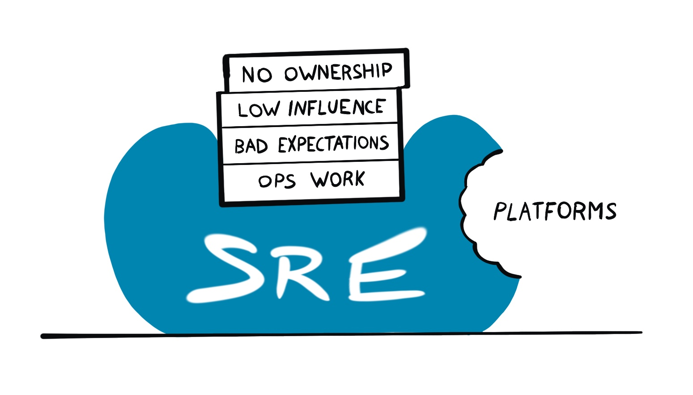
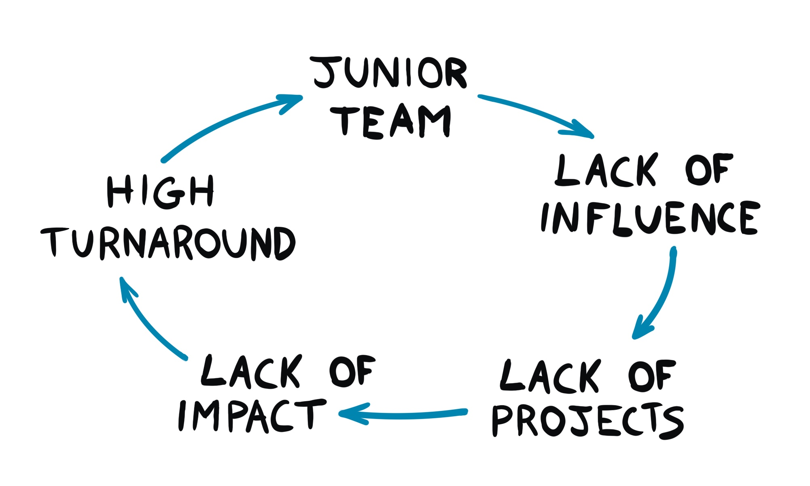
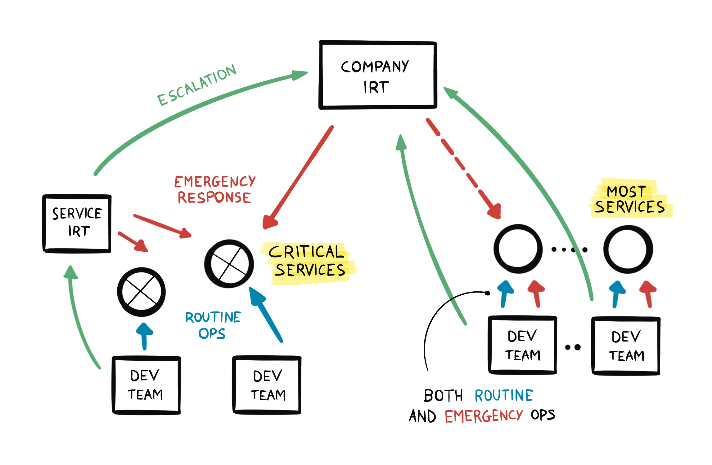

Running a Site Reliability Engineering (SRE) organization correctly is difficult
and expensive. Spare the frustration, perhaps what you need is Sysadmins.

Since the term was coined by Ben Treynor in 2003 at Google, lots of ink was
spent on praising SRE practices. Not enough on *when* it is appropriate to have
SREs. This post is a take on that angle.

Disclaimer: I was an SRE at Google and this piece represents only my own views.

## What is an SRE?

Among the various definitions floating around, let's use the most common from
the [Google SRE books](https://sre.google/workbook/how-sre-relates/). SRE is
both a set of practices and a job title. Ultimately, the idea is to solve
operational problems through automation and share responsibilities with
developers. These are the most important principles of SRE:

* Operations is a software problem (i.e. you need Software Engineers).
* Manage by Service Level Objectives (SLOs) (i.e. measure to take decisions
  about reliability vs feature velocity).
* Work to minimize toil (i.e. manual work is bad).
* Automate this year's job away (again, manual work is bad. Use automation).
* Move fast by reducing the cost of failure (i.e. reduced impact of faults
  increases dev velocity).
* Share ownership with developers (i.e. SRE is not a gatekeeper, devs co-own the
  outcomes).

SREs can fulfill their mission from different angles (consultation for devs,
on-call expertise, improvements in internal platform or migrating to newer
infrastructure). But SREs are primarily software engineers. They are encouraged
to improve the reliability of systems through *software*, as opposed to *manual
work*.

The biggest contribution from the SRE, and more widely from the DevOps movement,
is recognizing that reliability work can be *specialized engineering work* and at
the same time *should not be treated as a silo* from development.

## What can go wrong

This is all nice and more or less obvious nowadays. But what can go wrong?

Many common problems and solutions are discussed in the canonical [Google SRE
books](https://sre.google/books/). The focus there is however on “day 1". The
goal of the books is to move from the “old world" of ops into a new one, where
devs and ops are not siloed and reliability improvements are measurable.

Here I want to focus only on *day 2 problems*: I have SREs implemented By The
Book and it's 2023. Is it all ponies and rainbows?

Unfortunately Things can go wrong at all levels. They can go wrong for SRE teams
in many more ways than developer teams. I think this comes from the fact that
even though SRE is a young discipline, it also crystallized quickly. In its 20
years of life, *many things changed* in the software domain. The definition of SRE
did not (and stayed quite narrow).

Most of the problems I've encountered so far can be categorized as follows:

* Power dynamics where SRE is at the short end.
* Mismatch in expectations between SREs and business needs.
* Lack of influence in setting priorities.
* Failure to acknowledge the rise of *platforms*.

What the hell am I talking about? Let's go in order.

### The vicious cycle of being Somewhat Irrelevant

Here's a handy picture:

When a team starts, it never does with a lot of influence or trust from other
parts of the organization. This happens despite all efforts and it's normal.
Everyone needs to prove themselves when they begin a new job and this applies to
newly formed teams as well.

This lack of trust translates into lack of influence to the reference dev
organization. Which leads to a lack of Big Enough Projects and therefore Impact.
There will be a seniority ceiling nobody in the team can ever smash. The exact
level depends on the specifics, but it's usually quite lower with respect to the
one in the dev organization.

If this stays true for long enough, senior people move to teams where they can
more easily find impact. The remaining people cannot get promoted and the
vicious cycle continues. Interestingly, this can't be fixed by adding senior
engineers to the team. You can try, but internal transfers will be joining
begrudgingly (and so either refuse to go or leave at the first opportunity) and
external hires will have a very hard time ramping up (and follow a similar
destiny).

Success stories do happen in these teams as well. They are usually single people
who can swim upstream and find a niche for themselves. These stories are nice
and give hope, but *they are never reproducible*. Try the exact same steps and
you will fail. In these teams people are disconnected from each other (as
projects are relatively small) so you can't look up to more senior people and do
the same to get promoted. It's very hard to escape the vicious cycle of being
Somewhat Irrelevant.

### Justifying proactive action is hard

Much of what SRE does (and wants to do) is proactive. You work today to solve
tomorrow's problems. The challenge is that SRE does not operate in isolation.
You always need to convince dev partners to be onboard with your plans. And this
is hard because:

* See above: you might lack influence.
* Adding features is always more shiny than fixing old crap.
* In economic downturns or when the company has to play catch-up with
  competitors, the focus is on today, not tomorrow.

Before devs are convinced of doing major changes to accommodate reliability
improvements, you will need multiple major incidents. At that point, the
necessity of improvements will be clear, but *did you really need SRE to realize
it*? Perhaps you'll win an I-Told-You-So badge of honor, but not much more.

In the meantime, SRE needed to shoulder the incidents and the consequent manual
work to keep things running anyway.

This state can be temporary but could also be somewhat permanent. Operational
work shoots up and all projects that require dev collaboration are at the back
of their queue. Justifying proactive action is hard!

You might think: "But I know how to solve this. Give back the pager!" If that's
your thought, please continue below.

### Power dynamics

Oftentimes the SRE organization is at the short end in power dynamics. This
comes from multiple factors, but the most common causes are:

* The business *requires* SRE to operate critical services.
* The dev organization is effectively funding SRE.

The first one is easy to understand. You can't give back the pager if the
business explicitly forbids you to do so. This seems like an anti-pattern, but
think about it. The CEO wants to protect their own crown jewels. What's the best
way to do it? Give the pager to whomever's best to resolve incidents. The
business doesn't care whether you're a happy on-caller or not. It just cares
that things keep running.

The second is more insidious. Most tech companies are organized so that
development organizations are effectively the ones that hold budgets. They may
decide that part of the budget is used to fund SRE. Even though SRE is a
parallel organization (i.e. mostly independent from a management perspective),
it is in effect controlled by the developer org, through funding.

This control doesn't have to be explicit. But it's enough to skew the incentives
on the SRE management side. For example, in thinking that to grow their SRE team
they need to onboard new services. Even if nobody forces them, it's still a
powerful argument to get funding: "I need more people if you want me to support
more services".

Giving back the pager removes the lever and goes in the opposite direction. It
will prevent new funding or even trigger a team dismantling. This is bad for
promo. No SRE director will be promoted to "senior director" by managing fewer
teams, so they don't do it.

These forces make sure that SRE holds the pager, no matter what.

Obviously there are exceptions to this. I have seen successful pagers handover,
but they are exceptionally rare.

### Platforms eating SRE

Brief history of how production platforms are born.

In the beginning there was Chaos. Dev teams maintained their own infrastructure,
making the same mistakes over and over. To reign the chaos, SRE was born. They
brought a unified perspective to multiple teams, providing guidance by virtue of
experiencing what was or wasn't working in production (the "[Wisdom of
Production](https://sre.google/workbook/how-sre-relates/)").

Then the company grows bigger and SRE teams multiply. They all want to automate
themselves out of their job and so develop automation. Many Different Versions
Of It. And the same observation applies: we need to provide unified production
to the whole company. And a platform team is born.

The SREs job now shifts from "automate your toil away" to "bring service X to
The Platform". All is well. But what happens next?

The SRE book says:

> A production platform with a common service structure, conventions, and software
> infrastructure made it possible for an SRE team to provide support for the
> "platform" infrastructure, while the development teams provide on-call support
> for functional issues with the service—that is, for bugs in the application
> code. Under this model, SREs assume responsibility for the development and
> maintenance of large parts of service software infrastructure, particularly
> control systems such as load shedding, overload, automation, traffic management,
> logging, and monitoring.
> 
> -- SRE Book [[Chapter 32](https://sre.google/sre-book/evolving-sre-engagement-model/)]

All is well? Not quite, as platforms are developed and maintained by a product
team, not SRE!

The implications are interesting:

* SRE doesn't own the platform, so they can't directly change it to suit their
  needs.
* Supporting the platform itself is not a job for 1000 SREs, so only a few get
  to work on it.
* Incentives in the platform team are on *minimizing maintenance cost*, which
  means a lot of feature requests get shoved under the rug.
* Platform teams don't need to please their customers so much *if they get them
  through company mandates*.

This last point is the real problem. The business wants to minimize cost by
de-duplicating work. They do so by mandating the use of the Blessed Platform.
This makes sense, but creates perverse incentives. Guess who loses in this? SRE,
because they are "such a small customer" compared to the rest of the company.
Remember, there are many more devs than SREs. The platform will always try to
prioritize problems for the majority of their customers.

In addition, platforms ate up a chunk of interesting work from SRE (automation).
As fun as it sounds, SREs haven't automated themselves out of their job, but
only out of its *most interesting part*.

### Mismatch in expectations

SREs are first and foremost engineers. In many cases they come from pure
software development and even have PhDs. They come to SRE expecting to have a
software engineering job (i.e. building systems, researching cutting edge
technologies) and just apply their skills to the "reliability domain".

Well, it often doesn't work that way. Yes, there might be a [50% cap on
toil](https://sre.google/sre-book/eliminating-toil/), but what do SREs need to
do with the rest of their time? From migrating one technology to the next to
changing obscure configuration files, the reality for most of them is not so
interesting.

"What about SLOs or monitoring?" I hear you saying. PMs should own SLOs because
they own the user experience. Platforms should own the SLO and alerting
implementation, because there's no need to reinvent the wheel in every team.
What's left for SRE? Well, they can put the little number in that config file
there.

To be fair, not all of it is easy work. Migrations are especially delicate and
need planning. Stakes are high and mistakes expensive. But is it interesting
work? Changing one number from X to Y and waiting a week for a rollout? This
feels like walking on ice for miles and miles. Challenging but just tedious.

It's important work. You just don't need a PhD or 15 years of experience to do
it.

This mismatch in expectations is a very common experience for SRE new hires.
Ultimately, most of the frustration comes from a disconnect between what an SRE
is paid for (i.e. what the business wants from them) and what they want to be
doing. The hard question is *what value is SRE adding to the business*?

Successful engineers in platforms don't automatically make good incident
responders and vice-versa. Insisting on bundling together the two roles has
several negative repercussions on teams.

### Unclear business value

Signs that an SRE team has unclear business value:

* The dev organization is too small. This happens when e.g. SREs are on-call for
  most services of the org and it's hard to negotiate what services to focus on.
* Services are not critical to the business. Did anyone notice when one of your
  services was down for two hours?
* SLOs are always red, paging or ticketing, but no actual user complains about
  it.

These are signs that you are being on-call not to serve the end users (and so
the business), but to "serve the devs" and ease their operational burden.

This can also happen for just a part of the services the SREs are on-call for.
It's often not a straightforward picture.

## Partial solutions

What if we take
[Chapter 32](https://sre.google/sre-book/evolving-sre-engagement-model/) of the
SRE book to the letter? If the production platform can automate most ops tasks,
SRE could give back all the services to the devs and just be on-call for the
platform. This would have two immediate effects:

* Drastically reduce the number of SRE teams necessary.
* Many more devs start to be on-call 24/7.

The company saves a bunch of money with the first point, but loses a bunch more
with the second. There are way more dev than SRE teams and, contrary to SREs, a
dev team is often in a single location. This means that a lot of people will be
on-call during the night (because there's no team across the ocean to hand off
the pager to), which is very expensive and bad for retention (stressed out
people tend to leave).

Money is one thing, effectiveness is the other. Can devs actually manage
incidents effectively? They can definitely do it when the cause is within the
service itself (e.g. a bug). But many outages happen in the cracks between
services. The land of nobody. It often happens that an outage is caused by a
service dependency, but the people managing the dependency can't see anything
wrong with their service.

Incidents involving multiple teams require coordination. However there's no SRE
team to escalate to. It would be wrong to use platform SREs to do that, unless
the platform itself is at fault. There won't be a single team in charge of the
overall incident, nor any team to escalate this to.

This setup overlooks also a third problem, which is operational expertise for
critical services. There's always a need for incident response experts for
services that are *both complicated and critical*.[^1] The developers of those
services may not have the skills to be good at that. And for this type of
service, incidents must be resolved quickly (i.e. the business *requires it*).

We then have three unresolved problems:

1. Everyone being on-call is expensive.
1. Missing expertise for incident response in critical user facing services.
1. Missing incident response on large (i.e. multi-service) outages.

Let's fix that?

## Incident Response Teams to the rescue

Problem #2 seems to suggest a specialized on-caller role. Yes, critical services
*could* still be managed by their dev teams. BUT, given the criticality, there's
still room for incident specialized responders. This is -- surprise surprise --
an ops role.

Problem #3 is also for an ops role. This clearly requires specialization, but
not necessarily SRE. This team needs strong systems understanding and incident
response skills, but it doesn't have to go beyond that. There's no need for them
to *automate anything*. In fact, incidents in this category are oftentimes
[black swan](https://en.wikipedia.org/wiki/Black_swan_theory)-like events, and
as such, difficult to predict and unlikely to reoccur the same way. Their focus
is on ops during incidents. Spare time should focus on post-mortems and
consultation with the platform team and the business deciders. They are the best
people that can answer the question: what are the biggest reliability risks
right now?

### Minimizing cost

The problem of cost (problem #1) is a bit more complicated to solve. There's no
way around having literally everyone building a service also being on-call and
*responsible for it*. Shit happens, but these are the people having the best
hand at fixing short and long term problems. If the dev team is paged every
night for a month, they'll fucking see at fixing the problem, trust me. The
*wisdom of production* doesn't really apply to SRE only. Wisdom arrives to
anyone exposed to how systems behave. SRE shouldn't rob developers this learning
opportunity.

This, and constant improvements coming from the platform, should drive the need
for *routine ops work down*. Emergencies outside business hours become more
painful, so teams will strive to minimize them:

* Minimize *critical* dependencies.
* Stronger incentives to *not build* fucking Rube Goldberg machines, but better
  systems.
* No releases on public holidays.
* … and so on. I think you get the gist.

**Run your own shit. You'll get the wisdom of production.**

This will make it so that besides critical services (which should be minimized
anyway), there will not be much need for highly reactive work. This will drive
the number of teams that need to be on-call with guaranteed response time down
(mitigating problem #1). This will not eliminate on-call in dev teams. It will
be much less stressful and cheaper.

If a service considered not a critical dependency suddenly becomes important in
an outage, the global incident response team should have the permissions to fix
whatever they need, or page the shit out of anybody that can help. And this
should be very rare.

### Putting everything together

This is how things would roughly look like:

Incident Response Teams (IRT) are responsible for both:

* emergency response for critical (i.e. revenue impacting) services, and
* providing an escalation path during large incidents.

Is this the same as SRE by another name? No! Note how:

* Routine operations are *always a responsibility of the devs*.
* Emergency operations are also mostly on the dev teams, *except for a small
  number of critical services*. Building a reliable system is *still a dev
  responsibility*.
* IR teams are only responsible for incident management and coordination.

The teams can be quite a lot smaller than SRE, thanks to the reduced
responsibilities and a pervasive platform that makes operations (e.g. drain a
cluster, roll back a release, etc) look the same across the board.

This avoids most of the problems presented above: there's no real need to
influence the devs to make the system more reliable. It's mostly on them anyway.
Expectations are clear: incident response and ops. No engineering work required
nor expected. The business value is 100% clear. They only work on incidents that
impact revenue, which are important by definition.

### Career

I see one problem with this role: career and prestige. After years of Internet
People bashing on ops (because it's manual, inefficient, etc), the profession
has now become unattractive. This is a marketing problem. I'm firmly convinced
that ops will not go away anytime soon. Never mind AIs, bots, automation.
Incidents happen and the more automation, the nastier they become. Yes, the
profession needs to evolve from turning machines on and off to carefully
operating complex tools. But it's still *operating things*, just at a higher level
of abstraction.

I also see clear career paths where the better one becomes, the higher the
influence over the business. From e.g. ops for a single (critical) service to
coordinating large scale incidents across multiple teams. There's a clear career
progression from service IRT to company-wide IRT. Bigger scope, bigger
responsibilities, more expertise required. It is only applicable to companies of
a certain size, true. But this is true for most career paths in tech.

I see a clear evolution (and career) path for Sysadmins here. From ssh-ing and
rebooting machines to operating higher-level tools and influencing the business.

## Conclusion

In the software operations space, SRE and DevOps movements were fundamental
innovations. They brought to attention important principles[^2]. There's however
a common misconception: *you need SRE to apply SRE principles*.

There's a perfectly valid alternative, which is... just apply the principles?
Developers themselves can run most services. In a world where platforms apply
best practices, are mostly automated and devs know how to develop scalable
services, the potential benefit of SRE teams is vastly reduced.

Can the picture be as black for SRE as I paint it? As always, the answer
depends. Depends on the maturity of the company and on how much SRE leadership
is invested in running things As They Always Did. Some teams see the effects
more than others. Some are shielded because they are closer to infrastructure.

I think most of this really comes from a fact of *ownership*. SRE doesn't really
own systems end-to-end. Results are better when teams are empowered and
responsible for the full lifecycle and outcome of their product.

I also want to stress that this is not specific to Google only, even if that's
the place I know best. The pressures are the result of power dynamics that
happen in many tech companies. Perhaps not with the same speed, but they are
happening. If you are in a small company, you're probably thinking I'm talking
nonsense. And I am to some extent. This only applies to companies a certain
size.

The goal of this little piece of mine was not to blame anyone or Rage Against
The Machine. This is one of those cases where everyone's best intentions cause a
bad situation. I mostly wanted to bring to light some negative dynamics of “day
2 in SRE".

Part of the unfortunate situation is also the amount of gaslighting, because so
many people have spent lots of time promoting SRE. Talking about the problems is
much harder. If you are an SRE leader, you also don't want your teams to shrink
to a fraction of what they were, so you fight against the current. And deny the
evidence.

Conversely, I don't have a vested interest in any of these dynamics. Or at
least, not anymore.

[^1]: By critical I mean either directly impacting revenue (e.g. Ads serving in
    Google) or be a mandatory dependency of a revenue-critical service (e.g. a
    load balancer service).

[^2]: Like "running production is a *shared responsibility*", or that "you need
    SLOs with consequences".
