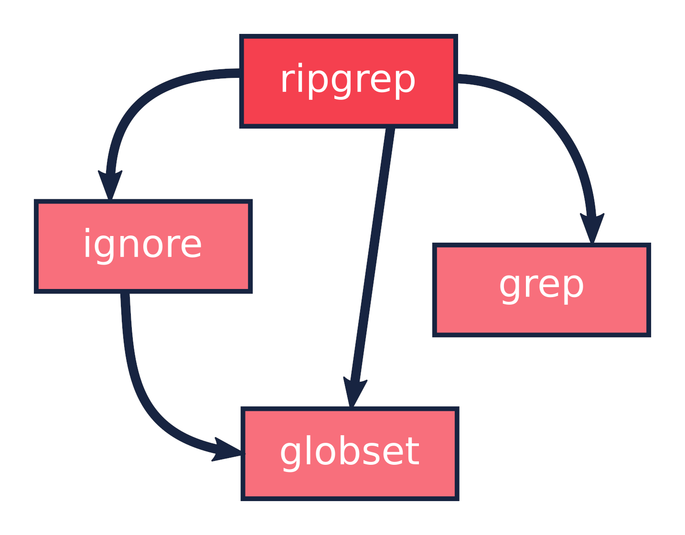
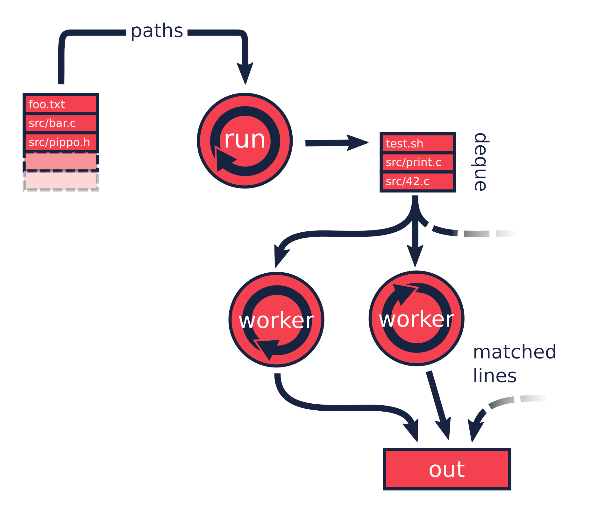
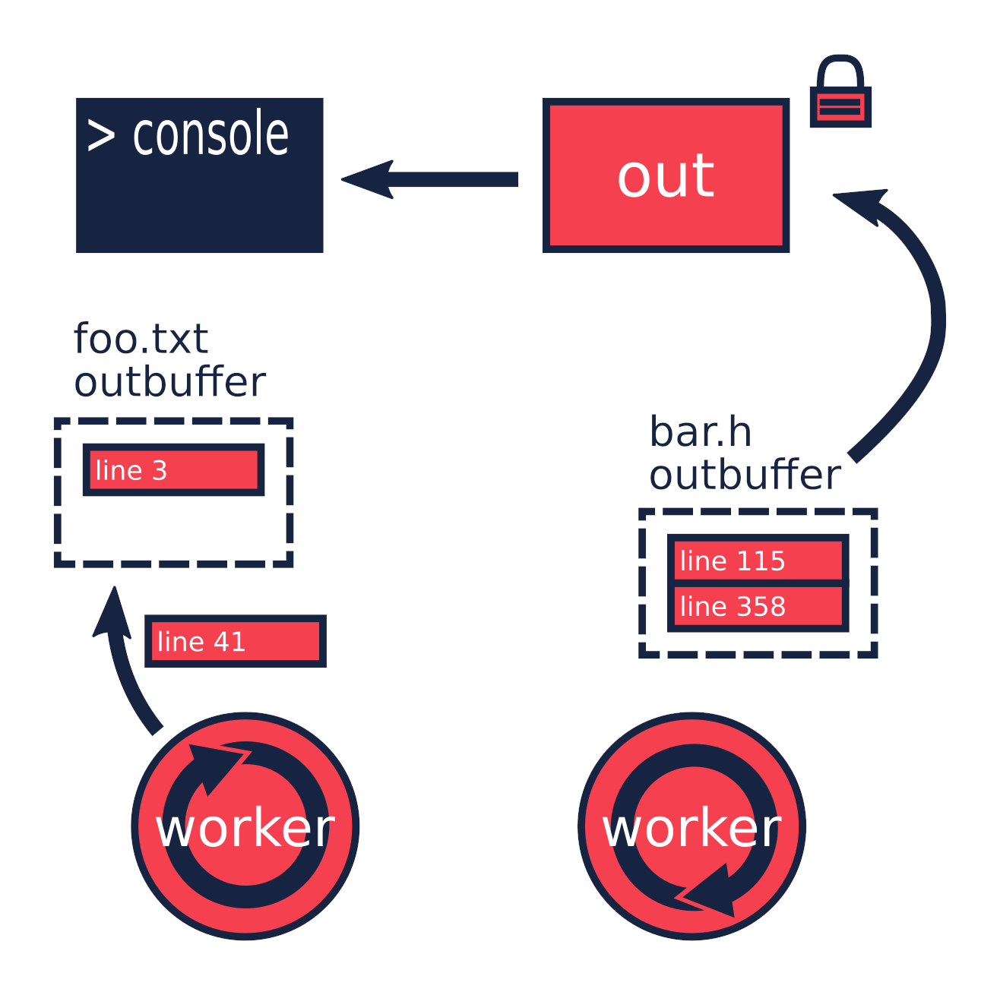

I've been playing around with [Rust](https://www.rust-lang.org) for a year and a
half, and the best part of it, like many others say, has been the very helpful
community. There are a lot of online resources that help you to get started: the
[Rust book](https://doc.rust-lang.org/book/), the
[Rustonomicon](https://doc.rust-lang.org/nomicon/) and many [blog
posts](https://this-week-in-rust.org/) and [stack overflow
questions](http://stackoverflow.com/questions/tagged/rust). After I learned the
basics I felt a bit lost though. I couldn't find enough resources for
intermediate-level-Rustaceans. I'm a C++ developer in my daily job, and so I'm
used with books like [Effective C++](http://www.aristeia.com/books.html) from
Scott Meyers, the [Herb Sutter's blog](https://herbsutter.com/) and a lot of
online resources that always helped me with advanced C++ topics (that are a
lot... :sigh:). Those resources teach you how to get the best from the
language, how to use it properly, and how to structure your code to be more
clear and effective. Those resources are not completely absent in the Rust
community, but neither common.

How do you learn those things then? Well, there are two ways in my opinion: you
spend a lot of time and learn by doing, or you look at some good code. I think
code reviews are incredibly useful; you can see how other people reason about
problems you also struggled with, and how they have solved them. This post
attempts to target those intermediate-level-Rustaceans (like me), by looking at
the [ripgrep](https://github.com/BurntSushi/ripgrep) crate by Andrew Gallant, a
great example of good Rust.


## Introduction

I'm not going to explain everything about the crate, since there is already a
very good [blog post](http://blog.burntsushi.net/ripgrep/) by Andrew himself,
explaining how the application works from a functional perspective, and some
used algorithms. We are going instead to walk through the crate architecture.
I'm going to take for granted some of the basics, so if you need a refresher you
can take a look at the resources I mentioned above.

We are going to look at this specific version of the crate:

```
$ git describe
0.2.5-4-gf728708
```

which is the last one at the time of writing. By the time you are reading this,
however, the crate might have evolved, so if you want to look at the code by
yourself while reading, you should checkout this specific version:

```
$ git clone https://github.com/BurntSushi/ripgrep.git
$ cd ripgrep
$ git checkout f728708
```

and without further ado, let's get started.


## The big picture

`ripgrep` is a command line tool for searching file contents using regular
expressions, similarly to GNU grep. The tool is split across four crates: the
main one (`ripgrep`), `ignore`, `grep` and `globset`.



The `grep` crate provides line-by-line regex searching from a buffer and it is
used only by the main crate. The `globset` crate uses regex to perform [glob
matching](https://en.wikipedia.org/wiki/Glob_(programming)) over paths. It is
used by the main and the `ignore` crates. The `ignore` crate implements
directory walking, ignore and include patterns. It uses the `glob` crate for
that. Finally, the main crate, that glues everything together, implements
command line argument parsing, output handling and multi-threading.

One clear advantage of splitting an application in multiple crates is that this
forces you to keep your code scoped. It's easy to create a mess of dependencies
among the components if everything is in the same crate (or, even worse, in the
same module). If you instead take a part of your application and try to give it
a meaning by itself, you'll end up with a more generic, usable and clearer
interface. Embrace the [Single responsibility
principle](https://en.wikipedia.org/wiki/Single_responsibility_principle) and
let it be your guide, like `ripgrep` clearly does.

## Main

Everything starts from the `ripgrep` main function:

```rust
fn main() {
    match Args::parse().and_then(run) {
        Ok(count) if count == 0 => process::exit(1),
        Ok(_) => process::exit(0),
        Err(err) => {
            eprintln!("{}", err);
            process::exit(1);
        }
    }
}
```

It is very concise: it parses the command line arguments and then passes them to
the `run` function. In between, there is the
[Result::and\_then](https://doc.rust-lang.org/std/result/enum.Result.html#method.and_then)
combinator, so the `match` statement gets to the `Ok` branch only if both
operations succeed. If not, it selects the `Err` branch, handling errors for
both the first and the second operation. Then the exit code depends on whether
the count for matches is not zero.

```rust
fn run(args: Args) -> Result<u64> {
    // ...
}
```

The `run` function at first decides if it's worth to spawn threads or not, and
if so, this is the way it setups the things:



The main thread, controlled by the `run` function digs files from the file
system, and pushes them into a [deque](https://crates.io/crates/deque). This is
a Single-producer / Multiple-consumers queue, from which multiple worker threads
can pull at the same time. They will in turn perform the search operations. Here
is the workers initialization in the `run` function:

```rust
let workq = {
    let (workq, stealer) = deque::new();
    for _ in 0..threads {
        let worker = MultiWorker {
            chan_work: stealer.clone(),
            // initialize other fields...
        };
        workers.push(thread::spawn(move || worker.run()));
    }
    workq
};
```

As you can see, the `deque::new()` returns two objects. The queue is indeed
composed by two ends: one is the `workq` from which the main thread can push,
and the other end is the `stealer`, from which all the workers can pull. The
loop creates a bunch of workers and move them to new threads, along with a
`stealer`. Note that the `stealer` is
[cloneable](https://doc.rust-lang.org/std/clone/trait.Clone.html), but this
doesn't mean that the queue itself is cloned. Internally indeed the `stealer`
contains an [Arc](https://doc.rust-lang.org/std/sync/struct.Arc.html) to the
queue:

```rust
pub struct Stealer<T: Send> {
    deque: Arc<Deque<T>>,
}
```

To note here is the beauty of the `deque` interface. To express the fact that
the producer is only one, but the consumers can be multiple, the type is split
in two: the producer is then
[Send](https://doc.rust-lang.org/std/marker/trait.Send.html) but not
[Sync](https://doc.rust-lang.org/std/marker/trait.Sync.html), nor
[Clone](https://doc.rust-lang.org/std/clone/trait.Clone.html). There is no way
to use it from multiple threads, since you can move it to another thread, but in
that case you lose your reference to it. The `Stealer`, which is the other end,
is instead both `Send` and `Clone`. You can then pass it around by cloning and
sending the copies off to other threads; they all refer to the same queue. There
is no way to use this interface incorrectly.

Another thing to note here is that the `workq` variable is initialized by a
block that returns just the producer part of a new `deque`. Inside the block,
the workers along with their stealers are moved into new worker threads and
those are in turn pushed into a vector. Using a block that just returns what
it's needed for the rest of the function is a good practice. In this way the
`run` function is not polluted with variables that are not usable anymore
because their values have been moved.

This is the `MultiWorker` struct, that runs in a separate thread:

```rust
struct MultiWorker {
    chan_work: Stealer<Work>,
    quiet_matched: QuietMatched,
    out: Arc<Mutex<Out>>,
    #[cfg(not(windows))]
    outbuf: Option<ColoredTerminal<term::TerminfoTerminal<Vec<u8>>>>,
    #[cfg(windows)]
    outbuf: Option<ColoredTerminal<WindowsBuffer>>,
    worker: Worker,
}
```

the first field is the stealer. As you can see from its type, the stealer
receives `Work` structs:

```rust
enum Work {
    Stdin,
    File(DirEntry),
    Quit,
}
```

The main thread will push them from its `workq` variable:

```rust
for dent in args.walker() {
    if quiet_matched.has_match() {
        break;
    }
    paths_searched += 1;
    if dent.is_stdin() {
        workq.push(Work::Stdin);
    } else {
        workq.push(Work::File(dent));
    }
}
```

The `args.walker()` is an iterator over the files to search, or the standard
input stream, if the `-` argument is passed. In the former case it pushes a
`Work::File` entry with the path, in the latter a `Work::Stdin` entry. The items
are received in the `MultiWorker::run` function. It is a loop that pops items
from the `deque` and process them one by one:

```rust
loop {
    if self.quiet_matched.has_match() {
        break;
    }
    let work = match self.chan_work.steal() {
        Stolen::Empty | Stolen::Abort => continue,
        Stolen::Data(Work::Quit) => break,
        Stolen::Data(Work::Stdin) => WorkReady::Stdin,
        Stolen::Data(Work::File(ent)) => {
            match File::open(ent.path()) {
                Ok(file) => WorkReady::DirFile(ent, file),
                Err(err) => {
                    eprintln!("{}: {}", ent.path().display(), err);
                    continue;
                }
            }
        }
    };
    // ...
}
```

The `steal()` method tries to pop from the `deque` and returns a `Stolen`
instance:

```rust
pub enum Stolen<T> {
    /// The deque was empty at the time of stealing
    Empty,
    /// The stealer lost the race for stealing data, and a retry may return more
    /// data.
    Abort,
    /// The stealer has successfully stolen some data.
    Data(T),
}
```

The outcome is matched against the different possibilities, but only
`Stolen::Data` contains a `Work` entry. Both `Stdin` and `File` entry types are
then translated into a `WorkReady` instance. In the second case the file is then
opened with an `std::fs::File`. The `work` variable is later consumed by a
`Worker` instance:

```rust
self.worker.do_work(&mut printer, work);
```

We'll get back to that in a moment, but let's first backtrack to the
`MultiWorker::run` loop. The `Work::Quit` case breaks it, so the thread
terminates:

```rust
let work = match self.chan_work.steal() {
    // ...
    Stolen::Data(Work::Quit) => break,
    // ...
};
```

This value is pushed by the main thread after it walks through all the files.

```rust
for _ in 0..workers.len() {
    workq.push(Work::Quit);
}
let mut match_count = 0;
for worker in workers {
    match_count += worker.join().unwrap();
}
```

The threads are all guaranteed to terminate because the number of `Quit`
messages pushed is the same as the number of workers. A worker can only consume
one of them and then quit. This implies, since no messages can be lost, that all
the workers will get the message at some point, and then terminate. All the
workers threads are then joined, waiting for completion.

To recap, this is a the multi-threading pattern used:

-   a `deque` in between a producer (that provides the work items) and a bunch of
    consumers (that do the heavy lifting) in separate threads;
-   the `deque` carries an enumeration of the things to do, and one of them is the
    `Quit` action;
-   the producer will eventually push a bunch of `Quit` messages to terminate the
    worker threads (one per thread).

In case you just have one type of job, it makes perfect sense to use an
`Option<Stuff>` as work item, instead of an enumeration. The workers have then
to terminate in case `None` is passed. The `Option` can be used also in the
`ripgrep` case instead of the `Quit` message, but I'm not sure the code would be
more readable:

```rust
let work = match self.chan_work.steal() {
    Stolen::Empty | Stolen::Abort => continue,
    Stolen::Data(None) => break,
    Stolen::Data(Some(Work::Stdin)) => WorkReady::Stdin,
    Stolen::Data(Some(Work::File(ent)) => {
        // ...
    }
};
```

### Mono thread

`ripgrep` can also operate in a single thread, in case there is only one file to
search or only one core to use, or the user says so. The `run` function checks
that:

```rust
let threads = cmp::max(1, args.threads() - 1);
let isone =
    paths.len() == 1 && (paths[0] == Path::new("-") || paths[0].is_file());
// ...
if threads == 1 || isone {
    return run_one_thread(args.clone());
}
```

and calls the `run_one_thread` function (I have removed some uninteresting
details from it):

```rust
fn run_one_thread(args: Arc<Args>) -> Result<u64> {
    let mut worker = Worker {
        args: args.clone(),
        inpbuf: args.input_buffer(),
        grep: args.grep(),
        match_count: 0,
    };
    // ...
    for dent in args.walker() {
        // ...
        if dent.is_stdin() {
            worker.do_work(&mut printer, WorkReady::Stdin);
        } else {
            let file = match File::open(dent.path()) {
                Ok(file) => file,
                Err(err) => {
                    eprintln!("{}: {}", dent.path().display(), err);
                    continue;
                }
            };
            worker.do_work(&mut printer, WorkReady::DirFile(dent, file));
        }
    }
    // ...
}
```

As you can see, the function uses a single `Worker` and if you remember, this
struct is used by `MultiWorker` too. The files to search are iterated by
`args.walker()` as before and each entry is passed to the `worker`, as before.
The use of `Worker` in both cases allows code reuse to a great extent.


## The file listing

We are now going to look over the file listing functional block.

The default operation mode of `ripgrep` is to search recursively for non-binary,
non-ignored files starting from the current directory (or from the user
specified paths). To enumerate the files and feed the search engine, `ripgrep`
uses the `ignore` crate.

But let's start from the beginning: the `walker` function. It returns a `Walk`
instance, it is constructed by `Args` and used by the `run` function in
`main`:

```rust
pub fn walker(&self) -> Walk;
```

`Walk` is just a simple wrapper around the `ignore::Walk` struct. A value of
this struct can be created by using its `new` method:

```rust
pub fn new<P: AsRef<Path>>(path: P) -> Walk;
```

or with a `WalkBuilder`, that implements the [builder
pattern](https://doc.rust-lang.org/book/method-syntax.html#builder-pattern).
This allows to customize the behavior without annoying the users of the library,
since it frees them from the burden to provide a lot of parameters to the
constructor, when just the default values are needed:

```rust
let w = WalkBuilder::new(path).ignore(true).max_depth(Some(5)).build();
```

In this example we have created a `WalkBuilder` with default arguments and just
override the `ignore` and `max_depth` options.

The implementation of the type is not very interesting from our point of view.
It is basically an `Iterator` that walks through the file system by using the
`walkdir` crate, but ignores the files and directories listed in `.gitignore`
and `.ignore` files possibly present, with the help of the `Ignore` type. We'll
look at that type a bit later. Let's look at the `Error` type first:

```rust
/// Represents an error that can occur when parsing a gitignore file.
#[derive(Debug)]
pub enum Error {
    Partial(Vec<Error>),
    WithLineNumber { line: u64, err: Box<Error> },
    WithPath { path: PathBuf, err: Box<Error> },
    Io(io::Error),
    Glob(String),
    UnrecognizedFileType(String),
    InvalidDefinition,
}
```

This error type has an interesting recursive definition. The `Partial` case of
the enumeration contains a vector of `Error` instances, for example.
`WithLineNumber` adds line information to an `Error`.[^1] Then the
[error::Error](https://doc.rust-lang.org/std/error/trait.Error.html),
[fmt::Display](https://doc.rust-lang.org/std/fmt/trait.Display.html) and
[From<io::Error>](https://doc.rust-lang.org/std/convert/trait.From.html) traits
are implemented, to make it a proper error type and to easily construct it out
an `io::Error`. Here, the necessary boilerplate to crank up the error type are
handcrafted. Another possibility could have been to use the
[quick-error](https://github.com/tailhook/quick-error) macro, which reduces the
burden to implement error types to a minimum.[^2]

### Ignore patterns

Ignore patterns are handled within the `ignore` crate by the `Ignore` struct.
This type connects directory traversal with ignore semantics. In practice it
builds a tree-like data structure that mimics the directories tree, in which
nodes are ignore contexts. The implementation is quite complicated, but let's
give it a brief look:[^3]

```rust
#[derive(Clone, Debug)]
pub struct Ignore(Arc<IgnoreInner>);

#[derive(Clone, Debug)]
struct IgnoreInner {
    compiled: Arc<RwLock<HashMap<OsString, Ignore>>>,
    dir: PathBuf,
    overrides: Arc<Override>,
    types: Arc<Types>,
    parent: Option<Ignore>,
    is_absolute_parent: bool,
    absolute_base: Option<Arc<PathBuf>>,
    explicit_ignores: Arc<Vec<Gitignore>>,
    ignore_matcher: Gitignore,
    git_global_matcher: Arc<Gitignore>,
    git_ignore_matcher: Gitignore,
    git_exclude_matcher: Gitignore,
    has_git: bool,
    opts: IgnoreOptions,
}
```

The `Ignore` struct is a wrapper around an atomic reference counter to the
actual data (namely, the `IgnoreInner`). A first interesting field inside that
struct is `parent`, that is an `Option<Ignore>`. It points to a parent entry if
present. So, this is where the tree structure comes from: the `Arc` can be
shared, so multiple `Ignore` can share the same parent. But that's not all; they
can also be cached in the `compiled` field, that has a quite complex type:

```rust
Arc<RwLock<HashMap<OsString, Ignore>>>
```

This is the cache of `Ignore` instances that is shared among all of them.
Let's try to break it down:

-   the `HashMap` maps paths to `Ignore` instances (as expected);
-   the `RwLock` allows the map to be shared and modified across different
    threads, without causing data races;
-   and finally the `Arc` allow the cache to be owned safely by different owners
    in different threads.

Every time a new `Ignore` instance has to be built and added to a tree, the
implementation first looks in the cache, trying to reuse the existing instances.
The tree is built dynamically, while crawling the directories, looking for the
specific ignore files (e.g. `.gitignore`, `.ignore`, or `.rgignore`). The tree
gets also custom ignore patterns from the command line, and adds them to the
tree too.

Another interesting bit here is the `add_parents` signature for `Ignore`:

```rust
pub fn add_parents<P: AsRef<Path>>(&self, path: P) -> (Ignore, Option<Error>);
```

Instead of returning a `Result<Ignore, Error>`, it returns a pair, that contains
always a result and optionally an error. In this way partial failures are
allowed. If you remember, the error value can also be a vector of errors, so the
function can collect them while working, but then it can also return a (maybe
partial) result in the end. I found this approach very interesting.

## The search process

In this section we will look at how the regex search inside a file is
implemented. This process involves some modules in `ripgrep` and also the `grep`
crate.

Everything starts from `Worker::do_work` in `main.rs`. Based on the type of the
file passed in, it calls `search` or `search_mmap`. The first function is used
to read the input one chunk at a time and then search, while the second is used
to search into a memory mapped input. In this case there is no need to read the
file into a buffer, because it is already available in memory, or more
precisely, the kernel will take care of this illusion.

The `search` function just creates a new `Searcher` and calls `run` on it.

```rust
impl<'a, R: io::Read, W: Terminal + Send> Searcher<'a, R, W> {
    pub fn run(mut self) -> Result<u64, Error>;
}
```

The first interesting thing to note here is that the `run` function actually
consumes `self`, so you can't actually run the method twice. Why is that? Let's
have a look at the `new` method, that creates this struct:

```rust
impl<'a, R: io::Read, W: Terminal + Send> Searcher<'a, R, W> {
    pub fn new(inp: &'a mut InputBuffer,
                printer: &'a mut Printer<W>,
                grep: &'a Grep,
                path: &'a Path,
                haystack: R) -> Searcher<'a, R, W>;
}
```

It takes a bunch of arguments and stores them into a new `Searcher` instance.
All the arguments to `Searcher` are passed as reference, except `haystack` which
is the `Read` stream representing the file. This means that when this struct
will be destroyed, the file will be gone too. Whenever you complete the search
for a file, you don't have to do it again, indeed. You can enforce this usage by
consuming the input file in the `run` function, or take its ownership in the
constructor and force the `run` function to consume `self`.

Since we cannot run the search twice using the same `Searcher` instance, why
don't we just use a function then? The approach used here has several
advantages:

1.  you get the behavior that the search cannot be run twice with the same file
    (but that's nothing that a free function could not do);
2.  you can split the function among different private functions, without passing
    around all the arguments; they will all take `self` by reference (maybe also
    `&mut self`) and just use the member variables.

So, instead of:

```rust
fn helper1(inp: &mut InputBuffer,
            printer: &mut Printer<W>,
            grep: &Grep,
            path: &Path,
            haystack: &mut R)
{
    // do something with path, grep, etc
}
```

we have:

```rust
fn helper1(&mut self) {
    // do something with self.path, self.grep, etc
}
```

The end result is much nicer.

The first variable that the `Searcher` takes is an `InputBuffer`. It is defined
in the same `search_stream` module, and it provides buffering for the input
file. It has the interesting feature to be able to keep part of the data across
reads. This is needed, for example, when the user requests context lines, or
when a single read is not enough to reach the next end of line.

The `fill` function in the `InputBuffer`, reads from the input and optionally
rolls over the contents of the buffer starting from the `keep_from` index:

```rust
fn fill<R: io::Read>(&mut self, rdr: &mut R, keep_from: usize) -> Result<bool, io::Error>;
```

The interesting implementation bit here is that the buffer grows whenever it
needs more room, but it never shrinks. This avoids some re-allocations, at the
expense of some memory. This approach is perfectly fine in this case, since the
application is intended to work in one shot and then terminate. In a long
running application such as a webserver, this is probably not what you want to
do.

After the buffer has been filled, the `Grep` matcher runs, and in case of a
match, it prints the results according to the options (context lines, line
numbers, etc.).

Note that `Searcher` takes the input buffer by mutable reference. This means
that it can be reused for the next file, without allocating new memory for the
buffer with a new `Searcher` instance.

I'll be skipping most of the implementation review here, even if the code may be
interesting. Most of it however is not very relevant outside this specific case.
If you are interesting you can skim through the `search_stream` module code.

The other case is covered by the `search_mmap` function, that creates a
`BufferSearcher`, defined in the `search_buffer` module, and calls run on it,
like in the `Searcher` case:

```rust
impl<'a, W: Send + Terminal> BufferSearcher<'a, W> {
    pub fn run(mut self) -> u64;
}
```

The same reasoning applies here: the struct is created and used only once for
one file, because the `run` function takes `self` by value. The purpose of the
`search_buffer` module is to search inside a file completely contained in a
single buffer, instead of a stream. This buffer is provided by a memory mapped
file, and it's used only when a stream would be slower.[^4] This module reuses
some types provided by the `search_stream` module:

```rust
use search_stream::{IterLines, Options, count_lines, is_binary};
```

Notably, it does not use the `InputBuffer`, since there is nothing to buffer
here: everything is already available in the given array. The implementation is
very basic, and it doesn't support some of the features the other module does
(like showing context lines).

No big surprises here. The only minor weak point for me is that this module
depends on the `search_stream` one. It doesn't actually build on top of it, but
it just imports some functionality. I'd rather try to move the common
implementation in another module from which they can both import. This makes
sense, since the common stuff is indeed not specific to either of the modules.

### The grep crate

The `grep` crate provides all you need to regex search into a line. It builds on
top of the [Rust regex](https://doc.rust-lang.org/regex/regex/index.html) crate
and adds some optimizations in the `literal` module. The result of a search is a
`Match` instance, which is simply a position inside that buffer:

```rust
#[derive(Clone, Debug, Default, Eq, PartialEq)]
pub struct Match {
    start: usize,
    end: usize,
}
```

The `Grep` type is cloneable. This is important, since it can be built once
(which is an expensive operation) and then cloned to all the worker threads:

```rust
#[derive(Clone, Debug)]
pub struct Grep {
    re: Regex,
    required: Option<Regex>,
    opts: Options,
}
```

I won't dig into the implementation details, since they are already very well
covered in the already mentioned [Andrew's blog
post](http://blog.burntsushi.net/ripgrep/).


## Output handling

The last bit we are going to investigate now is the output handling. The
challenge here is that `ripgrep` needs to write from multiple threads to a
single console avoiding to interleave the results.

Here is how the `run` function in our `MultiWorker` handles that:

```rust
let mut outbuf = self.outbuf.take().unwrap();
outbuf.clear();
let mut printer = self.worker.args.printer(outbuf);
self.worker.do_work(&mut printer, work);
// ...
let outbuf = printer.into_inner();
if !outbuf.get_ref().is_empty() {
    let mut out = self.out.lock().unwrap();
    out.write(&outbuf);
}
self.outbuf = Some(outbuf);
```

An output buffer is taken from `self` and passed to a printer. The printer is
then passed to the worker, that uses it to print the results. So far all the
output went to the buffer, and not to the actual console. Then, if anything has
been buffered, lock the output, that is shared across all the workers, and write
everything. The output buffer is reused in this interesting way: it is kept as
an `Option` field inside the `MultiWorker` itself. For every file, it is taken
from the option, passed by value to a `Printer`, and then when the `Printer` is
done, put it back in the `Option`. This allows to keep it mutable and pass it
around by value without creating it every time.

The trick used here, to avoid to interleave the prints, is to buffer all the
matches found in a file into a "virtual terminal" that doesn't print to the
console. After the search in that file is done, the output is written in one
shot, by locking a shared `Out` object and write the buffer contents to the
actual console.



Let's take a look at the various types involved. The `MultiWorker` keeps a
`ColoredTerminal` instance in its `self.outbuf` field. Its type depends on the
platform:

```rust
#[cfg(not(windows))]
outbuf: Option<ColoredTerminal<term::TerminfoTerminal<Vec<u8>>>>,
#[cfg(windows)]
outbuf: Option<ColoredTerminal<WindowsBuffer>>,
```

The `self.out` is the same in all the platforms:

```rust
let out: Arc<Mutex<Out>>;
```

As you can see, it can be shared and mutated by multiple threads, because it is
wrapped in a `Mutex` and an `Arc`. Inside an `Out` instance, there is the
terminal used to write directly to the console:

```rust
#[cfg(not(windows))]
let term: ColoredTerminal<term::TerminfoTerminal<io::BufWriter<io::Stdout>>>;
#[cfg(windows)]
let term: ColoredTerminal<WinConsole<io::Stdout>>;
```

A `ColoredTerminal` that refers to a `TerminfoTerminal` on Linux, and to a
`WinConsole` on Windows. They are both structs defined in the [term
crate](https://crates.io/crates/term).

But let's step back a and describe all these types a little bit better. The
`Searcher` uses a `Printer` whenever a match is found and the output is enabled.
The `Printer` is defined in the `printer` module and it encapsulates the general
output logic. It knows how to print a match, given some options, and forwards
the writes to an inner `Terminal` type.

```rust
pub struct Printer<W> {
    wtr: W,
    has_printed: bool,
    column: bool,
    context_separator: Vec<u8>,
    eol: u8,
    file_separator: Option<Vec<u8>>,
    heading: bool,
    line_per_match: bool,
    null: bool,
    replace: Option<Vec<u8>>,
    with_filename: bool,
    color_choice: ColorChoice
}
```

Note that I took the comments out to make it shorter. As you can see, there is a
generic writer `W` (that is taken by value) and a lot of other options. This
generic parameter is expected to implement
[term::Terminal](https://docs.rs/term/0.4.4/term/trait.Terminal.html) and
`Send`, as you can see in the implementation:

```rust
impl<W: Terminal + Send> Printer<W> {
    // printer implementation
}
```

The struct uses the builder pattern again, but in a slightly different flavor.
The `new` method takes only a `Terminal` and sets all the options with a default
value. To change them, the user needs to call the various builder methods,
directly on the `Printer` itself, not on another builder helper. For example:

```rust
pub fn heading(mut self, yes: bool) -> Printer<W> {
    self.heading = yes;
    self
}
```

takes `self` by mutable value and, after changing the `heading` option, returns
`self` by value again.

The implementation is simple. The public interface provides some methods to
print the various match components, like the path, the context separator and the
line contents. The only thing that is still not clear to me is why the `Send`
trait is also needed, since I don't see any threading in the struct
implementation, and all the print methods require a mutable `self`, e.g.:

```rust
pub fn context_separate(&mut self) {
    // N.B. We can't use `write` here because of borrowing restrictions.
    if self.context_separator.is_empty() {
        return;
    }
    self.has_printed = true;
    let _ = self.wtr.write_all(&self.context_separator);
    let _ = self.wtr.write_all(&[self.eol]);
}
```

In any case, the implementation is more or less straight forward, and in the end
all the writes are directed to the inner `Terminal`.

In the Linux case, the `Terminal` is the default one provided by the `term`
crate itself:
[TerminfoTerminal](https://docs.rs/term/0.4.4/term/terminfo/struct.TerminfoTerminal.html).
On Windows `ripgrep` provides a custom implementation, since the coloring needs
a special treatment, to avoid performance hurt:

```
This particular implementation is a bit idiosyncratic, and the "in-memory"
specification is to blame. In particular, on Windows, coloring requires
communicating with the console synchronously as data is written to stdout.
This is anathema to how ripgrep fundamentally works: by writing search results
to intermediate thread local buffers in order to maximize parallelism.

Eliminating parallelism on Windows isn't an option, because that would negate
a tremendous performance benefit just for coloring.

We've worked around this by providing an implementation of `term::Terminal`
that records precisely where a color or a reset should be invoked, according
to a byte offset in the in memory buffer. When the buffer is actually printed,
we copy the bytes from the buffer to stdout incrementally while invoking the
corresponding console APIs for coloring at the right location.
```

The implementation is provided by `WindowsBuffer`:

```rust
/// An in-memory buffer that provides Windows console coloring.
#[derive(Clone, Debug)]
pub struct WindowsBuffer {
    buf: Vec<u8>,
    pos: usize,
    colors: Vec<WindowsColor>,
}

/// A color associated with a particular location in a buffer.
#[derive(Clone, Debug)]
struct WindowsColor {
    pos: usize,
    opt: WindowsOption,
}

/// A color or reset directive that can be translated into an instruction to
/// the Windows console.
#[derive(Clone, Debug)]
enum WindowsOption {
    Foreground(Color),
    Background(Color),
    Reset,
}
```

This struct implements `terminfo::Terminal` as we said before, and it contains a
buffer of characters to print, a position on the buffer itself, and a vector of
colors and positions. Whenever the write is called, the output is buffered in
`self.buf`:

```rust
impl io::Write for WindowsBuffer {
    fn write(&mut self, buf: &[u8]) -> io::Result<usize> {
        let n = try!(self.buf.write(buf));
        self.pos += n;
        Ok(n)
    }

    fn flush(&mut self) -> io::Result<()> {
        Ok(())
    }
}
```

and whenever a coloring option is passed, it is pushed into the `colors` vector,
along with the current position:

```rust
impl Terminal for WindowsBuffer {
    type Output = Vec<u8>;

    fn fg(&mut self, fg: Color) -> term::Result<()> {
        self.push(WindowsOption::Foreground(fg));
        Ok(())
    }
    // ...
}
```

Then, when the higher level logic decides it's time to print everything, the
`print_stdout` is called, passing another terminal (the real one, linked with
the console):

```rust
/// Print the contents to the given terminal.
pub fn print_stdout<T: Terminal + Send>(&self, tt: &mut T) {
    if !tt.supports_color() {
        let _ = tt.write_all(&self.buf);
        let _ = tt.flush();
        return;
    }
    let mut last = 0;
    for col in &self.colors {
        let _ = tt.write_all(&self.buf[last..col.pos]);
        match col.opt {
            WindowsOption::Foreground(c) => {
                let _ = tt.fg(c);
            }
            WindowsOption::Background(c) => {
                let _ = tt.bg(c);
            }
            WindowsOption::Reset => {
                let _ = tt.reset();
            }
        }
        last = col.pos;
    }
    let _ = tt.write_all(&self.buf[last..]);
    let _ = tt.flush();
}
```

Here, if the terminal does not support coloring, there is nothing special to do,
and all the buffer contents are written. Otherwise, for every color option, it
writes the buffer contents until the recorded position for that option, and than
it applies the option. This is repeated until the end of the buffer.

The terminal is not used as is by the higher level logic, but wrapped inside a
`ColoredTerminal` instance:

```rust
#[derive(Clone, Debug)]
pub enum ColoredTerminal<T: Terminal + Send> {
    Colored(T),
    NoColor(T::Output),
}
```

The purpose of this type is simple: determine if the current terminal supports
coloring, and if so use it. If not, just drop the terminal and use its internal
writer type. Determine color support is a costly operation, so it's done only
once, and the result is cached in a static variable, with the help of the
[lazy\_static](
) crate:

```rust
lazy_static! {
    // Only pay for parsing the terminfo once.
    static ref TERMINFO: Option<TermInfo> = {
        match TermInfo::from_env() {
            Ok(info) => Some(info),
            Err(err) => {
                debug!("error loading terminfo for coloring: {}", err);
                None
            }
        }
    };
}
```

The type then implements some specialized constructors for a bunch of types:

-   `WindowsBuffer`;
-   `WinConsole<io::Stdout>`;
-   and the one for the generic writer `W: io::Write + Send`.

If the terminal then supports coloring, it uses the `Colored(T)` enum value
(where `T` is `T: Terminal + Send`). In this case the `ColoredTerminal` instance
contains a `Terminal`. In the other case, the `NoColor(T::Output)` value is
selected and a plain `io::Write` is used. `ColoredTerminal` then implements
`Terminal` itself in this way:

```rust
impl<T: Terminal + Send> term::Terminal for ColoredTerminal<T> {
    type Output = T::Output;

    fn fg(&mut self, fg: term::color::Color) -> term::Result<()> {
        self.map_result(|w| w.fg(fg))
    }
    // other very similar implementations...
}
```

The intended behavior here is to forward the function to the inner terminal, if
present, or return an error. A possible solution would have been to `match self`
in this way:

```rust
match *self {
    ColoredTerminal::Colored(ref mut w) => w.fg(fg),
    ColoredTerminal::NoColor(_) => Err(term::Error::NotSupported),
}
```

for all the functions. The solution adopted here is more elegant, as it
Implements a `map_result` that applies the given function to the inner
`Terminal` if it's present and returns an error otherwise:

```rust
impl<T: Terminal + Send> ColoredTerminal<T> {
    fn map_result<F>(&mut self, mut f: F) -> term::Result<()>
        where F: FnMut(&mut T) -> term::Result<()>
    {
        match *self {
            ColoredTerminal::Colored(ref mut w) => f(w),
            ColoredTerminal::NoColor(_) => Err(term::Error::NotSupported),
        }
    }
}
```

In this way the whole `Terminal` implementation is just a bunch of one-liners.

The missing piece of this puzzle is the `Out` struct. The comment on top of the
struct speaks for itself:

```rust
/// Out controls the actual output of all search results for a particular file
/// to the end user.
///
/// (The difference between Out and Printer is that a Printer works with
/// individual search results where as Out works with search results for each
/// file as a whole. For example, it knows when to print a file separator.)
pub struct Out {
    #[cfg(not(windows))]
    term: ColoredTerminal<term::TerminfoTerminal<io::BufWriter<io::Stdout>>>,
    #[cfg(windows)]
    term: ColoredTerminal<WinConsole<io::Stdout>>,
    printed: bool,
    file_separator: Option<Vec<u8>>,
}
```

The implementation is straightforward: whenever `write` is called with a
`ColoredTerminal` as a buffer, it prints a separator (except for the first
file), then prints the buffer contents and then flushes the terminal. Here is
the Unix version:

```rust
#[cfg(not(windows))]
pub fn write(&mut self, buf: &ColoredTerminal<term::TerminfoTerminal<Vec<u8>>>) {
    self.write_sep();
    match *buf {
        ColoredTerminal::Colored(ref tt) => {
            let _ = self.term.write_all(tt.get_ref());
        }
        ColoredTerminal::NoColor(ref buf) => {
            let _ = self.term.write_all(buf);
        }
    }
    self.write_done();
}
```

A very similar but not exactly equal version is provided for Windows, so there
is some code duplication. It would be better to abstract these details in
`ColoredTerminal`, providing a `write_all` method there, or in alternative, to
introduce a new trait used by `ColoredTerminal` itself that does the same and
than make `TerminfoTerminal`, `WindowsBuffer` and `WindowsConsole` to implement
it.

## Concluding remarks

In this post we have done a `ripgrep` code review, with the main focus on the
design decisions and the interesting implementation solutions. The review is far
from being complete, but my goal was to look at the patterns and break them
down, in hope that they can be used in similar contexts by other projects.

In general the code is very clean, a part certain functions that would benefit
from some more comments. There is however an extensive usage of
`#[inline(always)]` and `#[inline(never)]` directives in the code, that I could
not explain. I wonder if they have been added after profiling and if so, why the
compiler have failed to identify them correctly. A possible use case is
intra-crate inlining, but compiling with `rustc -C lto` already allows to inline
everything (by slowing down compilation).[^5]

In any case, I found the `ripgrep` crate a beautiful piece of software, from
which I could learn a lot. I hope I was able to convey this beauty with this
post.


### Feedback

[Andrew](https://twitter.com/burntsushi5) posted his feedback on Twitter and on
[HN](https://news.ycombinator.com/item?id=13097556). I report his comment here,
because it's relevant for some of the remarks I made:

> ripgrep author here! This is a great review, thanks for doing it! I'd like to
> respond to a few of the bad things pointed out. :P
> 
> The search code is indeed in a less than ideal state. I've mostly avoided
> refactoring it because I want to move it to its own separate crate. I've been
> steadily doing this for other things. Namely, ripgrep used to be a single main
> crate plus a small regex handling crate (grep), but now it's several: globset,
> grep, ignore, termcolor and wincolor. I'd like to roll the search code into the
> grep crate so that others can use it. Once that's done, ripgrep proper will be a
> pretty small, limited mostly to argv handling and output handling.
> 
> I do sometimes get overzealous with inline(always) and inline(never). Both are
> almost always a result of trying things while profiling, and then forgetting to
> remove them. If you look closely, most of them are in the core searching code
> where performance is quite important!
> 
> Finally, this code review was done while I was in the middle of moving more of
> ripgrep code out into the \`ignore\` and \`termcolor\` crates. The \`ignore\` crate
> does all the gitignore handling (which is quite tricky and is now being used by
> the [tokei](https://github.com/Aaronepower/tokei) project) and provides a parallel recursive directory iterator, which
> made ripgrep even faster! The \`termcolor\` crate handles cross platform coloring
> shenanigans, including Windows consoles and mintty. It wasn't fun: [issue #94](https://github.com/BurntSushi/ripgrep/issues/94#issuecomment)&#x2026;
> &#x2014; The author did a great job reviewing the previous solution I used for colors
> though, and was something I really wasn't proud of!

I have corrected a typo, thanks [@toquetos](https://twitter.com/toqueteos).

There is some discussion going on in the
[r/rust](https://m.reddit.com/r/rust/comments/5gayqw/ripgrep_code_review/)
subreddit, and on [HN](https://news.ycombinator.com/item?id=13097125). Thank you
guys for the feedback and the kind words, and thanks to Andrew for his great
work.

That's all folks.


[^1]: In this case `Box<Error>`, since a recursive type cannot embed itself,
otherwise it would be impossible to compute the size of the type.

[^2]: You can find a good reference on the error handling topic in [the Rust
book](https://doc.rust-lang.org/stable/book/error-handling.html).

[^3]: Please bear in mind that I have taken out the comments to make it
shorter.

[^4]: Generally this happens when searching into a single huge file.

[^5]: See [When should I use inline](https://internals.rust-lang.org/t/when-should-i-use-inline/598).