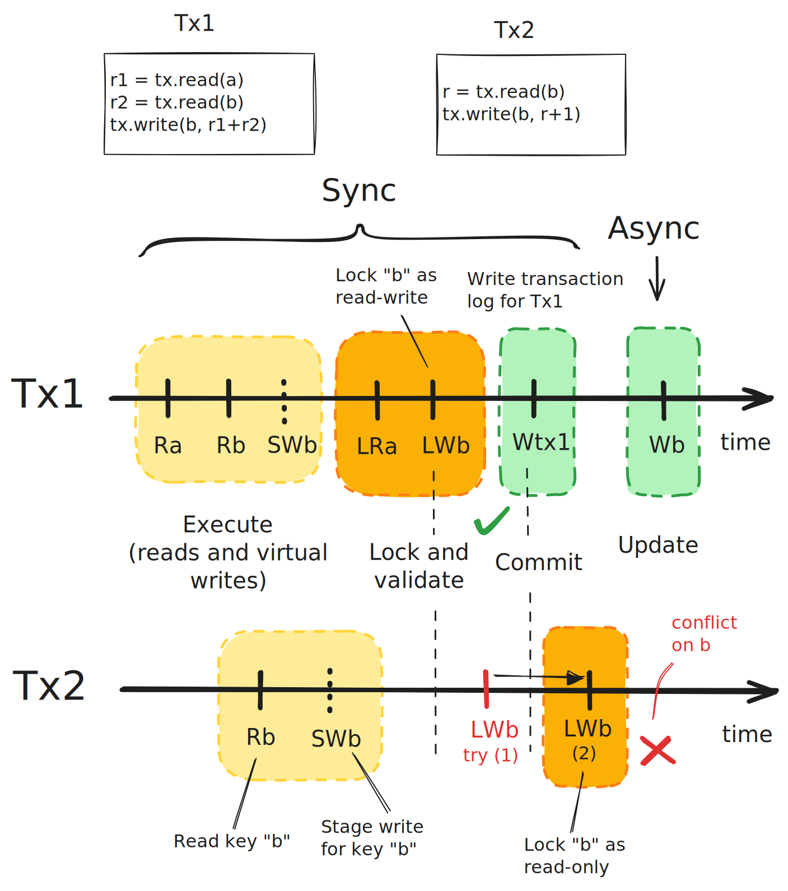

I was frustrated by the gap between stateless and stateful applications in the
cloud. While I could easily spin up a stateless application as a "serverless"
function in any major cloud provider and pretty much forget about it, persisting
data between requests was a game of pick two among three: cheap, strongly
consistent, portable.

Could I solve portability and lack of transactions myself with *a single
client-side solution?* I thought it would be possible through object storage:
cheap, strongly consistent and ubiquitous.

I could just build a thin conversion layer between
[DynamoDB](https://aws.amazon.com/dynamodb/) (AWS), [Cosmos
DB](https://azure.microsoft.com/en-us/products/cosmos-db/) (Azure) and
[Firestore](https://firebase.google.com/docs/firestore/) (GCP), so does it make
sense to instead reinvent a database almost from scratch? Not in a practical
sense, but think about it this way: I learned a lot about database design, so it
was still worth it, and I think you will find my journey useful too.

And before I forget, [here's the source code](https://github.com/mbrt/glassdb).

## The beginning

My thinking started a few years back, when I realized I could easily deploy
serverless solutions – like [AWS Lambda](https://aws.amazon.com/lambda/) or
[Google Cloud Run](https://cloud.google.com/run) – to deploy a *function* that
handles HTTP requests, without worrying about host OS updates, Kubernetes
clusters, VMs, and all the underlying infrastructure. And since the serverless
billing is a pay-per-request (with a decent free tier), I also paid little to
nothing for most of the services I was running for myself.

The deal is easy: you provide the code and the cloud provider runs it. Pay no
money, do no maintenance, and get a functional web service in return. Sounds
like a good deal?

It was until I realized that this worked only if I didn't need to persist data
across requests. All database options had downsides: [Google SQL for
Postgres](https://cloud.google.com/sql/docs/postgres/pricing) costs money
whether I use it or not, [upgrades were
manual](https://cloud.google.com/sql/docs/postgres/upgrade-major-db-version-inplace)
and required downtime. [Spanner](https://cloud.google.com/spanner) was strongly
consistent, but very expensive (shared instances didn't exist) and not portable.
[Datastore](https://cloud.google.com/datastore/docs/concepts/overview) (now
surpassed by [Firestore](https://cloud.google.com/firestore)) was cheap, but had
restrictions on transactions (reads before writes) and wasn't portable outside
Google Cloud either. AWS provided similar services
([RDS](https://aws.amazon.com/rds/) portable but expensive and manual,
[DynamoDB](https://aws.amazon.com/dynamodb/) hands-off and cheap, but not
portable to other clouds and eventually consistent).

## The idea

I decided to give the wheel reinvention another round of my energies. With the
excuse of learning something, I thought: I'm already using object storage
([Google Cloud Storage](https://cloud.google.com/storage) and [AWS
S3](https://aws.amazon.com/s3/)) to store larger files. Can I abuse their
[strong consistency](https://cloud.google.com/storage/docs/consistency)
properties and turn them into transactional databases? And yes, GCS is slow, but
it's extremely scalable. And how slow is too slow? I ran some tests on reading
and writing 100KiB objects, and the 90th percentile looked like this:

* Read: 63.1ms
* Write: 105ms
* Metadata: 41.3ms

Which is far from what you get from a local SQLite (10x slower), but fine in
many scenarios and also works with multiple writers. In fact, a*s many writers
as I want*.

The other question was: when does this become too expensive compared to a
traditional managed database solution like Google Cloud SQL? The cheapest
managed Postgres instance comes at $8.57 per month. To pay the same, [we would
need](https://numbat.dev/?q=unit+query+%3D+1+piece%E2%8F%8Eunit+qps+%3D+query+%2F+s%E2%8F%8E%288.57%24+%2F+0.004%24+*+10+thousand%29+*+query+%2F+month%E2%8F%8E_+-%3E+qps%E2%8F%8E_+%2F+0.05%24+*+0.004%24%E2%8F%8E)
an average of 0.66 writes / s or 8.3 reads / s (at $0.004 per 10k read ops and
$0.05 per 10k write ops). If we instead use the smallest dedicated instance as a
reference, estimates would grow to 2.7 writes / s or 34 reads / s.

For infrequent or bursty traffic, this makes sense so far.

### The simplest database

After I got the cost component confirmed, the next step was to come up with the
*simplest* working solution – disregarding all performance considerations.
"First make it work, then make it pretty" was my working mode. I started with
GCS, because Google Cloud was the one I knew better at the time.

The first design choice I made was the architecture. The simplest possible is
the one with *no server component*. I wanted to see how far I could go with a
client-side library and just object storage.


In the same line of thinking, the simplest possible database is
[SQLite](https://www.sqlite.org/). You can make it work by running each
transaction locally in the client and returning OK *only if* both the
transaction *and* the upload to object storage succeed. To avoid race conditions
between two different clients, you can either use locks, or implement a form of
OCC (Optimistic Concurrency Control), by checking that no concurrent updates
happen between a transaction's reads and commit.

I decided to go with the second option, because it was *much easier to
implement*.

For that, I needed two APIs: read and [conditional
write](https://cloud.google.com/storage/docs/request-preconditions) – both
available in GCS. These primitives, although primitive, allowed me to build a
database. I could serialize a SQLite database into an object and for every
transaction do the following:

1. Download the DB locally from GCS, keep note of its metadata version, and open
   it with SQLite. Execute the transaction locally.
2. If it succeeds, take this new database and try to write it conditionally to
   GCS (using the previously read metadata version).
3. If it fails, repeat from \#1, executing the transaction again.
4. On success, return success to the user.

Step number two is atomic and succeeds only if no other client modified the
object in the meantime, which is what makes the algorithm work.

Well, this is slow. The whole database must be downloaded and uploaded in full
at every transaction – a bit of a problem if it's gigabytes in size. Clients are
also guaranteed to conflict at every transaction, adding retries on top. Even if
they access different tables, they still need to update the same global object,
resulting in no parallelism.

Even worse, GCS officially allows [one update per
second](https://cloud.google.com/storage/quotas) per object, resulting in a
maximum of one transaction per second, killing the performance of the database.
In practice, because of the way rate limiting is implemented (tokens are checked
and reset every minute), GCS allows short bursts of requests to go faster, with
penalties coming afterward. This results in very inconsistent performance, with
latencies going from tens of milliseconds to tens of seconds, the moment clients
hit the same object consistently.

## Distributed transactions

With the single object approach only going so far, I needed to look into
distributing the load to multiple objects. The main problem I needed to solve
became implementing ACID transactions across multiple objects. Even though
updates to the *same object* are guaranteed to be strongly consistent – the
contents of a write are available to all readers, no matter where they are,
immediately after the write completes – this only applies to *single objects*.
Operations involving multiple objects at once, such as copying or renaming
multiple objects, [are not
atomic](https://cloud.google.com/storage/docs/consistency). Furthermore, the
version number of an object has nothing to do with that of another, so there's
no global ordering for writes either.

Luckily, there's a whole literature of distributed transactions algorithms
designed to solve this problem space with different tradeoffs. And the design
space at this stage was:

* Object storage
  * Provides strong consistency for operations on single objects.
  * Latency can be high (50ms \- 150ms).
  * Does not allow frequent updates to the same objects (\< 1s).
* No backend component, only a client library.
* No direct communication channel between clients.

This suggested that I look into algorithms that *minimize the number of write
operations*, while keeping "correctness". We'll get back to this in a moment,
but as an aside, what do I mean by *correctness*?

### Aside: Isolation and Consistency

When thinking about correctness, my mind went to university lectures on
databases about [ACID properties](https://en.wikipedia.org/wiki/ACID),
especially isolation. But I found it difficult to relate that (stale) knowledge
with material in the literature and on the web. The main issue, I believe, is
due to overlapping terminology and concepts between research on traditional
relational databases and shared memory systems. These concepts, previously
treated separately, became simultaneously useful to distributed systems, which
borrowed terminology from both sides.

The crux of the issue is that about ACID properties (Atomicity, Consistency,
Isolation, Durability), everybody agrees on *atomicity* (a transaction is
applied in full or not at all) and *durability* (after a commit, the effects of
a transaction are persistent even after system crashes). But not so much on the
other two. *Isolation levels* in the SQL standard are not only imprecise, but
also stuck in the nineties. This is a problem known [since
1995](https://www.microsoft.com/en-us/research/wp-content/uploads/2016/02/tr-95-51.pdf),
which opened the door to narrow and misleading interpretations by database
vendors. Oracle famously claimed their implementation of snapshot isolation to
be "serializable" – even though [it
wasn't](https://blog.dbi-services.com/oracle-serializable-is-not-serializable/)
– through some legally anal interpretation.[^1] Furthermore, isolation levels
apply to single host databases, but fail to adequately take *replication* into
consideration, which *introduce new anomalies* and so require more
expressiveness. In addition, *consistency* means [different
things](http://sites.computer.org/debull/A16mar/p3.pdf) between the SQL standard
and in distributed systems' literature. In ACID, *C* has traditionally meant
"respects constraints specified by the user" such as foreign keys and unique
constraints. Whereas, the *C* in the
[CAP](https://en.wikipedia.org/wiki/CAP_theorem) and
[PACELC](https://en.wikipedia.org/wiki/PACELC_theorem) theorems refers to the
ability of a *read to receive the value of the most recent write*.

On top of all this, literature and blogs use "isolation levels" in a very
liberal way, sometimes meaning to say "consistency level", or a combination of
an isolation and a consistency guarantee. If I wanted to design a database, I
first needed to clarify things for myself.

And in my quest for clarity, I bumped into [Jepsen's
diagram](https://jepsen.io/consistency) over and over. Jepsen takes
[Bailis](http://www.vldb.org/pvldb/vol7/p181-bailis.pdf)' approach of unifying
everything in a single hierarchy of ever greater "consistency". This is a nice
simplification, but it forgets to mention that the unified hierarchy is actually
*two hierarchies* fused together: one of consistency and one of isolation
guarantees. **Isolation provides rules for how the system behaves when
transactions run concurrently**, and **consistency specifies when writes are
available to reads** after they complete. Thanks to [Daniel
Abadi](https://fauna.com/blog/demystifying-database-systems-part-4-isolation-levels-vs-consistency-levels)
I realized that a database can provide guarantees for both hierarchies at the
same and this is what we sometimes call "isolation level" and sometimes
"consistency model", making the terminology very confusing.


My revised diagram makes this distinction more prominent. Arrows show guarantees
of inclusion (e.g.
[Linearizable](https://jepsen.io/consistency/models/linearizable) *is*
[Sequential](https://jepsen.io/consistency/models/sequential) *plus additional
guarantees*). Dotted lines show how "isolation levels" are defined as a
combination of isolation and consistency guarantees. Note how [Strict
Serializable](https://jepsen.io/consistency/models/strict-serializable) is the
strongest level, as it implies all the guarantees.

In essence, a guarantee is defined in terms of which *anomalies it prevents*.
The more it prevents, the stronger it is. And since anomalies are unexpected
results that happen when transactions run concurrently, the more anomalies are
allowed in an isolation level, the more care a developer has to put to prevent
them from popping up as bugs in the application logic. For example, [dirty
reads](https://en.wikipedia.org/wiki/Isolation_\(database_systems\)#Dirty_reads),
allowed in the [Read
Uncommitted](https://jepsen.io/consistency/models/read-uncommitted) isolation
guarantee, happen when a transaction is allowed to read a value modified by
another transaction that isn't committed yet. Because of this, transactions that
abort may still influence other transactions.

Isolation anomalies break the illusion of *transactions running independently*
of each other, and consistency anomalies break the illusion of a system being in
a single machine (i.e. replication lags become visible).

### Notable levels

Isolation levels seemed quite abstract to me, until I looked at notable
databases and their position in the hierarchy. Two things were clear: the first
is that database vendors go to great lengths in explaining why their database is
"consistent enough" and how "rare those anomalies are in practice". The second
thing is that there's great variability in levels:


For example, Postgres provides [Read
Committed](https://jepsen.io/consistency/models/read-committed) by default,
which means that the same process can update a row in a transaction and then the
next transaction could still read the outdated value. Yes, these are two
separate transactions, but this is surprising to most developers, especially
when the database is hosted as a single replica. But since Postgres is also
[Sequentially Consistent](https://jepsen.io/consistency/models/sequential), at
least that the transactions' ordering is *the same for everyone*, even though it
doesn't necessarily follow the real time in which transactions were applied.

King of the pack in terms of isolation is
[Spanner](https://cloud.google.com/spanner) – which is [Strict
Serializable](https://jepsen.io/consistency/models/strict-serializable) –
meaning that transactions run *as if they were serially executed,* and *they
follow the real time order globally*. This is the most correct model.
[FaunaDB](https://fauna.com/) is also Strict Serializable through a [different
mechanism](https://fauna.com/blog/consistency-without-clocks-faunadb-transaction-protocol).[^2]

Unsurprisingly, [Cassandra](https://cassandra.apache.org/), being a true NoSQL
database, provides a weak, eventually consistent model, because the focus is on
availability at all costs. An interesting middle ground is
[CockroachDB](https://www.cockroachlabs.com/). Very close to Spanner, but
occasionally allows for transactions to read stale data, in the name of more
optimistic concurrency controls.[^3]

### Which isolation level to target?

Weaker isolation levels allow for more optimizations in the database
implementation, but also allow for more classes of *anomalies*. This means they
are usually faster, but require application developers to implement more logic
themselves to avoid bugs. The balance between performance and correctness is a
pendulum that swung from the NoSQL years – faster is better – to the NewSQL era,
after the [Spanner
paper](https://static.googleusercontent.com/media/research.google.com/en//archive/spanner-osdi2012.pdf)
in 2012, where correct is better. Practice and papers like [ACID
rain](http://www.bailis.org/papers/acidrain-sigmod2017.pdf) (from Bailis) showed
that designing correct applications with weak consistency databases *is a lot
harder*: they require more effort and time to develop [and
understand](http://www.bailis.org/blog/understanding-weak-isolation-is-a-serious-problem/),
so why bother, if stronger consistency is fast enough? After all, developer time
is more expensive than machine time.

For me the answer was clear: the ideal isolation level is the highest one
*before things become too slow* for the application at hand.

## No isolation

Given this background, my thinking went to this basic algorithm for a
transaction:

```
- Read what you need
- Write what you need
- On commit: do nothing
- On abort: undo the writes one by one
```

This clearly doesn't provide *Atomicity*, nor basic isolation such as [Read
Committed](https://jepsen.io/consistency/models/read-uncommitted), because
transactions commit one key at a time and concurrent transactions can read new
values *before they are committed*. This however provides
[Linearizable](https://jepsen.io/consistency/models/linearizable) consistency,
thanks to the strong consistency offered [by
S3](https://docs.aws.amazon.com/AmazonS3/latest/userguide/Welcome.html#ConsistencyModel)
and [GCS](https://cloud.google.com/storage/docs/consistency), which state that
any read initiated after a successful write, return the contents of that latest
write. Without effort, we have basically achieved *strong consistency with no
isolation*.


The challenge then was to introduce stronger isolation guarantees while keeping
acceptable performance.

## Interface

Before going further down the rabbit hole of picking a transaction algorithm, I
needed to take a step back and decide on which interface I wanted to provide.
The nice part of my [simplest database](#the-simplest-database) is that it
provides a recognizable SQL interface through SQLite out of the box. But, by
deciding to split the data among multiple objects in a bucket, I was making that
*a lot harder* to achieve.

I looked around for inspiration and found that many modern databases are
transactional key value stores at their core. Some, like
[FoundationDB](https://www.foundationdb.org/), stop there. They *are in a way*
just key value stores. Others – like CockroachDB – take a step further and build
a Postgres compatible [SQL
layer](https://www.cockroachlabs.com/docs/v22.1/architecture/sql-layer) [on
top](https://www.cockroachlabs.com/docs/v22.1/architecture/overview) of it.

One more source of inspiration was Ben Johnson's
[BoltDB](http://github.com/boltdb/bolt), a very elegant transactional embedded
key value store written in Go. You can see its influence in my [GlassDB
example](https://github.com/mbrt/glassdb?tab=readme-ov-file#usage-example):

```go
func compareAndSwap(ctx context.Context, key, oldval, newval []byte) (bool, error) {
	coll := db.Collection([]byte("my-collection"))
	swapped := false
	err := db.Tx(ctx, func(tx *glassdb.Tx) error {
		b, err := tx.Read(coll, key)
		if err != nil {
			return err
		}
		if bytes.Equal(b, oldval) {
			swapped = true
			return tx.Write(coll, key, newval)
		}
		return nil
	})
	return swapped, err
}
```

This snippet implements a simple
[compare-and-swap](https://en.wikipedia.org/wiki/Compare-and-swap) for a key in
a *collection* – which is just a set of keys with the same prefix. The *db.Tx*
method wraps the operations into a single transaction, so that it can be retried
by GlassDB transparently.

I will not spend too much time discussing how to use it. If you are curious,
please check out the [repository](https://github.com/mbrt/glassdb) and the
relative [reference documentation](https://pkg.go.dev/github.com/mbrt/glassdb).
The only thing I wanted to show is that you can put arbitrary code inside a
transaction, and *reads and writes to the database* will be, well,
transactional.

## Choosing the algorithm

As I mentioned earlier, my goal was to choose an algorithm that guarantees the
strongest possible isolation levels, while retaining a reasonable level of
performance. The first thing that came to mind then was to use [Strict Two Phase
Locking (S2PL)](https://en.wikipedia.org/wiki/Two-phase_locking), similarly to
Spanner. This alone would guarantee
[serializable](https://jepsen.io/consistency/models/serializable) isolation, and
combining that with the
[linearizable](https://jepsen.io/consistency/models/linearizable) consistency of
GCS, I would get the top spot in isolation levels: [strict
serializability](https://jepsen.io/consistency/models/strict-serializable).

The algorithm itself is quite intuitive:

1. A key must be locked as *read-only* or *read-write*, before you can read it.
2. It must be locked as *read-write*, before you can modify it.
3. You can release all the locks only after committing.

My approach was to first *make it work*, and then *make it fast*.

## Make it work

To make the algorithm above work, I needed locking and atomic commits.

### Locks

GCS objects are made of two independent parts: content and metadata. Metadata
contains user-controlled key values and a version that automatically changes at
every write (or metadata change). Given this, it's easy to update an object's
metadata to mark it as "locked". The algorithm is basically a compare-and-swap:

1. Read the object's metadata with its version number. Is the "locked" tag set
   to "true"?
2. If yes, wait a bit and repeat \#1.
3. If no, *conditionally* write the metadata, setting "locked" to "true". The
   condition constrains the write to succeed only if the metadata version is the
   same as the one we read in step \#1.
4. If the write failed, go to \#1. If it succeeded, we got the lock.

Unlocks work similarly, but it does a compare-and-swap for "locked=false"
instead.

This algorithm is quite simplistic: it doesn't distinguish between read and
write locks, and crashes in the application may result in forever-locks. We'll
talk about crashes in a bit, but before we need to add read locks:

* Use a *lock-type* and a *lockers* tag, containing respectively the type of
  lock (read, write, none) and the IDs of the transactions holding the lock.
* Locking means updating the *lock-type* and adding the ID of the transaction
  holding the lock to the *lockers* tag (we can modify multiple tags
  atomically).
* Unlocking is the opposite: remove the ID from *lockers* and if that was the
  last locker, set the *lock-type* as *unlocked*.

Some additional intuitive ground rules as well:

* Multiple transactions can hold *read* locks to the same key at the same time.
* Read locks can be upgraded to *write*, but only if there was a single
  transaction holding it.
* Write locks are *exclusive*.

### Commits

Commits must appear instantaneously: a transaction is either committed or not,
and nothing in between. How do we do it with transactions updating multiple
keys? How do we realize those updates at the same time? It's clear that we can't
update one key at a time while releasing the locks, because if the process
crashes in the middle, we would get an inconsistent state.

One way would be to use *transaction logs*. Transactions stash the updates they
are going to do into a log, before actually doing them. This allows *replays*
after crashes. When the log is committed, the transaction is considered
committed and a process picking up the work after a crash will read it and
continue committing the writes.

The way I implemented this was to include all the values written by a
transaction into its transaction log upon commit. A transaction keeps the keys
untouched until commit, and only after the log is written successfully it
unlocks the keys while updating their values.

### Deadlocks and crashes

Distributed locks require timeouts. If a process opens a transaction, locks a
few keys and then crashes, those keys would become inaccessible. Even if the
crash was temporary, we still would depend on all clients to come back online
reasonably quickly after crashes, which might be unreasonable.

The way to solve this is by introducing TTLs on locks. While locking a key, a
transaction also keeps track of the time it's taking to commit. After a timeout,
it will create (or update) its transaction log by stating that the transaction
is still pending, along with a refresh timeout. Competing transactions that want
to check whether a lock is still valid, just need to read the corresponding
transaction log. If the timestamp is too far back in the past, or no log appears
during the entire timeout period, the lock is considered "expired".

However, the naive algorithm of observing a lock and just taking it over after a
period of inactivity, is incorrect. The reason is that if a transaction blocks
only temporarily, after the verify stage and before writing the transaction log,
there's no way for this transaction to check whether it's still allowed to
commit or it has lost some of its locks.


This cannot be solved by introducing more checks before committing, because the
delay could happen exactly *during* the write for the transaction log, which
would be impossible to block.

A way to solve this, is to use the *transaction log itself* as a synchronization
point. A transaction (2) that wants to take over an expired lock held by (1),
can try to conditionally write to the transaction log for (1), stating that it
is aborted. If it succeeds (i.e. the log didn't change in the meantime), then
(1) is officially aborted and all its locks are invalid. If it failed (because
e.g. the transaction successfully committed, or refreshed the locks), then (2)
will have to wait longer.

By making sure changes to transaction logs happen atomically and are never
overwritten incorrectly, we make sure that even in the presence of concurrent
changes, we always communicate the intention and the state of each transaction.

In the example above, if (2) succeeds in writing the transaction log for (1),
the write to the same log that (1) tries to do for its commit will fail, because
its condition would be set for a past version. At that point, (1) will just
abort.

### Collections, create and delete keys

The way we handle creating and deleting keys in transactions is by using
pseudo-keys. There's one such key per collection, representing the "list of
keys" present in that collection. To ensure consistency when iterating through
keys or adding and removing keys, transactions just lock the corresponding
pseudo-key for each affected collection:

* Creating a key: lock the collection (i.e. its pseudo-key) in write and create
  the key (locked in write).
* Deleting a key: lock the collection and the key in write.
* Iterating through a collection: lock the collection in read.

This mechanism allows keeping the collection unlocked while keys are just
modified, but not added or deleted (which should be most of the time).

## Make it fast

Up until this point, I had a working algorithm with strong isolation and
consistency, but was it fast? Given that object storage itself is not
particularly fast, to maximize throughput I wanted to avoid *transactions
operating on different keys to interfere with each other*. This excluded any
kind of global lock, or single transaction log, because they would generate
contention from all the transactions. I also wanted to maximize parallelism,
given that object storage is designed for horizontal scalability in mind.

In the quest of making things faster, we still should not forget the larger context and constraints:

* No server component
* No communication between different clients

### Transaction logs

The easiest way to avoid transactions to interfere with each other is by having
a different log object for each transaction, rather than a single object for
all. The client assigns a random ID to each transaction and that is part of the
path of the log object. Each client is then able to read a transaction log
without the need to communicate with anyone, because given an ID, its path is
deterministic.

But how do we map keys to transactions affecting them? The answer is in objects
metadata. When locking, we keep track of the ID of the locker(s). A reader is
then able to check whether the object is still locked or not, by which
transaction and what is the state of that transaction, just by reading its
metadata. We have three cases to consider while testing a key:

1. The *lock-type* is set to *none*: The key is *unlocked*.
2. The *lock-type* is set to *read* or *write*, and:
   1. There's one transaction listed in *locked-by* that is pending (by looking
      at the corresponding logs): the key is *locked*.
   2. Otherwise, the key is *unlocked*.

### Optimistic locking

Fast is always relative and situational: faster compared to what? And under
which conditions? Which use cases are we willing to sacrifice in order to
improve on the most important ones? The key decision for me was to optimize for
low data contention workloads. If writes to the same key at the same time are
rare, I could optimize for transactions that don't conflict with each other, to
the expense of transactions that do. This idea points in the direction of
[optimistic
locking](https://en.wikipedia.org/wiki/Optimistic_concurrency_control), where
transactions use data resources without acquiring locks. Transactions verify
that no other transaction affected the same data only on commit. It also
optimizes the case where object storage shines, which is not latency, but
throughput.

The algorithm works like this:

1. **Modify:** Read keys and tentatively write (i.e. stage locally) changes.
2. **Verify:** Check that other transactions did not modify read values *after*
   the transaction started.
3. **Commit:** If no conflicts are detected: make the changes effective
   (commit), otherwise retry the transaction.

Optimistic locking avoids locking, *but implicitly requires transactions to
validate and commit one at a time*. This is because verify and commit must be
executed atomically. If not, we would risk [losing
writes](https://jepsen.io/consistency/phenomena/lost-write):


To avoid this problem and maintain the isolation level achieved by the base
algorithm, I used a modified version of optimistic locking. One that, well –
uses locks. The difference from the base algorithm is that transactions run
without locks until the *verify phase*, where they acquire all the locks in
parallel, verify for conflicts safely and only then, commit a transaction log
(or retry):



1. Read all the key values it needs without locks.
2. Write values in a staging area (in memory).
3. When committing:
   1. Lock all the keys that were read or written in parallel.
   2. Check that the read keys haven't changed in the meantime. If yes, retry
      the transaction from \#1.
   3. Write a transaction log that includes which keys were modified along with
      their new values.
4. (async) Write the new values back to the modified keys.

This avoids global synchronization points. If two transactions touch different
keys, they will not compete for the same objects, so they are able to proceed in
parallel and locks are kept for the shortest amount of time.

Note that in \#3b, when retrying, locks are not released. This has the side effect that transactions will be retried at most once, as the second run will happen while still holding the locks, turning it effectively into pessimistic locking. No other transaction will be able to commit those keys in the meantime.

### Read-only transactions

We are already optimizing for high throughput, low contention workloads. In this
scenario, read-only transactions are also going to run undisturbed most of the
time. Can we take advantage of that and run the standard optimistic concurrency
control algorithm without locking? Remember that *verify steps* of transactions
must run sequentially, to prevent losing updates. In the general case of
read-write transactions, both the current transaction can interfere with others,
and others can interfere with the current. For read-only transactions, however,
we don't have to worry about the first problem. They don't write anything, so
they can't interfere with other transactions' *verify* and *commit* steps.
Therefore, the only thing to do is to make sure no transaction modified keys
while our read-only transaction was reading them, i.e. between our first and
last read.

We can achieve this in a relatively simple way:

1. Read phase: read all required keys while keeping track of their current
   version.
2. Verify phase: check the current version of all the keys read again:
   1. If the versions didn't change, and the keys were not locked in read-write,
      we can return successfully.
   2. Otherwise, there was a concurrent write and we retry.

Note that in (2) we not only check that the object version stayed the same, but
that the metadata version did. The actual check is slightly more complicated, as
we can avoid retrying in a few cases even when metadata did change, for example
when the key was locked in read and unlocked, or when locked, but the
transaction aborted.

To avoid retrying an unlucky transaction forever, after the first retry we fall
back to the regular algorithm, which will acquire (read) locks to keep writers
away. This approach guarantees progress eventually.

If the transaction succeeded the first time around, since we didn't really make
any change in values, nor in the state of locks, we can avoid writing a
transaction log as well. The happy path requires no writes and just one value
plus one metadata read per key.

### Single read-modify-write

We can optimize transactions that read and write to a single key by using native
object storage compare-and-swap (CAS) operations. The algorithm becomes:

1. Read the key contents.
2. During validation: read the key metadata
   1. If it's locked: retry (go to \#1)
   2. Otherwise, check that the version is the same it was during the read. If
      not, retry (go to \#1)
3. Do a conditional write on the key with the new value, and set the condition
   to be that content and metadata versions match what we read in \#2.

In case of conflicts, we can retry the transaction with the base algorithm, so
that the transaction is not starved in case of high contention.

### Local cache

The last optimization I wanted to talk about is the local cache. The cache is
useful to eliminate reads when a client is the only one updating a certain key.
A set of transactions like these would require reading the same key 100 times,
even in the case no other transaction touched it:

```go
for i := 0; i < 100; i++ {
	db.Tx(ctx, func(tx *glassdb.Tx) error {
		b, _ := tx.Read(coll, key)
		return tx.Write(coll, key, string(b) + “a”)
	})
}
```

For this reason, I introduced a local [LRU
cache](https://en.wikipedia.org/wiki/Cache_replacement_policies#LRU) that keeps
in memory the values committed by the most recent transactions. The cache has a
limited and configurable size, to make sure it won't eat all the available
memory.

The way this works is by checking the cache during every read in a transaction.
If there's a value, the transaction uses that. If, during validation, the value
turned out to be outdated, the key is marked as stale and the transaction
retried. During the retry, the cache would be invalid, and so the transaction
will go and fetch the fresh value from object storage.

## Benchmarks

How performant is this thing? Details are on the
[glassdb](https://github.com/mbrt/glassdb/blob/main/README.md#performance) repo,
but in summary, low conflicts workloads lead to a somewhat linear throughput
with the number of transactions.


The graph above shows three different types of transactions, where the bold line
is the median number of transactions per second and the error band includes the
10th and 90th percentiles. The dataset above was composed of 50k keys and each
client is doing 10 transactions in parallel (10% read \+ write 2 keys, 60% read
2 keys, 30% weak reads[^4] of a single key).

Given that keys are selected randomly by transactions, you can see how higher
percentiles are affected by the higher concurrency, because of the higher
probability of conflicts.

Instead, latency – which is not the strong point of the solution – is higher
than most databases, but stays relatively flat even with higher concurrency.
Exception being with higher levels of contention.


## Is that all?

The article is pretty long, and even if it doesn't cover everything – and I
would have really liked to talk about testing, correctness, profiling and more
optimizations – it covers the most important aspects of the design. I hope I was
able to transmit some of the key lessons I learned along the way and demystified
some of the opaque sounding, but actually not so hard to understand,
terminology, used and abused in database design and classification.

One more thing: did I forget about S3? At the beginning, I praised how easy it
would be to have the same solution across cloud providers. Did this come to
pass? Not really. Or, at least, I spent so much time making this work on GCS
that I never had the time to port it to other cloud providers. It also turns out
to be not so easy, because Google Cloud provides a superset of conditional
updates with respect to AWS S3.

Well, no problem. I learned something and solved something. The rest can wait
for another release.


[^1]:  See [Introduction to Isolation Levels](https://fauna.com/blog/introduction-to-transaction-isolation-levels) in the Fauna blog for more details on this.

[^2]:  See also [Fauna architectural overview](https://assets.ctfassets.net/po4qc9xpmpuh/2LkoSujDTxtMWdzso84WDw/0abe5c3a121b83096ab99830c01e147a/Fauna_architectural_overview.pdf).

[^3]:  See CockroachDB's [blog post](https://www.cockroachlabs.com/blog/consistency-model/) on consistency and the [Jepsen report](https://jepsen.io/analyses/cockroachdb-beta-20160829).

[^4]:  A weak read is a read that is allowed to get a stale value, bounded by a user specified limit. For example, a weak read with a 10s staleness bound, is allowed to read the latest value of a key, or any value written in the previous 10s from the cache, but no earlier.
