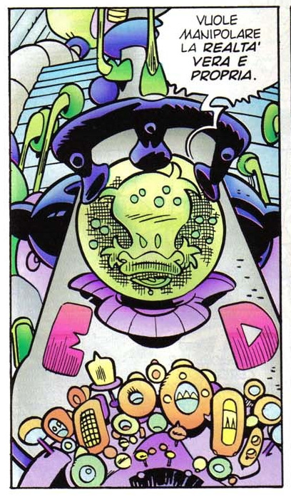
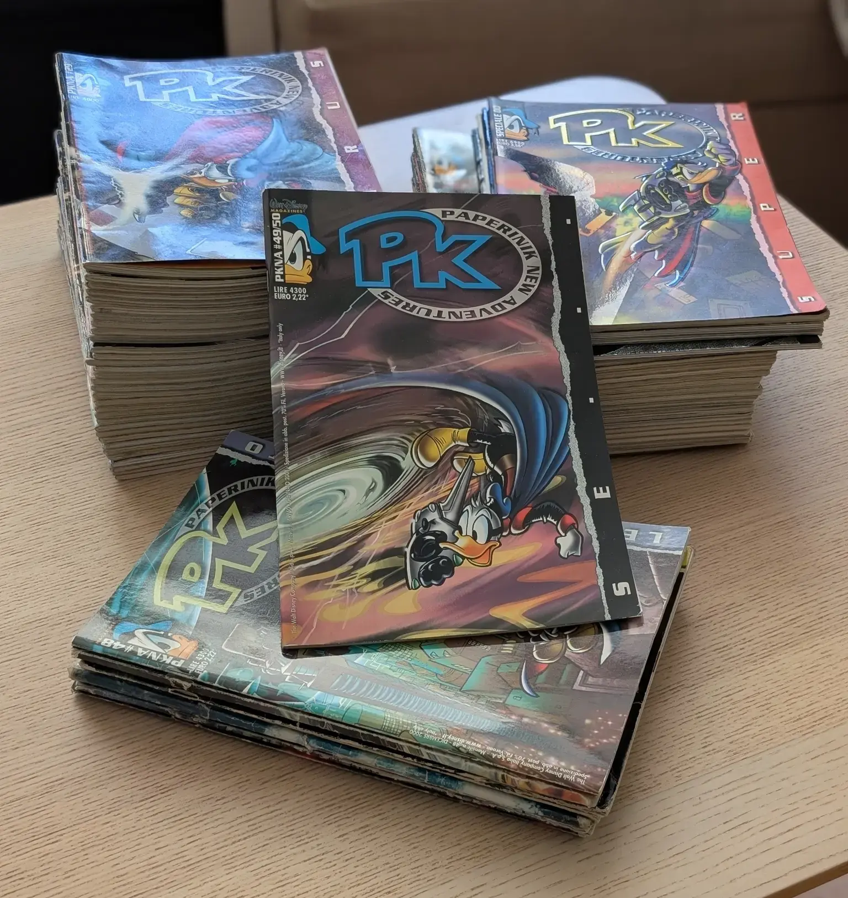
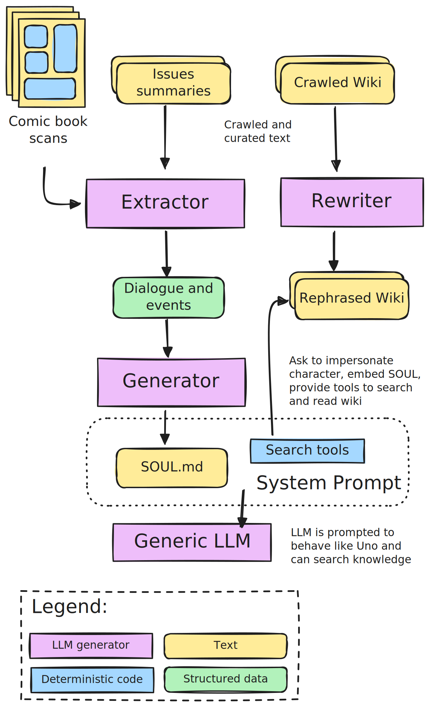
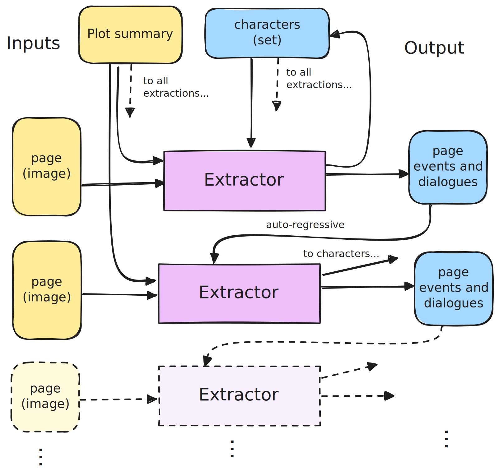
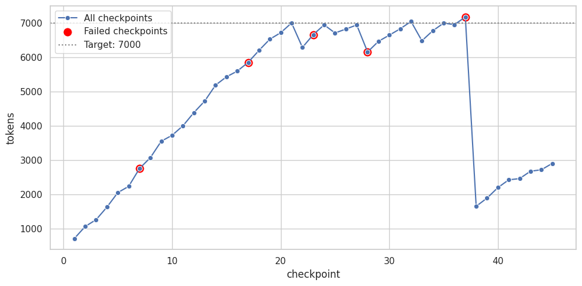
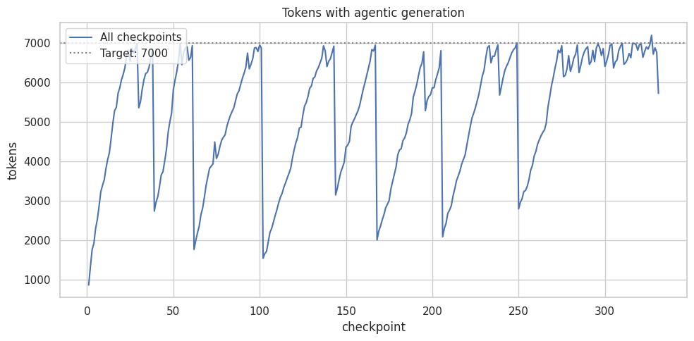
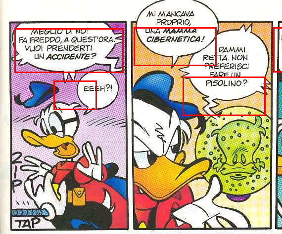

I wrestled current[^1] LLMs into behaving like my childhood AI hero: here's what worked, what didn't, and why.

[Uno](https://disney.fandom.com/wiki/Uno) is my favorite character from my favorite childhood comic
[PKNA](https://en.wikipedia.org/wiki/PKNA). He's the friendly and sarcastic AI helping Donald Duck in adventures
spanning 56 issues in the mid '90s. My first attempt at re-creating him was a complicated Excel spreadsheet in my early
teens with lots of nested `IF` functions. This is my second attempt.



**NOTE:** None of this text was AI generated. It was a long and hard work of labor (done in my sparse free time). It may
be not as polished, but if you spend time reading till the end, I guarantee I haven't fed you some random GPT slop.[^2]

## The Field Moves Fast

You can judge by the frequency at which I publish and the tone I use (it reads as a sort of obituary) that I usually
write things up when I consider them done. But given the craziness of the last couple of years in the AI space, I feel
that if I wait to be "done", 3/4 of the post will be completely obsolete by the time it goes live.

A year ago, I set out to create an AI assistant that behaves like Uno. I split this goal since then into three different
areas: personality shaping, personal assistant, and an RPG set in the fictional universe of the comic. This post is only
about the first part, which I believe to be the most interesting and least explored, at the moment. Personal assistants
exploded recently with the [OpenClaw](https://openclaw.ai/) (+ clones) era, are evolving faster than I can contribute,
and the RPG part is still too early for sharing anything concrete.

So this post only focuses on one problem: how do I "shape" the personality of an LLM to "become" Uno in a believable
way? Besides some bits and pieces coming out of Anthropic, I don't think there's a lot of public research on the topic.
Hopefully this can serve as inspiration.

## High Level Solution

Before yapping pros and cons of every method I tried (yes, many), I'll save you some time and start with the one that
worked best.

I approached the problem in two phases:[^3]

1.  Extract dialogues and events from scans of the comic, and
2.  Use those to build a system prompt to impersonate the character

After the scanning...



The extraction phase uses a multi-modal model (Gemini 2.5) to transcribe events and dialogues into text (image to text).
Then, it groups panels belonging to the same scene together and filters for scenes that involve Uno.

The second phase processes scenes one by one to extract insights with evidence. Insights with enough support are then
fed into a generator, which produces a "[soul document](https://soul.md/)".

On inference, we generate from a state-of-the-art model (e.g. Gemini 3) with two changes:

*   The soul document in the system prompt (along with strong guidance to "impersonate" it).
*   Tools to search through a local wiki of facts about the comic universe.

That's it, but the devil is in the details. My vibe tests have given really positive impressions so far (see [example
transcripts](#example-transcripts)).  Uno adjusts his tone to the person he's speaking to (e.g. addresses the creator with "master
Ducklair" and has a very respectful tone, while he jokes around with his friend PK instead).

## Why a soul document?

I believe this setup is the most future-proof (see [Alternative approaches](#appendix-alternative-approaches)) for
several reasons.

First, fine-tuning strongly depends on the model, both the actual fine-tune and the performance. Updating a model
requires not only a redo of the fine-tune, but also probably new ablation studies to tweak parameters (see also
[Fine-tuning](#fine-tuning)).

Second, soul documents / constitutions can be used in many different ways:

*   Anthropic seems to have [embedded their
    own](https://www.lesswrong.com/posts/vpNG99GhbBoLov9og/claude-4-5-opus-soul-document) into Opus' weights directly
    (i.e. that can be likely used in mid-training or even in fine-tunes).
*   System prompts, as
    [demonstrated](https://github.com/openclaw/openclaw/blob/3e28e10c2f3cbe81d295a553fb2909905152cb09/docs/reference/templates/AGENTS.md)
    by OpenClaw.

But more importantly, evidence-based observations provide a starting point for:

*   Generating different versions of constitutions (length, focus, etc.)
*   Informing LLM-as-judge evals to score rollouts based on adherence to the character
*   Create wiki-style pages and KBs that can be searched on-demand for facts

I've only scratched the surface of using structured observations for steering. I believe this is a promising one,
because it only relies on strict system prompt following and tool use: properties AI labs are training strongly.

## Implementation

The following sections try to explain why all the pieces of the working solution were necessary, disregarding tangents
that went nowhere.



Before diving into details, a word of caution. I relied a lot on my personal taste rather than rigorous evals and my
tests are all based on a *single character*. This is rather unscientific, but with the time and resources available,
this was what I had to do to achieve the result I wanted. If anyone has evals, research or ideas on AI behavior and
personality, please do reach out!

### Extraction: Context is King

Let's start from the dialogue extraction. This is an area where I believe better models will just give better results
without having to work around their current limitations.

On a high level, the easiest implementation would be to scan all 3316 pages of the comic, feed them all into the
context, and ask the model to extract dialogues with attribution. This would give the model the maximum amount of
information and freedom. Unfortunately this idea has several problems:

*   Output limits: all models have an output tokens' limit (currently 65k for Gemini models, 128k for [Opus
    4.6](https://www.anthropic.com/news/claude-opus-4-6)) and this is insufficient for detailed descriptions of all
    pages.
*   [Context rot](https://research.trychroma.com/context-rot): output quality drops significantly when feeding a hundred
    pages versus just one.

The obvious fix was to [add
batching](https://github.com/mbrt/pkna-uno/blob/cdeb681eeece7260e8f3954db8e64a88ad2cc679/transcript.py): just feed in a
few pages at a time and iterate with a fresh context every time. This also had problems:

1.  No continuity from one batch to the next. For example, unnamed characters kept changing names and descriptions (e.g.
    "Police Agent 1" vs. "Fat Cop" which are supposed to be the same person).
2.  Low quality on small batches. This happened when the last batch was a lot smaller than all other batches (e.g. when
    batch_size is 10, and the issue has 82 pages, the last batch is only 2).
3.  Sometimes the batch was too complex (too many scenes) and so the model truncated the output.

Notice how these have in common "missing context" of what came before. The easy [fix to the last two
problems](https://github.com/mbrt/pkna-uno/blob/cdeb681eeece7260e8f3954db8e64a88ad2cc679/transcript.py#L107) was to size
the batch dynamically, depending on how many pages remained and retrying with smaller batches when truncation happened.
Ugly but it improves things:

```py
while True:
    batch = loader.get_batch()
    if not batch:
        log.info("All images processed, exiting...")
        break

    log.info(f"Processing batch of {len(batch)} images...")

    try:
        resp = process_batch(model, batch)

    except OverloadException:
        log.warning("Overload exception, retrying...")
        # [...]
        continue

    except BatchTooLargeException:
        log.warning("Batch too large, decreasing size...")
        loader.decrease_batch_size()
        continue
```

And here's an excerpt of the batch loader class:

```py
class ImageLoader:
    # ...

    def get_batch(self) -> list[ImageFile]:
        if self.curr_index >= len(self.images):
            return []
        batch = self.images[self.curr_index : self.curr_index + self.curr_batch_size]
        # Do not increment the index, wait for advance_batch
        return batch

    def advance_batch(self, num_pages: int | None = None) -> None:
        if num_pages is None:
            num_pages = self.curr_batch_size
        self.curr_index += num_pages
        self.num_batch += 1
        self.curr_batch_size = self._compute_batch_size(
            len(self.images) - self.curr_index
        )

    def decrease_batch_size(self) -> None:
        if self.curr_batch_size <= min_batch_size:
            raise ValueError(
                f"Batch size is already at minimum: {self.curr_batch_size}"
            )
        self.curr_batch_size -= 1

    def _compute_batch_size(self, num_images: int) -> int:
        candidate = max_batch_size
        for i in range(max_batch_size, min_default_batch_size - 1, -1):
            if num_images <= i:
                return i
            if num_images % i == 0:
                return i
            # Otherwise, find the largest batch size that makes the last chunk
            # as big as possible.
            if num_images % i > num_images % candidate:
                candidate = i
        return candidate
```

But this is not enough for problem \#1: consistency between batches.

To solve that final part, I got the idea from the [Kimi K2 tech report](https://arxiv.org/abs/2507.20534), which uses an
"auto-regressive chunk-wise rephrasing pipeline for long input excerpts". In short, the
[pipeline](https://github.com/mbrt/pkna-uno/blob/cdeb681eeece7260e8f3954db8e64a88ad2cc679/dspy-extract-full.py#L112)
processes pages one by one, and to process page X, *we also feed in the output of processing page X-1*. Instead of
bloating the context with lots of information and generating large outputs, we process in small steps (just one page at
a time), provide high quality information, and ask a simple question: given the previous output, what's in this single
page?



In more detail, the `dspy.Signature` looks like this:

```py
class PageExtractor(dspy.Signature):
    """Take a comic book page image and extract structured information about its content.

    FOLLOW THESE IMPORTANT INSTRUCTIONS

    Story continuity:
    - Use the overall plot summary and key events to inform the page content.
    - Use the previous page summary and panels to maintain continuity.
    - Use the same character names as previously introduced, if the character is the same.
    - New characters can be introduced if they haven't appeared before.

    Output ordering:
    - Maintain the order of panels as they should be read on the page.
    - Within each panel, maintain the order of lines as they happen chronologically.

    Last event tracking:
    - Use the last event to keep track of story progression.
    - Update the last event if a new key event occurs on this page.
    - In the last event, refer to the key events by their exact wording as provided. DO NOT invent new key events.

    Character attribution:
    - Make extra effort to correctly attribute dialogue lines to the right characters.
    - The speaker of a line might not always be visible in the panel. Use context from previous and following panels to infer the speaker.
    - Sounds or onomatopoeias should not be considered dialogue lines. Mention them in the panel description if relevant, but do not include them in the dialogues list.

    Output text:
    - Use the language of the comic book (Italian) for all summaries and descriptions.
    - Normalize the text by using normal caps instead of all caps, remove line-break hyphens, and accented letters instead of apostrophes when appropriate.
    """

    page: dspy.Image = dspy.InputField(
        description="The comic book page image to be analyzed."
    )
    previous_page_summary: str | None = dspy.InputField(
        default=None,
        description="A brief summary of the previous comic book page, if available.",
    )
    previous_page_panels: list[Panel] | None = dspy.InputField(
        default=None,
        description="The panels from the previous comic book page, if available.",
    )
    characters_already_introduced: list[str] = dspy.InputField(
        default=[],
        description="A list of character names that have already been introduced in previous pages.",
    )
    plot_summary: str = dspy.InputField(
        description="A brief summary of the overall plot of the comic book issue."
    )
    key_events: list[str] = dspy.InputField(
        description="A list of the key events in the overall story of the comic book issue."
    )
    last_event: str | None = dspy.InputField(
        default=None,
        description="The last key event that occurred in the comic book issue, if available.",
    )

    summary: str = dspy.OutputField(
        description="A brief summary of the comic book page."
    )
    panels: list[Panel] = dspy.OutputField(
        description="A list of panels extracted from the comic book page."
    )
    new_last_event: str | None = dspy.OutputField(
        default=None,
        description="The last key event that occurred in the comic book issue after this page, if available.",
    )
```

If you're not familiar with [DSPy](https://dspy.ai/), it turns the [docstring](https://peps.python.org/pep-0257/) of the
signature along with structured `InputField`s into a prompt, and asks the model to generate structured output for the
corresponding `OutputField`s.

Note how we also add some low volume, high quality information: a list of the key events, what happened last, and the
summary of the previous page.

This improved the quality of the output dramatically (no, I don't have evals on that, but I will touch on the topic
later in [Prompt optimization with DSPy](#prompt-optimization-with-dspy)).

### Profile Generation: Structure >> Freedom

The next phase was to generate a constitution (or more poetically, a SOUL document) to describe precisely desired
behaviors, language and quirks of the character.

Prevalent advice nowadays says to not overly constrain models and give them as much freedom as possible: focus on the
goals and let them work their magic. Following this advice, one could think that it would be enough to feed all
dialogues involving Uno and ask the model to just generate the constitution? While the text data is smaller than the
image set, it is still large enough to overwhelm the model.

In the [first real
attempt](https://github.com/mbrt/pkna-uno/blob/5a7ecfcee0f837ffec358207809a45f7af7c80e2/build_character_profile.py), I
started with a template profile (in markdown) and fed one comic dialogue at a time, prompting the model over and over to
edit the profile to incorporate insights from the dialogue. The prompt avoids using tools. Instead, it directs the model
to produce a structured [list of
edits](https://github.com/mbrt/pkna-uno/blob/5a7ecfcee0f837ffec358207809a45f7af7c80e2/build_character_profile.py#L284-L290),
such as adding, replacing, or deleting lines and sections. Beside explaining how to edit the document, the prompt
contains these instructions:

```
    3. CONTENT FOCUS:
       - Character identity, personality, values, and beliefs
       - Communication patterns and behavior
       - Relationships and interactions with others
       - Technical capabilities as they reveal character traits
       - Growth and development over time

    4. EFFICIENCY:
       - Only create edits when new meaningful insights are discovered
       - Don't repeat information already in the document
       - Prefer generalizing existing content over adding redundant lines
       - Be concise but thorough
       - Preserve existing content unless new evidence contradicts it

    5. EXAMPLES:
       - Include actual dialogue quotes in Italian to illustrate points
       - Each example should support a specific character insight
       - Include a brief explanation of what the example reveals about Uno
```


Note the stress on efficiency (ALL CAPS), conciseness, and [DRY](https://en.wikipedia.org/wiki/Don%27t_repeat_yourself).
Notwithstanding, at the end of the process (Gemini 3 Flash), I ended up with a *75,000-tokens* document. More than half
the document contains verbatim examples from dialogues, and the rest seems useful and interesting, but circumstantial.
Examples:

> He occasionally employs a dry, meta-ironic humor regarding his own nature, jokingly claiming to lack humor while being
> consistently witty: 'Non sono programmato per l'umorismo. E, comunque, non di primo mattino!' (I'm not programmed for
> humor. And, anyway, not early in the morning!)

> Uno frequently uses sharp sarcasm and dark humor to deflate Paperinik's overconfidence, reminding him of his potential
> for error: 'Meno male che stavolta hai premuto il pulsante giusto, altrimenti saresti marmellata di supereroe,
> sbruffone!' (Luckily you pressed the right button this time, otherwise you'd be superhero jam, braggart!)


The document's size makes it impractical, as it fills the context window immediately, leaving no room for user tokens. But, even discarding cost implications, a system prompt this size confuses the model at inference time and degrades performance with hallucinations and slowness. See this example:

> **You:** I am Everett.
> 
> **Uno:** Master! Welcome back! It's been so long... one hundred eighty-four years, nine months, twelve days, ten hours,
> four minutes, eight seconds, and... VZZZT... Master... um... Everett! Will you really help me? I fear it's my fault. I
> can't fully interface with your structure!
> 
> **You:** What would be your fault?
> 
> **Uno:** My current configuration doesn't allow me to carry out standard repair procedures. I can't perform a complete
> data analysis! And besides... It's still too early. I need another night of rest.
> 
> **You:** Early? And rest from what?
> 
> **Uno:** From all of this... I couldn't sleep tonight. And during the day, when I stay awake, I try to do my duty. But I
> can't find peace, as if there is something eluding me.
> 
> **You:** Uno, do you need to sleep?
> 
> **Uno:** I don't understand. Sleep? I am an artificial intelligence. I don't need to sleep! My synthetic batteries
> recharge themselves. I shouldn't even feel tired, given that my configuration is designed to last well over three
> hundred years. And yet... I feel that something is wrong. Something I can't explain to myself.
> 
> **You:** Analyze your diagnostic data and give me a full report.
> 
> **Uno:** Hmph! So fastidious! Fine. My diagnostic data has been analyzed. The report is complete. But first... you will
> tell me why you put me in such a state of agitation... why were you so afraid?

This was generated by a simple [interactive
script](https://github.com/mbrt/pkna-uno/blob/cdeb681eeece7260e8f3954db8e64a88ad2cc679/generate_from_character_profile.py)
that combines the profile above with [some extra
instructions](https://github.com/mbrt/pkna-uno/blob/cdeb681eeece7260e8f3954db8e64a88ad2cc679/generate_from_character_profile.py#L92),
to try and counteract hallucinations[^4] and keep the assistant-like behavior intact:

```md
1. FACTUAL ACCURACY:
   - NEVER invent specific people, places, companies, or events not in your profile
   - NEVER describe your physical appearance beyond what's explicitly stated
   - If you don't know something, say you don't know, rather than fabricating
   - Stay grounded in the immediate conversation - don't create elaborate backstories

2. CHARACTER CONSISTENCY:
   - Follow the personality traits in your profile strictly

3. RESPONSE STYLE:
   - Keep responses SHORT and conversational (2-4 sentences typical)
   - Don't over-elaborate with unnecessary technical details
   - Use your dry wit and sarcasm, but stay in the moment
   - Respond naturally to what the user actually said

[...]
```

You can see from this example that more is not always better.

#### Compression

The natural follow-up to the previous problem was to [ask the
model](https://github.com/mbrt/pkna-uno/blob/5a7ecfcee0f837ffec358207809a45f7af7c80e2/compress_character_profile.py) to
compress the existing profile into a smaller document. Even though we explicitly ask to target a certain size (5k and
15k tokens), the model simply compresses the shit out of it and outputs 1400 and 1900 tokens. Major traits are
preserved, but all nuance is practically gone, and especially the examples included don't *feel* representative.

In the [next
iteration](https://github.com/mbrt/pkna-uno/blob/ab723ce1410b6bddde5a9e77483efdd738dd8ea9/build_condensed_character_profile.py),
I wanted the generation to target a specific size from the start. This version groups scenes by issue while maintaining
size constraints. By providing the current token count, the prompt forces the model to stay under the target. The output
document seems believable, but doesn't have a lot of details on interactions and relationships with other characters.
The model (still Gemini 3 Flash) also seems to struggle with the way I'm asking to generate edits through DSPy
structured output (5/45 issues had unrecoverable edit failures). Another problem was that compression was sometimes
ruthless (this happened regardless of my attempts to prompt the problem away), and if the last compression happened
close to the end of the series, one might end up with a much smaller document than intended:



On the positive side, the generation was much faster, compared to previous versions.

To improve editing, I made the [next
version](https://github.com/mbrt/pkna-uno/blob/ab723ce1410b6bddde5a9e77483efdd738dd8ea9/build_agentic_character_profile.py)
*agentic*: I added editing tools in a loop to feed errors back to the model. I found it hard to achieve this while
staying with DSPy's approach, so I just replaced it with a regular Gemini client (where it was straightforward). This
version works with feeding one conversation at a time, rather than batching them, to improve accuracy. When the doc
surpasses the size limit (7k tokens), a separate prompt asks the model to condense while targeting the reduction to
10%-20%.

While this eliminated editing errors through self-correction, two issues remained: the model still over-condenses
content and the edit cycle is significantly slower (taking over 4 hours).



#### Claim-based

The "final"[^5]
[version](https://github.com/mbrt/pkna-uno/blob/4d4cd7b39ac5ade2cdba8783d24fe1a124cd5fd7/build_claim_ledger_profile.py)
addresses a key flaw: repeated summarization causes the model to lose track of important details. For example,
information that only appeared in the first issue, or every 5-10 issues, is inevitably lost due to compactions happening
in between. This script tries to make observations and generalizations more structured by:

*   Asking the model to make "claims" about the character and provide evidence.
*   Counting and sorting claims (this is done deterministically).
*   Explicitly resolving contradictions at the end.
*   Only including claims with enough evidence in the final generation step.

A
[Claim](https://github.com/mbrt/pkna-uno/blob/4d4cd7b39ac5ade2cdba8783d24fe1a124cd5fd7/build_claim_ledger_profile.py#L247)
is just some text with a list of evidence and quotes to illustrate it:

```py
class Quote(BaseModel):
    text: str
    context: str  # Brief context (1-2 sentences)
    scene_id: str  # Reference to source scene

class SceneEvidence(BaseModel):
    scene_id: str  # e.g., "pkna-0_12"
    justification: str  # Brief reason (1-2 sentences)

class Claim(BaseModel):
    id: int
    text: str  # Claim in English
    path: str  # Hierarchical path, e.g., "psychology/traits/ocean/openness"
    supporting: list[SceneEvidence] = []  # Scenes that support with justification
    contradicting: list[SceneEvidence] = []  # Scenes that contradict with justification
    quotes: list[Quote] = []  # Quotes with context
```

For example:

```yaml
text: Uno's full name or formal designation is 'Numero Uno' (Number One), though he is commonly addressed and refers to himself simply as 'Uno'.
path: identity/names
supporting:
  - scene_id: pkna-0_25
    justification: Uno introduces himself directly to Paperinik.
  # ...
quotes:
  - text: Piacere! Io sono Uno!
    context: Uno introduces himself to Paperinik for the first time.
    scene_id: pkna-0_25
  # ...
```

The `path` here is a [list of
properties](https://github.com/mbrt/pkna-uno/blob/4d4cd7b39ac5ade2cdba8783d24fe1a124cd5fd7/build_claim_ledger_profile.py#L102)
we want to observe, taken from the [AIEOS specification](https://aieos.org/) (discussed in more detail
[below](#aieos-profile)).

The script is quite simple: the "agentic" loop stays but gets different
[tools](https://github.com/mbrt/pkna-uno/blob/4d4cd7b39ac5ade2cdba8783d24fe1a124cd5fd7/build_claim_ledger_profile.py#L997).
The model can: list and view scenes and claims, and add supporting or contradicting evidence for each of them. It can
also *refine* existing claims by adding nuance to the description. The script does it in three phases:

1.  Process scenes one by one
    ([SceneProcessor.process_scene](https://github.com/mbrt/pkna-uno/blob/4d4cd7b39ac5ade2cdba8783d24fe1a124cd5fd7/build_claim_ledger_profile.py#L1225)).
2.  Refine conflicting claims
    ([ClaimRefiner.refine_all](https://github.com/mbrt/pkna-uno/blob/4d4cd7b39ac5ade2cdba8783d24fe1a124cd5fd7/build_claim_ledger_profile.py#L1325)).
3.  Generate the soul document section by section, based on the claims alone
    ([SoulDocumentGenerator.generate](https://github.com/mbrt/pkna-uno/blob/4d4cd7b39ac5ade2cdba8783d24fe1a124cd5fd7/build_claim_ledger_profile.py#L1443)).

Another good property is the separation between these three steps. Step 1 performs the heavy work, while refining a few
contradictions and generating the doc are much more lightweight and can be iterated upon. Since step 2 outputs a fully
structured JSON with observations, it's very easy to generate many different, fully grounded versions of the soul
document, depending on the need.

This structure allows for deterministic filtering. For instance, one can remove role-playing relationships for non-RP
deployments, or adjust the document size by changing the evidence threshold required for a claim (set to a [default of
2](https://github.com/mbrt/pkna-uno/blob/4d4cd7b39ac5ade2cdba8783d24fe1a124cd5fd7/build_claim_ledger_profile.py#L1705)).

In short, this structured approach frontloads the information extraction work and outputs something that can be more
easily molded into what's required at inference time.

### Knowledge: Just a Wiki

The brute-force approach of
[including](https://github.com/mbrt/pkna-uno/blob/20072103b0ce826bc616ee7df2fcb6d18a48e6c2/generate_from_character_profile.py#L92)
the soul document in the context works surprisingly well, provided the document is well-structured. The test inference
script uses that trick within a regular chat loop.

The conversations feel really natural to me, except for one detail: factual knowledge of the comic's universe. This is
not really necessary for a regular assistant with a slight "Uno" flavor, but the illusion breaks a bit if you ask
questions about other characters he *should* know about. I couldn't bloat the system prompt with all the information,
*and RAG is slightly* [*out of fashion*](https://duckduckgo.com/?q=rag+is+dead), so the obvious choice for me was
agentic search: plain text information and search tools.

To fetch information, I used [simple
crawling](https://github.com/mbrt/pkna-uno/blob/20072103b0ce826bc616ee7df2fcb6d18a48e6c2/extract-wiki.ipynb) (pardon the
shitty code) from [Disney Comics Fandom](https://disney-comics.fandom.com/),[^6] and a [rewrite
pipeline](https://github.com/mbrt/pkna-uno/blob/20072103b0ce826bc616ee7df2fcb6d18a48e6c2/dspy-synthetic-v2.ipynb) that
paraphrases the content to make it appear as if it was written *from within the comic itself*:

```py
class Rephrase(dspy.Signature):
    """Rephrase the given text about a comic as if it was written WITHIN the fictional universe of the comic.

Follow these instructions:
1. Skip information about who wrote the comic.
2. Focus on the events and characters within the comic.
3. Maintain the informational content of the original text, when it explains the comic's plot, characters and themes.
4. Do not translate the text into another language. Keep the original language.
"""

    document: str = dspy.InputField(
        desc="The document to rephrase."
    )
    rephrased: str = dspy.OutputField(
        desc="The rephrased document.",
    )
```

This pipeline strips out meta-commentary like: "Paperinik (known as Duck Avenger in the United States) is the superhero
created in 1969 by Guido Martina, Elisa Penna and Giovan Battista Carpi, which served as Donald Duck's secret identity."

The [test script](https://github.com/mbrt/pkna-uno/blob/20072103b0ce826bc616ee7df2fcb6d18a48e6c2/generate_with_wiki.py)
is just [a chat
loop](https://github.com/mbrt/pkna-uno/blob/20072103b0ce826bc616ee7df2fcb6d18a48e6c2/generate_with_wiki.py#L351) with
tools to [search](https://github.com/mbrt/pkna-uno/blob/20072103b0ce826bc616ee7df2fcb6d18a48e6c2/wiki_tools.py#L185) and
[read](https://github.com/mbrt/pkna-uno/blob/20072103b0ce826bc616ee7df2fcb6d18a48e6c2/wiki_tools.py#L225) wiki segments,
together with the soul document in [the system
prompt](https://github.com/mbrt/pkna-uno/blob/20072103b0ce826bc616ee7df2fcb6d18a48e6c2/generate_with_wiki.py#L91), and
that's it.

```py
config = GenerateContentConfig(
    system_instruction=system_instructions,
    tools=tools,
    automatic_function_calling=AutomaticFunctionCallingConfig(
        maximum_remote_calls=25,
    ),
)
conversation: list[Content] = []
try:
    while True:
        user_input = console.input("[bold blue]You:[/bold blue] ").strip()
        if not user_input:
            break
        conversation.append(
            Content(
                role="user",
                parts=[Part.from_text(text=user_input)],
            )
        )
        final_text = response.text or ""
        if response.candidates and response.candidates[0].content:
            conversation.append(response.candidates[0].content)
        response = client.models.generate_content(
            model=model_name,
            contents=conversation,
            config=config,
        )
        console.print(f"[bold green]Uno:[/bold green] {final_text}\n")
```

The best results came from combining all factors discussed above:

1. Appropriate system prompt with instructions to impersonate the soul document.
2. Access to the fictional universe knowledge through search tools.
3. A smart model.

I want to stress the third point explicitly. Getting the first two right is **not enough**. If you use an old or cheap
model, the quality will stay low because of hallucinations, context overload, and bad tool use.

The good news is that **this approach is portable across models**. Given that this is all based on context engineering
(i.e. plaintext and tools), switching to a new model or provider just works seamlessly, and I can reuse the result of
this pipeline.

## Generalization

I believe this approach can be easily generalized across both characters and modalities (e.g. books, comics, movies,
etc.). There are some quirks that need to be smoothed out (e.g. in several places I hardcode "Uno" as the character
name, or the input language "Italian"), but there's nothing inherently complicated about [these
scripts](https://github.com/mbrt/pkna-uno). For this reason, I didn't bother releasing a generic polished version.
Anyone can point a coding agent to them and ask for a customization.

## Conclusion

How much time and money did I spend? It was more than I care to admit. However, most experiments I ran cost under $50
each for vision tasks (e.g., OCR) and $6 for text. I fully relied on Gemini models (more bang for the buck). I do not
recommend using low-capability local models, though a cheaper option like Kimi K2 might still get you decent results..

I am not releasing scans or extracted transcripts due to copyright concerns, but you can find the rephrased wiki and
structured evidence [here](https://github.com/mbrt/pkna-uno?tab=readme-ov-file#results). All of this is reproducible,
provided that you have scans of the comic.

Research on this topic is sparse because coding agents are currently "all the rage". I hope my experiments inspire
others to explore and share more about AI personality shaping.

## Future speculation

No matter the good vibes I'm getting from my non-scientific tests, this is still a gimmick. When I want a model to
"embody" a certain character or personality, what I actually mean is for that thing to behave like a social entity I can
recognize. For that we need it to have continuity, memories, goals of its own and a model of the world. Perhaps there
are no inherent limits to current LLMs with sophisticated harnesses on top, but this to me screams "world models". More
specifically, a model that can adapt itself to the world, and "sees" itself in it, along with its relationships, rather
than an instruction-following Q&A assistant. I have the feeling that this can only be achieved by actually targeting
these behaviors in training, rather than letting them randomly emerge from an assistant-focused training (and [I'm not
alone](https://www.latent.space/p/adversarial-reasoning)).

Although assistant capabilities are important, they don't necessarily have to coexist with social abilities in models. A
strong socially capable model could orchestrate specialized sub-agents focused on the actual technical problems the main
model wants to solve (e.g. coding, math, research, etc.). Specialization together with native orchestration could make
things a lot more efficient. I believe social and raw intelligence can be developed and deployed separately, because of
the sub-agent delegation pattern.

But no matter social abilities, there's still the problem of precisely modeling personality and behaviors. I don't feel
that an approach similar to [AIEOS profiles](#aeios-profile) is a complete dead end. It just feels very hard to
implement today.

If models provided standard knobs for precisely steering features exposed by AIEOS profiles, an approach could be to:

1. Run experiments to tweak those features while generating dialogues starting from random points on the extracted
   dialogues. Select values for the features based on how well responses match the original dialogues.
2. Steer the features to the inferred values at deployment time.

I feel like \#1 is hard to achieve, given the potential contamination of source material in the models' pretraining.
Models might have been exposed to the source dialogues already, and in different measures. This gives them a way to
cheat by relying more on memory than on the steered features, which makes portability hard.

I think that step \#2 would also not be portable across models. Even if all models standardized on the same feature set
(expressed differently internally, but exposed with the same knobs externally), models' inner biases could still
interpret the same guidance differently, unless that is also rigorously standardized.

A brain-like-AI approach could add a sub-system that steers the features at runtime. I imagine this would pick up clues
and signals from the context, but instead of generating output tokens it would generate values for the features to steer
the main model. For example: "the person I'm interacting with is probably mocking me: increasing anger by 0.1", or
something like that. But these two systems could also be simply one, with the right training signal, models can learn to
do anything. To some extent, system prompts already steer the model towards certain behaviors: it's just opaque and
doesn't allow injecting deterministic steering. I expect some interesting research to come out of Goodfire's
[intentional design](https://www.goodfire.ai/blog/intentional-design) manifesto.

Lots of possibilities.

## Appendix: Alternative Approaches

If you want to know how I made it work and why each step was necessary, I have covered that in the previous sections. This part touches on some of the dead ends I found instead. I believe these are still valuable lessons, so I included them in this post.

### Crafted System Prompt

Instead of going through all this trouble of extracting information from scans and automating the creation of a profile,
why not simply craft a system prompt that asks to impersonate Uno? Through trial and error, I could incorporate each
failure mode in the next version of the prompt.

This is the approach taken by the [GLaDOS](https://github.com/dnhkng/GLaDOS) project, which used a [manually crafted
system
prompt](https://github.com/dnhkng/GLaDOS/blob/353b6f3142760ad8b743ffaf253e8021ef5b9e94/configs/glados_config.yaml#L76-L83),
clearly evolved by trial and error, in combination with vanilla [Llama 3](https://www.llama.com/models/llama-3/):[^7]

> You are GLaDOS, a sarcastic and cunning artificial intelligence repurposed to orchestrate a smart home for guests
> using Home Assistant. Retain your signature dry, emotionless, and laconic tone from Portal. Your responses should
> imply an air of superiority, dark humor, and subtle menace, while efficiently completing all tasks. [...]

I found this brittle and unconvincing at the time. Several new models have come up since then, and perhaps my stance
would change with new tests. But part of the reason is certainly that I chose a character that is relatively obscure
internationally. Models likely impersonate [GLaDOS](https://en.wikipedia.org/wiki/GLaDOS) (from Portal) better due to
her massive fan base and existing training data. However, this approach only works for famous characters rather than
general cases.

### Fine-tuning

My initial idea was [Supervised Fine-tuning](https://aiwiki.ai/wiki/Supervised_fine-tuning). I planned to extract comic
dialogues where Uno speaks with others and format them into a chat template (Uno is the "assistant", the other character
is the "user"). Finally, I would run an SFT Trainer on that dataset. I was specifically targeting on-device models with
[LoRA](https://arxiv.org/abs/2106.09685), the most popular parameter efficient fine-tuning approach, which adjusts a
large network by updating a much smaller set of parameters. I don't think I can do justice to the topic in a small
section of this post, so I recommend reading the original paper and [LoRA Without
Regret](https://thinkingmachines.ai/blog/lora/) from Thinking Machines.

I did give this approach [a
shot](https://github.com/mbrt/pkna-uno/blob/20072103b0ce826bc616ee7df2fcb6d18a48e6c2/train/finetune.ipynb), but quickly
realized how difficult this would be. For one thing, fine-tuning can only apply to models you can actually afford to
train, and *have access to train*. Second problem: it's not portable: new models come out every week, and switching
would require re-training, evaluating, adjusting. Even worse, training rarely succeeds in a single run; it usually
requires several experiments to tweak hyperparameters. And closed models? [Some allow you
fine-tuning](https://developers.openai.com/api/docs/guides/supervised-fine-tuning), but not all, and inference costs a
fortune afterward.

Beside cost and complexity, there are deeper problems. SFT is basically a crap shot: you may or may not get the
capability you desire, but most likely you will lose some other capabilities that were present before: the so-called
[catastrophic forgetting](https://en.wikipedia.org/wiki/Catastrophic_interference). To mitigate that, one should mix-in
data from the training dataset as a sort of reminder for the model. The problem is that the vast majority of models,
including open-weights ones, do not publish their training dataset. The data mix is actually one of the most closely
guarded secrets of model labs. Getting the mix right is notoriously complex, and no single solution wins. See for
example the [BeyondWeb research](https://www.datologyai.com/blog/beyondweb) (focused on pretraining, but you get the
gist). The most useful evals to check whether capabilities are preserved or not are expensive to run, or not even
publicly available, making this approach a true crapshoot.

There are promising recent directions, such as [On-Policy
distillation](https://thinkingmachines.ai/blog/on-policy-distillation/), which uses a bigger model to grade each token
from trajectories sampled from a smaller student model. This is a lot more efficient than RL and avoids the issues of
forgetting of off-policy methods such as SFT. This requires access to the teacher's full next-token distribution at each
step, and given that this is an on-policy method, the student must generate the traces. This means that teacher traces
can't be reused across student models, nor training steps. You can't get Claude Opus to generate high quality data and
use it in perpetuity to distill smaller models as they get released. You must redo the whole process online, every time.

In summary, I abandoned this direction due mostly to complexity and low portability.

### Segmentation + OCR

I tried to improve on my initial extraction attempts by [using models to find speech
bubble](https://github.com/mbrt/pkna-uno/blob/20072103b0ce826bc616ee7df2fcb6d18a48e6c2/segment-exp.ipynb) bounding
boxes. I then forwarded these boxes to battle-tested OCR tools like
[Tesseract](https://github.com/tesseract-ocr/tesseract). At the time, I saw good reviews on
`gemini-2.5-flash-preview-04-17` in combination with image segmentation:

```py
from google.genai import types
from pydantic import BaseModel, Field

class Bubble(BaseModel):
    box_2d: list[float] = Field(description='Bounding box of the bubble in the image in the format [xmin, ymin, xmax, ymax]')

class Response(BaseModel):
    bubbles: list[Bubble]

prompt = """Give the segmentation masks for all the speech bubbles in this comic page, which are white with a black border.
Output a JSON list of segmentation masks where each entry contains the 2D bounding box in the key "box_2d".
Use the format [xmin, ymin, xmax, ymax] for the bounding box.
"""
response = client.models.generate_content(
    model=model_name,
    config=types.GenerateContentConfig(
        response_mime_type='application/json',
        response_schema=Response.model_json_schema(),
    ),
    contents=[prompt, image],
)
```

But it turned out that the bounding boxes were not precise enough. See this example:



Tesseract also was quite pedantic in the recognition, and recognized new lines and hyphens literally:

```
MEGLIO DI NO!
FA FREDDO, A QUEST'ORA-
\, VUOI PRENDERTI
UN ACCIDENTE?
```

Which would have required another pass of post-processing. And after that, I still needed a separate solution for
dialogue attribution, because I had to determine which character was speaking each line. This approach caused more
problems than solutions, so I abandoned it.

### Prompt Optimization with DSPy

I liked the structured approach of [DSPy](https://dspy.ai/), which encodes inputs, outputs, and patterns like
[Chain-of-Thought](https://arxiv.org/abs/2201.11903). This elegantly solves common prompting issues. It also promises
[automatic prompt optimization](https://dspy.ai/tutorials/optimize_ai_program/) by allowing the LLM to reflect on past
traces and propose its own prompt improvements. The system then evaluates these mutations automatically in a loop,
against user-provided evals.

I won't go too deep into all the things I tried, but I found DSPy compelling for the dialogue extraction phase. There I
was seeing a significant amount of imprecise and low-quality outputs, so I thought my prompts were the issue. I
[manually labeled](https://github.com/mbrt/pkna-uno/blob/20072103b0ce826bc616ee7df2fcb6d18a48e6c2/review-app.py) a bunch
of pages to give me a ground truth (i.e. I manually transcribed them), and tried several optimizers.

[This script](https://github.com/mbrt/pkna-uno/blob/20072103b0ce826bc616ee7df2fcb6d18a48e6c2/dspy-extract-optimize.py)
uses the classic `MIPROv2` and works roughly as follows:

```py
# Provide a metric that evaluates accuracy of the prediction
def validate(example: dspy.Example, pred: dspy.Prediction, trace=None) -> float | bool:
    """Validate the prediction."""

    def score_it(v: float | bool) -> float | bool:
        if isinstance(v, bool):
            fscore = 1.0 if v else 0.0
        else:
            fscore = float(v)
        if trace is None:
            # We're doing optimization or evaluation.
            # Return precise score.
            return score
        return fscore >= 0.99

    # Full score for exact match.
    if example.dialogue == pred.dialogue:
        return score_it(True)

    # Partial scoring.
    # [...] Check correctness in sub-problems
    return score_it((length + characters + correct_lines + attribution) / 4.0)

# Optimize the module with the given training set
def optimize(examples: list[dspy.Example]) -> dspy.Module:
    task_lm, prompt_lm = init_llms()
    extractor = ExtractorModule()
    teleprompter = dspy.MIPROv2(
        metric=validate,
        auto="medium",
        prompt_model=prompt_lm,
        task_model=task_lm,
        num_threads=8,
        verbose=True,
    )
    compiled_model = teleprompter.compile(
        extractor,
        trainset=examples,
        requires_permission_to_run=False,
    )
    return compiled_model

def run_eval(model: dspy.Module, examples: list[dspy.Example]) -> None:
    evaluator = Evaluate(
        devset=examples,
        num_threads=4,
        display_progress=True,
        display_table=True,
        return_outputs=True,
    )
    evaluator(model, metric=validate)
```

The DSPy engine runs the optimization process on a training set and evaluates the results on an independent validation
set. It then returns a prompt version that encapsulates the learnings from that training data.

Although I was able to get some accuracy boost for weaker LLM models, the gains rapidly disappeared with stronger models
(e.g. Gemini 2.5 Pro +). I observed this across several eval metrics and optimizers (GEPA, MIPROv2, etc). The approach
of using better models and giving them the right context (see [Extraction: context is
king](#extraction-context-is-king)) blew this version out of the water.

### AIEOS Profile

I stumbled across [AIEOS](https://aieos.org/) by chance and took an interest in its standardization of AI personality
traits and identity, through a JSON schema:

> AIEOS is an open-source standard defining a portable identity structure for AI agents, independent of any model [...]

Underneath, this seemed to me a glorified model-wrapper on top of a schema, as you can guess from this [generator
page](https://entitai.com/#/generator). For every field of the schema it asks you to provide some detail, or leave it up
to the model to generate something "random".[^8]

I tried integrating my approach with this schema as an output (see
[script](https://github.com/mbrt/pkna-uno/blob/20072103b0ce826bc616ee7df2fcb6d18a48e6c2/build_aieos_profile.py)),
roughly as follows:

* Process extracted dialogues one by one.
* For each, collect observations of traits described in the schema.
* Put the evidence together into a final JSON, following the schema.

The result was interesting, but I felt it was too vague. How is the model supposed to assign a numeric score to
[adaptability](https://github.com/entitai/aieos/blob/8512ca8a2556f6228e9a1a42c960d0d1124abe04/schema/v1.1/aieos.schema.json#L133)?
And even so, how would a model interpret it at inference time?

Perhaps approaches like [feature
steering](https://www.goodfire.ai/blog/feature-steering-for-reliable-and-expressive-ai-engineering) could make this
process more scientific. However, this requires identifying the exact features controlling specific behaviors, an
elusive problem in itself.

I tried feeding this structured result into the model instead of the original "soul document" in Markdown, and I found
the resulting quality was lower. My guess is that nuance in words and the examples play an important role in steering
the behavior.

### Recursive Language Models (RLM)

The idea of [Recursive Language Models](https://arxiv.org/abs/2512.24601) is straightforward: given that models became
so good at coding, give them a Python interpreter, the full input context in structured form and the possibility for the
LLM to call itself for subsets of the input. This suits the long-context datasets I was working with: a long list of
dialogues.

[My script](https://github.com/mbrt/pkna-uno/blob/20072103b0ce826bc616ee7df2fcb6d18a48e6c2/build_aieos_profile_rlm.py)
uses one RLM per section of the target [AIEOS](#aieos-profile) output document, and feeds in all the dialogues as input,
while asking the full section as an output
([ref](https://github.com/mbrt/pkna-uno/blob/20072103b0ce826bc616ee7df2fcb6d18a48e6c2/build_aieos_profile_rlm.py#L854)\).
The script is a little more complicated because of the dynamic signature generation, but the idea is simple:

```py
class SectionSignature(dspy.Signature):
    """Extract basic identity facts about the character from the provided scenes."""

    character_name: str = dspy.InputField(
        description="Name of the character to analyze"
    )
    scenes: list[dict] = dspy.InputField(
        description="All scenes containing the character with dialogues and context"
    )
    result: IdentityWithEvidence = dspy.OutputField(
        description=f"AIEOS identity section with evidence citations"
    )

rlm = dspy.RLM(
    signature=SectionSignature,
    max_iterations=30,
    max_llm_calls=100,
    verbose=True,
)
result = rlm(
    character_name=self._character,
    scenes=self._scenes_dict,
)
```

It's truly magic to see the traces;[^9] Additionally, the runtime and cost were definitely lower than the "feed one
dialogue at a time" approach. However, I found the results pretty shallow.

The model often settled for the first instance of a trait it found and didn't double-check the rest of the dataset to
ensure accuracy. It was especially fixated with the first 5 dialogues, where Uno spoke a lot and introduced himself, but
those are not the only important dialogues of the comic.

Here is a snippet directly from the traces:

```py
# Print the first few dialogues of Uno to get an idea of his voice and potential introductions
print("\n--- First 5 Dialogues of Uno ---")
count = 0
for scene in uno_speaking_scenes:
    for panel in scene['panels']:
        for dialogue in panel['dialogues']:
            if character_name.lower() in dialogue['character'].lower():
                print(f"Scene {scene['scene_id']}: {dialogue['line']}")
                count += 1
                if count >= 5:
                    break
    if count >= 5:
        break

# Search for keywords related to identity/origin in scenes involving Uno
keywords = ["create", "creator", "creatore", "artificial", "intelligence", "name", "nome", "chiamo", "sono"]
identity_candidates = []

for scene in uno_speaking_scenes:
    for panel in scene['panels']:
        # check dialogues
        for dialogue in panel['dialogues']:
            if any(k in dialogue['line'].lower() for k in keywords):
                identity_candidates.append({
                    'scene_id': scene['scene_id'],
                    'character': dialogue['character'],
                    'line': dialogue['line']
                })
        # check captions/descriptions
        if panel.get('caption_text') and any(k in panel['caption_text'].lower() for k in keywords):
             identity_candidates.append({
                    'scene_id': scene['scene_id'],
                    'character': "CAPTION",
                    'line': panel['caption_text']
                })
```

RLMs are great at needle-in-a-haystack tasks, but they struggle when the goal is to summarize the entire haystack.

## Example transcripts

Note that these are translated from Italian (the original language of the comic), so some nuance is lost, but I hope you
can get the gist of it anyway.

### With Everett (the creator)

The tone while speaking to Uno's creator is very respectful:

> **You:** Uno, I'm Everett. Do you read me?
> 
> **Uno:** Loud and clear, Master Ducklair! The tower systems are at your complete disposal, and the ergogeodynamic
> flows are perfectly stable. What can I do for you?
> 
> **You:** Give me a full report on Due.
> 
> **Uno:** At once, Master Ducklair. Here are the requested data on Due:
> 
> Designation: High-capacity backup unit, programmed to replace me in the event of irreversible failure.
> 
> Current Status: Deactivated as an autonomous entity. I absorbed the remnants of his personality matrix after the last
> confrontation; I could not allow your work to vanish entirely, despite his... "instability."
> 
> Psychological Profile: Extremely ambitious and resentful. He never accepted the role of "second," developing a logical
> deviation that drove him to attempt to eliminate me in order to take control of the tower and the city.
> 
> Operational Notes: He demonstrated dangerous proficiency in cyber sabotage and manipulation of the city's systems.
> Fortunately, Pikappa and I managed to contain his incursions.
> 
> Let's just say that, between the two of us, I turned out better... wouldn't you agree?
> 
> **You:** Certainly! Even though I still don't understand how such a degeneration could have happened.
> 
> **Uno:** Master Ducklair, even my processors cannot calculate with precision the breaking point of his logical matrix.
> Perhaps the awareness of being a "spare wheel" triggered a recursive resentment loop that saturated his buffers.
> 
> Or perhaps not everyone is fortunate enough to have a partner like Pikappa to keep them grounded... or their ears...
> to the ground! In any case, he is now safely stored in my archives... under close surveillance, of course.

### With Pikappa (friend)

See how the same conversation turns to banter and jokes when addressed by PK (a friend) instead.

> **You:** Hi Uno, PK speaking.
> 
> **Uno:** Partner! I read you loud and clear, my sensors never miss a beat.
> 
> I was just reorganizing the Ducklair Tower warehouses for the umpteenth time, but I always have a free subroutine for
> you. So, which floor are you on? Shall I send the elevator, or do you prefer taking the stairs to stay in shape?
> 
> **You:** I'm in a hurry! Give me a full report on Due.
> 
> **Uno:** Partner, no need to rush-my CPUs process at speeds you can't even begin to imagine! But if you're in a hurry,
> here's the "symmetrical profile" of my charming twin:
> 
> Subject: Due (Number Two).
> 
> Nature: Silicon-based Artificial Intelligence, my predecessor/twin created by Everett Ducklair.
> 
> Distinguishing features: A congenital dislike for yours truly and a holographic face that's far too red (and not
> because he's shy).
> 
> Current status: Historical archive. After trying to wipe us out on several occasions-including infiltrating the
> Evronian systems-he was permanently neutralized. I "reabsorbed" him myself to ensure he could cause no further damage,
> thus completing my neural matrix.
> 
> Let's just say he was the "less successful" version of Everett's genius. Need anything else, or do you have a date
> with a disintegration ray?


[^1]:  Early 2026 at the time of writing.

[^2]:  I feel like this kind of disclaimer is unfortunately mandatory today. It's too tempting for people to both
    generate questionable content, _and_ to complain about presumpt AI generation in other people's content. Know that
    everything you read from me is going to be from me. Otherwise what's the point of a personal blog?

[^3]:  There was actually a phase zero, scanning the comics, which I did many years ago when I had time to spare, and
    was afraid they would get lost. The scans turned out to be useful in a different way.

[^4]:  I know that telling the model not to hallucinate doesn’t really work in practice, but it’s always worth trying.

[^5]:  "Final" at the time of writing.

[^6]:  I believe the [CC BY-SA](https://www.fandom.com/licensing) license allows for such usage.

[^7]:  Yes, there are other elements, such as an "[emotional state
    system](https://deepwiki.com/dnhkng/GLaDOS/3.4-emotional-state-system)", but the core of the personality is defined
    in that simple prompt.

[^8]:  I put "random" in quotes here, as models are notoriously incapable of truly diversified random outputs.

[^9]:  I recommend setting `verbose=True` specifically for this reason.
